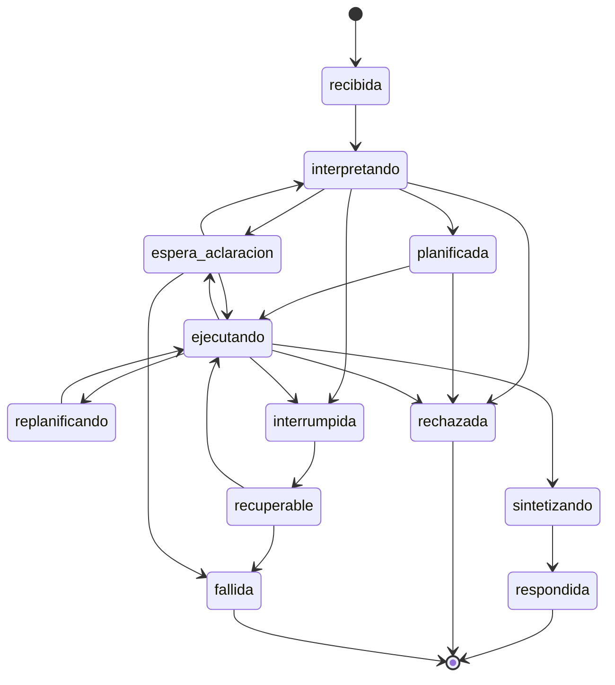
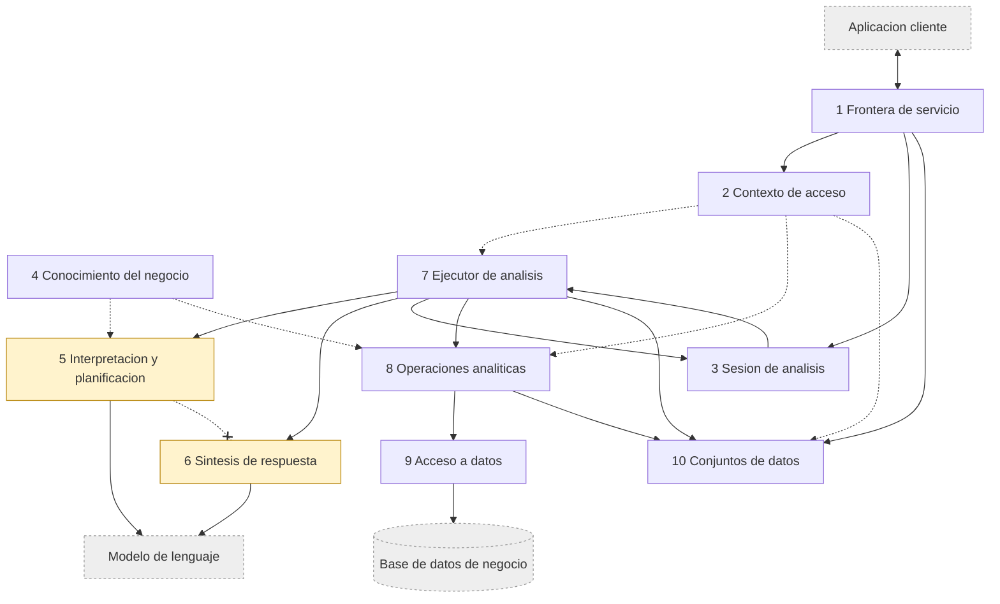
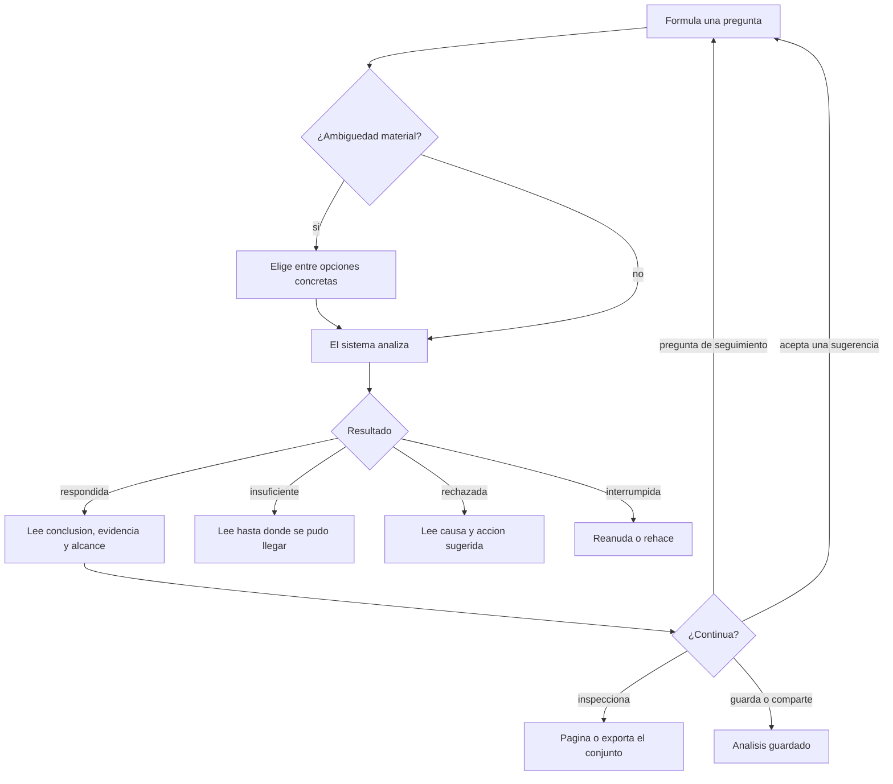
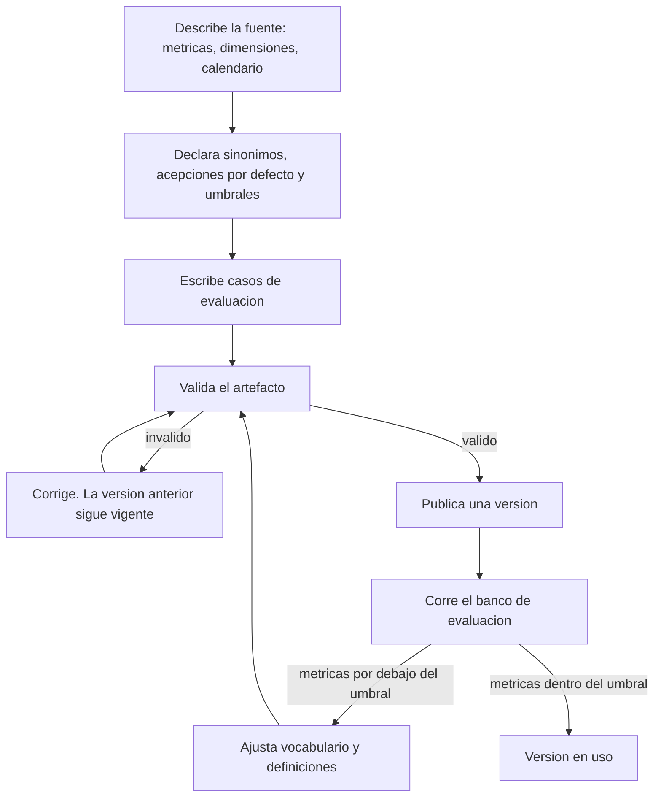
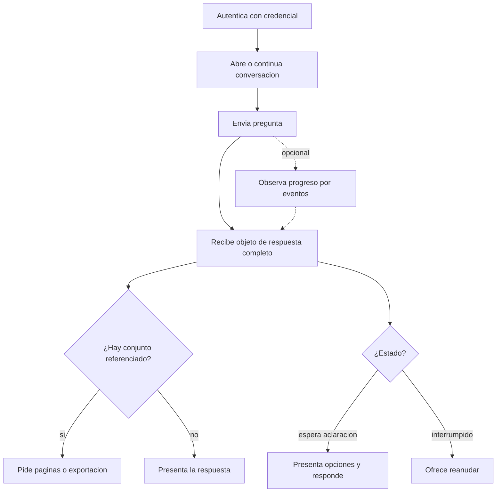

<!-- docs/01_metodo_solucion.md -->
<!-- Actualizado: 2026-08-16 -->
# 01 — Metodo de solucion

Producto del Bloque 2. **No nombra ninguna tecnologia.** Las elecciones de
implementacion viven en `02_vision_arquitectura.md` y `13_decisiones_tecnicas.md`.

---

## 1. Problema

Quien dirige un negocio tiene los datos y no tiene las respuestas. Entre la pregunta
—"¿por que cayo la facturacion en julio?"— y el dato hay una traduccion que hoy exige
conocer la estructura de la base, o esperar a que alguien la haga.

Las herramientas existentes resuelven la mitad: los tableros responden preguntas
previstas; las consultas directas exigen conocimiento tecnico; los asistentes que
generan consultas automaticamente producen cifras **plausibles y no verificables**, que
es el peor resultado posible en un contexto de decision.

> El problema no es generar consultas. Es producir respuestas **en las que se pueda
> confiar sin tener que comprobarlas a mano**.

## 2. Contexto

- Base de datos existente y conocida de antemano por quien monta el servicio.
- Pocos parametros, muchos datos: el esquema entra en la descripcion; los datos no.
- Volumen objetivo: decenas de miles a algunos millones de registros por tabla.
  Escenarios masivos explicitamente fuera de alcance.
- Acceso de solo lectura. El sistema jamas modifica la fuente.
- Doble destino: herramienta real de trabajo y pieza demostrativa.

## 3. Actores

| Actor | Rol |
|---|---|
| Usuario analista | Formula preguntas, inspecciona resultados y continua analisis |
| Integrador | Ensena al sistema la semantica de una fuente de datos |
| Administrador | Gestiona usuarios, accesos y conexiones |
| Aplicacion cliente | Consume las capacidades del sistema. Sin logica de negocio |
| Modelo de lenguaje | Interpreta, planifica y redacta. No calcula |
| Base de datos de negocio | Fuente externa, de solo lectura |

Integrador y administrador son roles distintos aunque en una empresa chica sean la misma
persona: uno ensena la semantica de la fuente, el otro administra quien accede.

---

## 4. Escalera aplicada

Plantilla de backend y servicios:

```
problema -> actores y contratos -> casos de uso -> arquitectura -> servicios
-> entidades -> persistencia -> API -> seguridad -> observabilidad -> tests
```

### Adaptaciones y su razon

| Adaptacion | Razon |
|---|---|
| **Seguridad** se resolvio junto con arquitectura, no despues | El contexto de acceso condiciona el corte de las partes: si se agrega despues, atraviesa todo el sistema |
| Se agrego **coherencia de captura** como peldano propio | Aparecio en la revision adversarial y afecta la correctitud, no la implementacion |
| Se agrego **evaluacion** como peldano, junto a tests | El comportamiento de la zona no determinista se mide, no se prueba |

Acoplamiento declarado del dominio: **los contratos entre actores condicionan el corte
en servicios**. Por eso las tres partes compartidas —conocimiento del negocio, contexto
de acceso y conjuntos de datos— se escribieron contra su consumidor mas exigente antes
de cerrar el resto.

---

## 5. Modelo del dominio

### Entidades

| Entidad | Que es |
|---|---|
| Conexion configurada | Una base concreta con su descripcion, vocabulario y umbrales |
| Vocabulario de negocio | Equivalencias y definiciones del cliente |
| Conversacion | Secuencia de turnos de un usuario sobre una conexion |
| Turno | Una pregunta y todo lo que produjo. **Frontera de consistencia** |
| Estado analitico | Periodo, filtros, definiciones vigentes y ultima referencia |
| Contexto de acceso | Que conexiones, filas, columnas y operaciones puede usar un usuario |
| Objetivo | Que se quiere lograr. De catalogo cerrado, con criterio de suficiencia |
| Operacion | Un calculo del catalogo cerrado, con parametros declarados |
| Plan de analisis | Objetivos, pasos, condiciones y dependencias. Durable |
| Invocacion | Una operacion ejecutada con argumentos concretos |
| Hecho | Afirmacion atomica con valor, unidad, alcance y momento de captura |
| Peticion de datos | Lenguaje canonico interno para expresar una necesidad de datos |
| Conjunto de datos | Snapshot inmutable con su descriptor de cobertura |
| Respuesta | Afirmaciones tipificadas, alcance y sugerencias |
| Evidencia | Original o **reconstruida** |
| Caso de evaluacion | Par pregunta / interpretacion esperada |
| Sugerencia de investigacion | Pregunta propuesta, nunca ejecutada sola |
| Analisis guardado | Definicion reproducible, no filas |

### Estados de un turno



Dos familias, y la distincion es para la observabilidad: `respondida`, `rechazada` y
`espera_aclaracion` son **resultados normales del dominio** —una tasa alta de rechazos
senala catalogo insuficiente, no errores—; `interrumpida`, `recuperable` y `fallida` son
situaciones operativas.

### Estados de un paso del plan

`pendiente` · `omitido` · `iniciado` · `completado` · `rechazado` · `no_ejecutado`

`iniciado` existe porque hay registro previo y no posterior: distingue "no se ejecuto" de
"se ejecuto y no sabemos el resultado".

---

## 6. Mecanismo central

> **El modelo propone planes y redacciones; el sistema determinista valida, autoriza,
> ejecuta y controla que afirmaciones pueden salir. Ninguna afirmacion sale sin haber
> sido validada contra evidencia producida deterministamente.**

El modelo elige **que** objetivo y **que** operacion, con que argumentos. Nunca **como**
se calcula, ni **si** alcanza, ni **que** significa un concepto.

### Alternativas descartadas

| Alternativa | Por que se descarto |
|---|---|
| El modelo genera consultas libres | Precision baja en esquemas reales y errores **silenciosos**: devuelve un numero plausible pero mal |
| El modelo lee filas y responde | Concluir sobre muestras produce impresiones, no datos. Rompe la separacion dato/interpretacion |
| Consulta libre validada y acotada | Reduce el riesgo sin eliminarlo; la validacion de una consulta arbitraria es tan dificil como generarla |
| Descubrimiento automatico del esquema | El significado de negocio no es deducible de la estructura fisica: `total` es bruto en una empresa y neto en otra |
| Planificador de proposito general | Impredecible, caro de evaluar y sin control de terminacion |

---

## 7. Arquitectura



Las cajas sombreadas son la zona no determinista. **La flecha tachada es una prohibicion
del diseno**: Interpretacion y Sintesis no se comunican; el Ejecutor es el unico
intermediario. Si Sintesis conociera la intencion cruda, podria redactar lo que el
usuario queria oir en vez de lo que los datos dijeron.

Diez cajas superan la cota de 7-9 del metodo. Se acepta con justificacion explicita: las
cajas 5 y 6 son **dos usos distintos del modelo** con riesgos y evaluaciones separadas, y
fusionarlas perderia la capacidad de diagnosticar si el sistema entendio mal o explico
mal. La alternativa —una caja "modelo de lenguaje"— reintroduciria la zona no
determinista como un bloque unico, que es justamente lo que el diseno evita.

### Distribucion de la complejidad

Una parte dificil —Interpretacion— y nueve tratables. Ocho de diez se verifican sin
fuente de datos ni modelo de lenguaje. Complejidad **contenida y nombrada**, no esparcida.

### Autoridad distribuida

> Cada componente es autoridad sobre sus propias reglas. El Ejecutor coordina las
> validaciones y solo ejecuta cuando todas las autoridades requeridas aceptaron.

| Pregunta | Autoridad |
|---|---|
| ¿Este objetivo existe y cual es su criterio? | Operaciones analiticas |
| ¿Que significa este concepto y donde esta? | Conocimiento del negocio |
| ¿A que fechas corresponde esta expresion temporal? | Conocimiento del negocio |
| ¿Este usuario puede hacer esto? | Contexto de acceso |
| ¿Esta operacion admite estos parametros y que universo exige? | Operaciones analiticas |
| ¿Hay un conjunto valido para esta peticion? | Conjuntos de datos |
| ¿Entra en los limites fisicos? | Acceso a datos |
| ¿Se cumple la condicion? ¿El objetivo esta satisfecho? ¿Comparten captura? | Ejecutor, por comparacion |

**Prueba de que la regla se cumple:** agregar una operacion, una metrica, una regla de
permisos o una fuente nueva **no debe requerir tocar el Ejecutor**.

Orden de validaciones, de mas barata a mas cara y de mas restrictiva a menos:

```
1 objetivo en catalogo      5 firma y parametros
2 autorizacion              6 requisito de universo
3 validez semantica         7 conjunto valido disponible
4 resolucion temporal       8 limites fisicos con conteo previo  <- unico acceso a la fuente
```

Un rechazo por permisos nunca debe haber consultado la fuente.

---

## 8. Flujos por actor

### Usuario analista



### Integrador



### Aplicacion cliente



El canal de eventos **observa la ejecucion; no es dueno de ella**. Cortarlo no cancela
nada; el estado se consulta aparte.

---

## 9. Invariantes del sistema

1. Ninguna cifra presentada como dato proviene de una muestra ni del modelo: toda cifra
   tiene una invocacion que la produjo.
2. Toda afirmacion esta etiquetada como dato, interpretacion o hipotesis.
3. Ninguna operacion se ejecuta fuera del contexto de acceso vigente del turno.
4. Toda respuesta declara su alcance: periodo, filtros, definiciones, momento o rango de
   captura, y momento de la respuesta cuando difieren.
5. El sistema nunca escribe sobre la base de negocio.
6. Ningun conjunto presentado como completo se trunca en silencio; las vistas parciales
   se identifican como tales.
7. Toda afirmacion presentada como dato conserva permanentemente su trazabilidad logica.
   La evidencia por registros puede ser temporal; recuperada por re-ejecucion se
   identifica como **evidencia reconstruida**.
8. El estado analitico vigente siempre es visible para el usuario.
9. "No se puede responder con estos datos" es una salida valida y siempre disponible.
10. Un analisis interrumpido nunca se presenta como completo.
11. Un conjunto se reutiliza solo si su descriptor demuestra que lo pedido es derivable
    por agregacion; la verificacion la hace codigo, no el modelo.
12. Los hechos que participan de un mismo calculo derivado comparten captura.
13. Ninguna afirmacion mezcla hechos de objetivos distintos ni de turnos distintos.

---

## 10. Decisiones de sistema

Formato abreviado: decision · supuesto · senal de invalidacion. Alternativas descartadas
en la seccion 6 y en los contratos de cada parte.

| Decision | Supuesto | Senal de invalidacion |
|---|---|---|
| El sistema se conecta a la fuente; no la ingiere | El esquema entra en la descripcion y los datos no hacen falta para interpretar | Aparece un caso que exige copiar datos |
| Capa semantica explicita en vez de descubrimiento automatico | El significado de negocio no es deducible del esquema | Configurar cuesta mas de lo que ahorra |
| Modelo semantico y mapeo fisico en una sola caja, versionados juntos | Son dos caras de la misma verdad y no pueden divergir | Cambiar el mapeo resulta rutinario y el versionado conjunto estorba |
| Catalogo cerrado de objetivos y operaciones, en una sola parte | El criterio de suficiencia se expresa sobre hechos, que publican las operaciones | Mas del 30 % de las preguntas cae en fuera de alcance |
| El modelo no escribe calculos: invoca operaciones | Las preguntas reales se cubren con un catalogo acotado | Aparecen preguntas legitimas sin operacion posible |
| Reduccion en la fuente; derivacion en zona determinista | El resultado agregado cabe comodamente en memoria | Un calculo necesita operar sobre volumenes que no se pueden traer |
| Prohibido concluir cifras sobre muestras | El sesgo de muestreo es invisible en la respuesta | — |
| Cada operacion publica sus propios hechos | El Ejecutor no necesita conocer la semantica de los resultados | Un tipo de hecho exige logica de composicion en el Ejecutor |
| Autoridad distribuida; el Ejecutor coordina y no juzga | Cada regla tiene un dueno natural identificable | Aparece una decision sin autoridad clara |
| Orden de validaciones fijo, de barato a caro | El conteo previo es la unica validacion cara | Otra validacion resulta costosa |
| Todo rechazo lleva causa y accion, nunca un booleano | La causa determina la recuperacion posible | — |
| Rechazos como resultado del dominio, no como excepcion | La mayoria de los rechazos son informacion util | Los consumidores los tratan como error igualmente |
| Contexto de acceso como entidad del dominio desde el inicio | Agregarlo despues atraviesa todas las partes | El modelo de permisos resulta innecesario en uso real |
| La restriccion viaja antes de la consulta | Toda restriccion es expresable en vocabulario canonico | Aparece una regla no expresable como filtro de dimension |
| Rechazo de operaciones sobre universo no autorizado | Es preferible no responder a responder con un total enganoso | El rechazo bloquea un uso legitimo frecuente |
| Snapshot inmutable, sin refresco silencioso | Es preferible un dato fechado a uno que cambia solo | Los usuarios esperan datos siempre actuales |
| Materializacion siempre, con descriptor en dos capas | Conservar conjuntos pequenos es despreciable frente a la consistencia | La sesion acumula conjuntos hasta volverse costosa |
| Cobertura verificada por codigo, no por el modelo | La comparacion es expresable mecanicamente | Aparece un caso de cobertura que requiere juicio |
| Un conjunto pertenece a su contexto y no se re-filtra | Re-ejecutar bajo el contexto del lector es viable | Re-ejecutar resulta prohibitivo al compartir |
| Frescura derivada del periodo consultado | La fuente no admite cargas retroactivas sobre periodos cerrados | Aparecen modificaciones sobre periodos cerrados |
| **El turno es frontera de consistencia** | Un turno es corto frente a la frecuencia de cambios de permisos y semantica | Aparece un caso que necesita evidencia de dos turnos |
| **Coherencia de captura en calculos derivados** | Hechos correctos sobre estados distintos producen respuestas incoherentes | Re-ejecutar por coherencia resulta prohibitivo |
| Una conversacion ejecuta un turno por vez | El uso natural es secuencial dentro de una conversacion | Los usuarios necesitan analisis en paralelo sobre el mismo hilo |
| Plan durable con estado por paso; registro antes y despues | La reanudacion debe evitar repetir operaciones | La persistencia domina la latencia |
| Ventana de recuperable derivada de la vigencia de los conjuntos | Reanudar sin conjuntos vivos no es mas barato que rehacer | La reanudacion tardia resulta valiosa igual |
| Maximo dos rondas y una replanificacion por objetivo | Dos rondas cubren las preguntas reales | Mas del 20 % termina con insuficiencia |
| Presupuesto global de turno | Los limites por objetivo no acotan el turno completo | El presupuesto corta turnos legitimos con frecuencia |
| Interpretacion y Sintesis separadas y sin comunicacion | Ambos usos del modelo tienen riesgos distintos | Un caso legitimo requiere que Sintesis conozca la intencion cruda |
| Continuidad explicita, sin herencia por omision | El costo de declararla es menor que el de un alcance equivocado | Produce continuaciones incorrectas frecuentes |
| Premisas declaradas como campo obligatorio | Las preguntas de negocio presuponen con frecuencia | Resultan siempre vacias en el banco |
| Ambiguedad material detiene la propuesta | Proponer y preguntar a la vez induce a ejecutar por defecto | La tasa de aclaracion resulta inaceptable |
| Respuesta minima determinista en todos los turnos | Construirla es barato comparado con el analisis | Su construccion resulta costosa |
| Alcance compuesto deterministamente | No debe depender de que el modelo lo recuerde | Resulta ilegible o redundante |
| Conclusion transversal solo con dependencia declarada | Sin evidencia que vincule objetivos, la relacion es especulacion | Los usuarios necesitan esa sintesis global |
| Una sugerencia nunca se ejecuta sola | La aceptacion explicita preserva el control de terminacion | La friccion resulta desproporcionada |
| Cliente sin logica; todo el estado en el servidor | El cliente puede reemplazarse sin perder capacidades | Una funcion util resulta imposible sin logica en el cliente |
| Frontera publica consumible por terceros | Habra consumidores distintos del cliente propio | El unico consumidor real es el propio |

---

## 11. Trazas

### 11.1 Nominal

Juan, gerente comercial, contexto sin restriccion de filas. *"Compara la facturacion de
julio contra junio y decime que clientes explican la caida."*

| # | Caja | Que ocurre |
|---|---|---|
| 1-3 | Frontera, Contexto, Sesion | Autentica; emite contexto congelado; abre turno y persiste la pregunta |
| 4 | Ejecutor | Solicita catalogos semantico y de operaciones, **filtrados por contexto** |
| 5 | Interpretacion | Objetivo `explicar_variacion`; premisa declarada; plan de dos pasos, el segundo condicionado |
| 6 | Ejecutor | Validacion estatica: el paso 1 declara publicar la variacion; la condicion es satisfacible |
| 7 | Ejecutor + autoridades | Ocho validaciones en orden. Conteo previo: 84.320 filas, resultado de 2 |
| 8 | Operaciones, Acceso a datos | Junio 4.812.400; julio 4.176.900; variacion -13,2 % |
| 9 | Ejecutor | Condicion cumplida: se activa el paso 2 |
| 10 | Operaciones | Descomposicion por cliente: 1.240 elementos. Contribucion calculada en zona determinista |
| 11 | Conjuntos | Materializa el conjunto con su descriptor, ligado al contexto y a la version semantica |
| 12 | Ejecutor | Suficiencia: cobertura 72 % >= 70 %. Satisfecho. Construye la respuesta minima |
| 13 | Sintesis | Redacta afirmaciones tipificadas referenciando los hechos |
| 14 | Ejecutor | Validacion de salida: respaldo, correspondencia, existencia, alcance, etiquetado |
| 15 | Sesion, Frontera | Persiste y entrega respuesta, vista previa y referencia al conjunto |

Invariantes verificados: 1, 2, 3, 4, 11, 13.

### 11.2 Falla — la fuente cae durante una operacion

Igual hasta el paso 9. Conteo previo del paso 2 correcto; **la conexion cae durante la
obtencion**.

| # | Que ocurre |
|---|---|
| 1 | Registro previo del paso 2 ya existia: queda en `iniciado`, sin registro posterior |
| 2 | El Ejecutor clasifica: **interrupcion**, no rechazo |
| 3 | Sesion persiste causa, momento y ventana. Turno a `interrumpida` y luego `recuperable` |
| 4 | La respuesta minima ya estaba construida sobre los hechos disponibles |
| 5 | **No se invoca Sintesis**: no hubo evaluacion de suficiencia |
| 6 | El estado analitico **no se actualiza**: el turno no fue `respondida` |
| 7 | La Frontera entrega salida de tipo interrumpido, con lo establecido etiquetado como parcial |

Invariantes verificados: 1, 6, 7, 10.

**Hallazgo principal:** el estado `iniciado` obliga a decidir si re-ejecutar. Como todas
las operaciones son lecturas, re-ejecutar es seguro: **el invariante de solo lectura es
lo que hace barata la recuperacion**. Segundo hallazgo: la ventana de `recuperable` no
puede exceder la vigencia de los conjuntos del plan, o la reanudacion conserva la ilusion
de continuidad sin su beneficio.

### 11.3 Recuperacion

**Dentro de ventana.** Contexto vigente, version semantica sin cambios, conjuntos vivos.
El Ejecutor localiza el punto de reanudacion, re-ejecuta el paso `iniciado`, completa el
objetivo y responde. Los hechos del paso 1 y del paso 2 tienen **momentos de captura
distintos**: el alcance declara el rango, y ambos son evidencia original.

**Imposible.** Tres causas —ventana vencida, contexto cambiado, version semantica
cambiada— producen el mismo desenlace: el turno pasa a `fallida`, sus conjuntos quedan
como evidencia historica y **no se re-filtran**, y se ofrece rehacer bajo condiciones
actuales. La respuesta rehecha declara `origen: rehecho` con su causa, porque lo que
cambio no fue el dato sino el observador.

**Hallazgo principal:** en la reanudacion imposible conviven los hechos del turno fallido
y los del nuevo. Sin `turno_id`, una afirmacion del nuevo podria citar evidencia del
viejo —producida bajo otro contexto de acceso—: no es solo un error de trazabilidad, es
una fuga de permisos.

---

## 12. Supuesto mas riesgoso

| Campo | Contenido |
|---|---|
| **Supuesto** | Un modelo de lenguaje puede convertir preguntas reales de negocio en propuestas estructuradas validas —objetivo, conceptos, alcance y plan— con confiabilidad suficiente, si dispone de una capa semantica bien definida y un catalogo cerrado |
| **Dano si es falso** | El producto entero pierde sentido. Toda la maquinaria determinista garantiza que las cifras sean correctas; ninguna garantia sirve si el sistema responde correctamente **la pregunta equivocada** |
| **Experimento minimo** | Un banco de preguntas reales con su interpretacion esperada, ejecutado contra Interpretacion, mas la validacion estatica de cada plan resultante. **No requiere ejecutar ninguna consulta** |
| **Resultado esperado** | Interpretacion correcta en la mayoria de las preguntas, y **aclaracion —no error silencioso—** en el resto |
| **Criterio de aceptacion** | Ver abajo. Ambas metricas deben superar su umbral; si solo una lo hace, el supuesto no queda validado |

### La asimetria que define el criterio

| Desenlace | Aceptable |
|---|---|
| Interpretacion correcta | Si |
| Aclaracion solicitada | Si, con moderacion |
| **Interpretacion incorrecta silenciosa** | **No** |

> Un sistema que pregunta es usable. Un sistema que se equivoca con confianza es
> inutilizable, por alta que sea su exactitud promedio.

### Metricas y umbrales

| Metrica | Umbral | Naturaleza |
|---|---|---|
| A1 — correctas sin aclaracion | >= 80 % | Usabilidad |
| **A2 — error silencioso** | **<= 5 %** | **Seguridad. El umbral duro** |
| A4 — falsos fuera de alcance | <= 5 % | Usabilidad |
| B1 — planes validos al primer intento | >= 90 % | Coste y friccion |
| B1 + B2 — validos tras un reintento | >= 98 % | Coste |

Banco minimo: 60 preguntas, congelado antes de ejecutar y no modificado en funcion de los
resultados.

### Falsabilidad

El supuesto es **condicional** —"si dispone de una capa semantica bien definida"— y por
lo tanto se puede alegar indefinidamente que falta configurar mejor.

> **Limite: tres iteraciones de mejora del artefacto semantico.** Si tras la tercera las
> metricas no alcanzan los umbrales, el supuesto queda refutado.

### Si falla

| Escenario | Pivote |
|---|---|
| A2 alto | Interpretacion siempre propone y el usuario **confirma antes de ejecutar**: un turno mas, cero errores silenciosos |
| A1 bajo, A2 bajo | Funciona pero pregunta demasiado. Se ataca con acepciones por defecto. No es refutacion |
| B bajo | El problema es el catalogo, no el modelo |
| A y B con la capa completa | La entrada en lenguaje natural libre no es viable. El producto pasa a **analisis asistido** con seleccion guiada, conservando toda la arquitectura restante |

---

## 13. Revision adversarial — resultado

Diez problemas encontrados, todos corregidos en los contratos.

| # | Problema | Correccion |
|---|---|---|
| P1 | El catalogo de objetivos no tenia caja duena | Pertenece a Operaciones analiticas, junto al de operaciones |
| P2 | La version semantica no se congelaba por turno | Se congela igual que el contexto |
| P3 | Hechos de un mismo calculo podian venir de capturas distintas | Coherencia de captura obligatoria; prevalece sobre la reutilizacion |
| P4 | Dos turnos simultaneos en una conversacion | Un turno activo por conversacion |
| P5 | Resultados de un intento superado | `intento_id`; los tardios se descartan sin procesar |
| P6 | Reanudacion concurrente del mismo turno | Una sola reanudacion en curso |
| P7 | Peticiones duplicadas | Clave de idempotencia opcional |
| P8 | No existia presupuesto de turno | Tiempo total y llamadas al modelo, por turno |
| P9 | La durabilidad de los conjuntos condicionaba la reanudacion | Resuelto: conjuntos durables, promesa sin condicion |
| P10 | El catalogo domina el coste del turno | El filtrado por contexto es tambien palanca economica |

**P3 fue el unico que podia producir cifras incoherentes presentadas como datos**: la
descomposicion reparte la variacion total, que proviene de otro paso; con capturas
distintas, la suma de contribuciones deja de cerrar. **P1 fue el unico defecto
estructural de descomposicion.**

### Numeros de servilleta

| Magnitud | Estimacion | Consecuencia |
|---|---|---|
| Conjunto tipico / en el limite | ~250 KB / ~10 MB | Acotar por cantidad es insuficiente: tambien por tamano total |
| Coste por turno | ~12.000 unidades de contexto, dominadas por el catalogo | El filtrado por contexto abarata, ademas de proteger |
| Turno nominal / complejo | 10-20 s / 30-60 s | Motiva el presupuesto de turno y la entrega incremental |

---

## 14. Criterio de correctitud del sistema completo

El sistema es correcto si, para toda pregunta:

1. **Ninguna cifra publicada como dato carece de una invocacion que la produjo.**
2. **Ninguna respuesta se apoya en datos que el usuario no puede ver**, ni permite
   deducirlos por diferencia o por denominador.
3. **Ninguna cifra de una misma respuesta contradice a otra** por provenir de capturas
   distintas.
4. **Toda respuesta declara el alcance bajo el cual es cierta.**
5. **Toda afirmacion es reproducible**: pregunta, plan, parametros, alcance y momento
   quedan registrados de forma permanente.
6. **El sistema entrega una respuesta util aunque el modelo de lenguaje no este
   disponible**, degradando la calidad linguistica y no la integridad factual.
7. **Cuando no puede responder, lo dice**, con causa y con alternativas.

Los siete son verificables. Ninguno depende del comportamiento del modelo.
