<!-- docs/02_vision_arquitectura.md -->
<!-- Actualizado: 2026-08-16 -->
# 02 — Vision de arquitectura

Producto del Bloque 3. Aqui si se nombra tecnologia. El metodo, los invariantes y las
decisiones de sistema viven en `01_metodo_solucion.md`.

---

## 1. Que es QueryPilot

Un servicio que convierte preguntas de negocio en lenguaje natural en **analisis
verificables** sobre una base de datos existente. El modelo de lenguaje interpreta y
redacta; un nucleo determinista valida, calcula y controla que puede afirmarse.

**Para quien:** quien decide —responsable comercial, operativo o directivo— y el analista
que acelera exploraciones. No apunta a cientificos de datos.

**Que no es:** no reemplaza a SQL, ni a una planilla, ni a una herramienta de tableros.
Convierte preguntas en analisis confiables y reproducibles, y deja que las demas
herramientas hagan lo que ya hacen mejor. Si el usuario quiere manipulacion manual libre,
exporta.

---

## 2. Restricciones dadas y elecciones abiertas

| Restricciones dadas (Bloque 1) | Elecciones abiertas (resueltas en Bloque 3) |
|---|---|
| Cliente web o PWA sin logica de negocio | Transporte de la API |
| API en Python como frontera publica | Framework web y validacion |
| Autenticacion por credencial | Mecanismo de credencial |
| Estado en el servidor | Motor de persistencia |
| El sistema se conecta; no ingiere | Motor de la fuente y estrategia multi-dialecto |
| Solo lectura, con limites duros | Proveedor de modelo |
| Codigo en ingles, documentacion en espanol | Formato del artefacto semantico |

---

## 3. Tecnologias

| Ambito | Eleccion | Justificacion |
|---|---|---|
| Lenguaje | Python 3.13 | Restriccion dada; ecosistema del dominio |
| Entorno y dependencias | `uv` + `pyproject.toml` + `uv.lock` | Reproducible y rapido; una sola herramienta |
| API | FastAPI | Genera el contrato publico desde los modelos; asincronia nativa |
| Contratos y validacion | Pydantic v2 | **Una sola definicion valida la salida del modelo y el contrato interno** |
| Persistencia | PostgreSQL, via SQLAlchemy 2 | Un solo motor; transaccion unica para plan, hechos y conjuntos |
| Migraciones | Alembic | El esquema evoluciona con el proyecto |
| Modelo de lenguaje | OpenAI, **detras de un puerto** | El dominio no depende del proveedor |
| Artefacto semantico | YAML versionado, validado con Pydantic | Revisable en control de versiones y comparable entre versiones |
| Tests | pytest | Restriccion dada |
| Calidad | ruff + mypy | Reemplazan black, flake8, isort y pylint |
| Empaquetado | Docker + Compose | Reproducible y desplegable |
| CI | GitHub Actions, como puerta de merge | Verificable |

### Lo que no entra en el MVP

| Fuera | Motivo |
|---|---|
| MySQL, SQL Server, SQLite como dialecto | **La extensibilidad se demuestra por corte arquitectonico, no por implementaciones que el MVP no necesita** |
| Redis | El unico dato voluminoso son los conjuntos, y deben ser durables |
| Kubernetes, despliegue continuo | Compose demuestra reproducibilidad; CI demuestra verificabilidad |
| WebSocket, cancelacion | Bidireccional no aporta sin cancelacion, y cancelar introduce dominio nuevo |
| LangChain o LangGraph como arquitectura | El dominio, los planes, los criterios y la reanudacion pertenecen a este sistema |
| Interfaz grafica de configuracion | El integrador trabaja sobre archivos versionados y comandos |

### Transporte

REST/JSON es el **contrato canonico**. SSE entrega progreso mediante estados del dominio.

> **El canal de eventos observa la ejecucion; no es dueno de ella.** Cortar el SSE no
> cancela el analisis; el estado se consulta por HTTP.

Los eventos llevan `turn_id`, `objective_id` e `attempt_id`, y **no transportan datos de
negocio**: el canal no es una segunda superficie de salida y no requiere revalidar
contexto. El evento final entrega el mismo objeto que el endpoint sincrono.

Autenticacion por clave de API en cabecera, en toda la superficie. El cliente propio
consume el canal con `fetch` en modo streaming, no con `EventSource`, porque este no
admite cabeceras arbitrarias y las alternativas —clave en la URL, cookie— romperian otra
cosa.

### Dos conexiones, no una

| Conexion | Uso | Permisos |
|---|---|---|
| Sistema | Sesion, planes, hechos, conjuntos, versiones | Lectura y escritura |
| Negocio | Consultas del cliente | **Solo lectura, verificada al conectar** |

Con conexiones separadas, el usuario de solo lectura deja de ser buena practica y pasa a
ser **lo que impide escribir por accidente en la base del cliente**.

---

## 4. Estructura interna

Cada elemento pertenece a **exactamente una** caja del diagrama de `01_metodo_solucion.md`.

```mermaid
flowchart TB
    subgraph FRO[1 Frontera de servicio]
        F1[Autenticador] --- F2[Receptor] --- F3[Entrega de respuestas]
        F4[Entrega de conjuntos] --- F5[Consulta de estado] --- F6[Canal de eventos]
    end
    subgraph ACC[2 Contexto de acceso]
        A1[Identidad] --- A2[Alcance] --- A3[Autorizador]
        A4[Restricciones] --- A5[Vigencia]
    end
    subgraph SES[3 Sesion de analisis]
        S1[Conversaciones] --- S2[Estado analitico] --- S3[Plan durable]
        S4[Registro durable] --- S5[Guardados] --- S6[Concurrencia]
    end
    subgraph CON[4 Conocimiento del negocio]
        C1[Artefacto semantico] --- C2[Validador] --- C3[Conceptos]
        C4[Temporal] --- C5[Especificacion fisica] --- C6[Filtro por contexto]
    end
    subgraph INT[5 Interpretacion]
        I1[Propuesta] --- I2[Plan] --- I3[Referencias] --- I4[Ambiguedad] --- I5[Replanificador]
    end
    subgraph SIN[6 Sintesis]
        Y1[Contexto de sintesis] --- Y2[Redactor] --- Y3[Transversalidad]
        Y4[Alcance] --- Y5[Sugerencias]
    end
    subgraph EJE[7 Ejecutor]
        E1[Coordinador] --- E2[Motor de plan] --- E3[Coherencia de captura]
        E4[Rondas y presupuesto] --- E5[Registrador] --- E6[Respuesta minima]
        E7[Validacion de salida] --- E8[Intentos]
    end
    subgraph OPE[8 Operaciones]
        O1[Catalogo de objetivos] --- O2[Catalogo de operaciones] --- O3[Validador]
        O4[Constructor de peticion] --- O5[Calculos] --- O6[Publicador]
    end
    subgraph DAT[9 Acceso a datos]
        D1[Conexion] --- D2[Traductor portable] --- D3[Dialectos]
        D4[Conteo previo] --- D5[Guardas] --- D6[Ejecutor de consulta]
    end
    subgraph CJD[10 Conjuntos]
        J1[Materializador] --- J2[Descriptores] --- J3[Validez]
        J4[Selector] --- J5[Entrega]
    end
```



---

## 5. Estructura de carpetas

Nomenclatura corregida segun `16_instrucciones_ia.md` seccion 7: **ingles** para todo
identificador interpretado por software, incluidos metricas, dimensiones, objetivos y
operaciones. Una metrica se declara `metric: "net_revenue"`, no `metrica:
"facturacion_neta"`. El espanol queda para lo que lee una persona: descripciones,
sinonimos, mensajes.

```
querypilot/
├── src/querypilot/
│   ├── canonical_language/      vocabulario compartido. Ver seccion 6
│   ├── service_boundary/        <- 1 Frontera de servicio
│   ├── access_context/          <- 2 Contexto de acceso
│   ├── analysis_session/        <- 3 Sesion de analisis
│   ├── business_knowledge/      <- 4 Conocimiento del negocio
│   ├── interpretation/          <- 5 Interpretacion y planificacion
│   ├── synthesis/               <- 6 Sintesis de respuesta
│   ├── executor/                <- 7 Ejecutor de analisis
│   ├── analytics/               <- 8 Operaciones analiticas
│   │   └── computations/        nucleo determinista
│   ├── data_access/             <- 9 Acceso a datos
│   │   └── dialects/            una pieza por motor
│   ├── datasets/                <- 10 Conjuntos de datos
│   ├── model_port/              puerto del modelo + prompts versionados
│   └── observability/           capacidad transversal
├── semantic/                    artefactos semanticos por conexion
│   └── demo/
├── prompts/                     prompts versionados
├── client/                      cliente minimo servido por FastAPI
├── migrations/                  Alembic
├── scripts/                     generacion de la base sintetica
└── tests/
```

Los elementos externos —base de negocio, proveedor del modelo, aplicacion cliente de
terceros— aparecen en el diagrama y **no tienen carpeta**: no contienen codigo propio.

---

## 6. Dos carpetas que no son cajas

### `canonical_language/`

Tres partes comparten el mismo vocabulario: Operaciones **construye** la peticion de
datos, Acceso a datos la **traduce**, Conjuntos la usa como **descriptor de cobertura**.
Si las definiciones vivieran dentro de una de las tres, las otras dos dependerian de ella
por una razon que no es arquitectonica.

Corresponde a un elemento real del diseno: el lenguaje canonico interno.

> **Regla dura:** contiene **solo definiciones** de artefactos compartidos. Nada de
> logica, validaciones, conversiones ni funciones auxiliares.

Es la carpeta con mas riesgo de degenerar en el cajon generico que el metodo prohibe.
Tiene prueba estructural propia: **no contiene comportamiento**.

### `observability/`

Capacidad transversal declarada. **Observa, pero no gobierna**: no participa del camino
funcional. La auditoria no vive aqui — es el registro durable del analisis y pertenece a
`analysis_session/`, porque forma parte del producto y no expira.

### `model_port/`

El puerto del modelo expone **dos operaciones del dominio**, no un cliente generico:

```
interpretar(...) -> InterpretationOutput
sintetizar(...)  -> SynthesisOutput
```

Un puerto que expusiera *completar texto* obligaria a los consumidores a saber de prompts
y modelos, y filtraria el proveedor al dominio. Los prompts son **artefactos versionados**
en `prompts/`; el codigo referencia una version y esa version queda auditada junto a la
version semantica.

---

## 7. Regla de dependencias

```
service_boundary  ->  analysis_session  ->  executor
executor          ->  interpretation, synthesis, analytics, datasets
analytics         ->  data_access, business_knowledge
todos             ->  canonical_language, access_context
nadie             ->  service_boundary
```

Tres prohibiciones con prueba estructural:

| Prohibicion | Impide |
|---|---|
| `interpretation/` no importa de `synthesis/` ni al reves | Que las dos zonas del modelo se comuniquen |
| `executor/` no importa catalogos, artefacto semantico, permisos ni dialectos | Que el Ejecutor absorba reglas ajenas |
| Solo `analysis_session/` accede al almacen de estado | Que aparezca un segundo dueno del estado |

**Prueba de que la autoridad distribuida se sostiene:** ninguna extension prevista toca
`executor/`.

| Extension | Toca |
|---|---|
| Motor nuevo | `data_access/dialects/<motor>/` |
| Operacion nueva | Ficha + archivo en `computations/` + tests |
| Cliente nuevo | Nada |
| Base de negocio nueva | Nada: solo el artefacto semantico, que es dato |

---

## 8. Estructura de tests

Primero por parte de la solucion, despues por tipo de prueba.

```
tests/
├── service_boundary/    unit/ behavior/
├── access_context/      unit/ contract/
├── analysis_session/    unit/ durability/ concurrency/
├── business_knowledge/  unit/ integrity/ time/ versioning/
├── interpretation/      contract/ evaluation/
├── synthesis/           contract/ evaluation/
├── executor/            unit/ plan/ coherence/ rounds/ degradation/ attempts/
├── analytics/           unit/ properties/ request/ universe/
├── data_access/         unit/ dialects/ limits/ integration/
├── datasets/            unit/ validity/ derivability/ retention/
├── structural/          reglas de dependencia entre carpetas
└── system/              end_to_end/ failure/ recovery/ limits/ performance/
```

`tests/system/` es la unica carpeta transversal permitida.

### Propiedad estructural

Ocho de diez partes se verifican **sin base de datos y sin modelo de lenguaje**.
Interpretacion y Sintesis lo necesitan **solo para evaluacion de calidad**: su contrato se
prueba entero con dobles que devuelven salidas fijas.

De ahi la frontera del CI:

| | CI, en cada PR | Evaluacion, manual |
|---|---|---|
| Prueba | Que el sistema es correcto | Que el modelo es bueno |
| Determinismo | Total | Ninguno |
| Coste | Cero | Por inferencia |
| Secretos | **Ninguno** | Clave del proveedor |

> **El CI no tiene acceso a ninguna clave de modelo.** Si un test la necesita, esta mal
> categorizado. Hay una prueba estructural que verifica que la suite de contrato pasa con
> las variables del proveedor ausentes.

---

## 9. Primer MVP

> **Probar el supuesto mas riesgoso: que Interpretacion puede convertir preguntas reales
> en propuestas estructuradas validas.**

La primera sesion de desarrollo construye esto, **no infraestructura**.

### Que se construye

| Pieza | Alcance |
|---|---|
| Base sintetica de demostracion | Solo su **esquema**. No se consulta durante el experimento |
| Artefacto semantico | Metricas, dimensiones, sinonimos, acepciones por defecto, calendario, umbrales |
| Catalogos de objetivos y operaciones | **Solo las fichas**, sin implementar ningun calculo |
| Puerto del modelo + Interpretacion | Con salida estructurada por esquema |
| Validador estatico de plan | Comprueba que cada condicion referencia un hecho publicable |
| Banco de 60 casos + comando de evaluacion | El instrumento de medicion |

**No hacen falta** Operaciones, Acceso a datos, Conjuntos, Sesion, Sintesis ni Frontera.
El experimento **no ejecuta ninguna consulta**.

### Que debe demostrar

| Metrica | Umbral |
|---|---|
| A1 — correctas sin aclaracion | >= 80 % |
| **A2 — error silencioso** | **<= 5 %** |
| A4 — falsos fuera de alcance | <= 5 % |
| B1 — planes validos al primer intento | >= 90 % |
| B1 + B2 — validos tras un reintento | >= 98 % |

Aceptacion: **todas** las metricas superan su umbral. Si A2 falla, no hay compensacion
posible por un A1 alto. Maximo tres iteraciones sobre el artefacto semantico, con el banco
congelado; si tras la tercera no se alcanzan los umbrales, el supuesto queda refutado.

### Por que no es trabajo desechable

El banco se convierte en el banco de evaluacion permanente; el artefacto semantico y las
fichas son insumos directos de las partes siguientes. **El experimento es el primer MVP,
no una prueba previa al MVP.**

---

## 10. Orden de implementacion

| MVP | Que se construye | Cierra con |
|---|---|---|
| 1 | Artefacto semantico, fichas, Interpretacion, validador estatico, banco | `business_knowledge/*`, `interpretation/*` |
| 2 | Operaciones y Acceso a datos | `analytics/*`, `data_access/*`, `system/performance` |
| 3 | Ejecutor | `executor/*`, `system/limits` |
| 4 | Conjuntos de datos | `datasets/*`, `system/recovery` |
| 5 | Sintesis y validacion de salida | `synthesis/*`, `executor/degradation` |
| 6 | Sesion, Frontera y cliente | `analysis_session/*`, `service_boundary/*`, `system/end_to_end` |

El bloque de mayor incertidumbre va primero, con dobles alrededor. El segundo es el mas
voluminoso y el menos incierto: matematica determinista, verificable sin modelo.

**Parte probada** (sus tests pasan) e **integrada** (participa del sistema) son evidencias
distintas. Una parte puede tener todo en verde y no estar integrada.

---

## 11. Plan de implementacion progresiva

Cada bloque cierra con sus tests en verde y con la **regresion de las tres trazas**
anotada en `MAPA_AVANCE.md`. Sin registro, la re-corrida es autoreporte.

| Bloque | Entregable verificable |
|---|---|
| 1.1 | Modelos de `canonical_language/` con `Decimal` y los tres identificadores obligatorios |
| 1.2 | Artefacto semantico de la conexion de demostracion + validador de integridad |
| 1.3 | Comandos: validar, publicar, evaluar |
| 1.4 | Fichas de 10 operaciones y 7 objetivos, con sus hechos publicados declarados |
| 1.5 | Puerto del modelo con salida estructurada y doble determinista |
| 1.6 | Interpretacion + validador estatico de plan |
| 1.7 | Banco de 60 casos y reporte de metricas |
| 1.8 | **Corrida del experimento y decision sobre el supuesto** |

Los bloques 1.1 a 1.7 se construyen con pruebas de contrato deterministas. El 1.8 es la
unica corrida que consume el modelo real.
