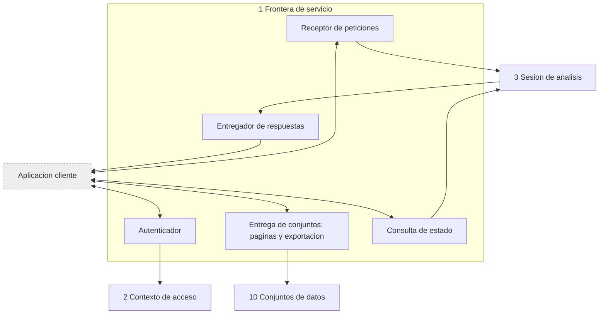

<!-- docs/03_parte_frontera_servicio.md -->
<!-- Bloque 2 - Contrato semantico. Nivel de formato pendiente (Bloque 3). -->

# Parte 1 — Frontera de servicio

> **Responsabilidad**
> Exponer el contrato publico del sistema: autenticar, recibir preguntas, entregar
> respuestas, vistas previas, paginas y exportaciones.

> **Invariante propio**
> Nada sale sin haber pasado por Contexto de acceso.

> **Consumidor mas exigente**
> Una aplicacion cliente de terceros que desconoce por completo la implementacion. El
> contrato se escribe para ese consumidor, no para el cliente propio: si solo sirve al
> cliente propio, deja de ser una frontera y pasa a ser un detalle interno.

---

## 1. Principio

> **El cliente no tiene logica de negocio.** Solo comunica y presenta.

De ahi se derivan tres consecuencias que atraviesan todo el sistema:

1. **El estado vive en el servidor.** Conversacion, estado analitico y plan se
   persisten del lado del servicio. El cliente envia texto y un identificador de
   conversacion. Abrir la misma cuenta desde otro dispositivo muestra todo el
   historial, que es la prueba de que el estado nunca estuvo en el cliente.
2. **Cualquiera puede escribir un cliente.** Si el propio cliente necesitara conocer
   algo que la frontera no expone, la frontera esta incompleta.
3. **El contrato es uno solo.** Si mas adelante existe una entrega incremental
   (progresiva, por eventos), es un **modo de entrega del mismo resultado**, nunca un
   formato paralelo. Un consumidor que no quiera entrega incremental debe poder pedir
   el mismo analisis y recibir el objeto completo de una vez. Dos formas del mismo
   contrato son dos productos que mantener.

---

## 2. Capacidades expuestas

Nivel semantico: **que** se puede pedir. El **como** se cierra en el Bloque 3.

| Capacidad | Entrada | Salida |
|---|---|---|
| Autenticar | Credencial | Sesion autenticada, contextos disponibles |
| Listar conexiones | — | Conexiones permitidas para el usuario |
| Abrir o continuar conversacion | Conexion, identificador opcional | Identificador de conversacion, estado analitico vigente |
| Preguntar | Texto, identificador de conversacion | Respuesta (seccion 3) |
| Responder una aclaracion | Texto, identificador de la aclaracion pendiente | Respuesta o nueva aclaracion |
| Reanudar analisis interrumpido | Identificador de analisis | Respuesta, o motivo de imposibilidad |
| Obtener pagina de un conjunto | Identificador de conjunto, rango | Filas del rango |
| Exportar conjunto | Identificador de conjunto, formato | Archivo, o rechazo con causa |
| Listar analisis guardados | Conversacion o usuario | Analisis con su pregunta, plan y cifras |
| Abrir analisis compartido | Identificador de analisis | Respuesta **re-ejecutada bajo el contexto del lector** |
| Consultar estado de un turno | Identificador de turno | Estado y avance |

La ultima capacidad existe porque un analisis puede tardar: sin ella, un cliente de
terceros no tiene forma de saber si el sistema sigue trabajando.

---

## 3. Forma de una respuesta

> **La respuesta analitica y el conjunto de datos son objetos distintos.**

Una respuesta nunca contiene el conjunto completo. Contiene la conclusion, la
evidencia resumida, el recuento y una **referencia** al conjunto.

```
answer
  turn:              t_57
  state:             answered
  sections:          (una por objetivo, con afirmaciones tipificadas)
  scope:             periodo, definiciones, universo, momento de captura
  drafting_origin:   validated_synthesis | minimal_response
  analysis_origin:   new | resumed | redone (con causa)
  suggestions
  datasets:
    - id:            ds_301
      total_rows:    1.240
      columns:       5
      preview:       (hasta el umbral configurado)
      exportable:    si
      captured_at:   2026-08-15 14:32
```

`drafting_origin` es visible para el cliente. Si la respuesta se degrado a la
version minima, el consumidor tiene derecho a saberlo.

`analysis_origin` distingue una respuesta nueva de una reanudada y, sobre todo, de
una **rehecha**: cuando un analisis no pudo reanudarse y se rehizo bajo condiciones
actuales, las cifras pueden diferir de las que el usuario vio antes. Sin esa senal, un
cambio de alcance del observador parece un cambio en los datos.

### Vista previa y truncamiento

Toda vista parcial **se identifica explicitamente como parcial**, con el recuento
total al lado. Ningun conjunto presentado como completo se trunca en silencio. Cuando
una operacion exige el conjunto completo y este excede los limites permitidos, la
respuesta es un rechazo con causa, no un resultado recortado.

---

## 4. Salidas que no son respuestas

Cuatro salidas legitimas ademas de la respuesta analitica. Un cliente de terceros debe
poder distinguirlas sin interpretar texto.

| Salida | Contenido | Que hace el cliente |
|---|---|---|
| **Aclaracion** | Ambiguedad detectada y opciones concretas | Presenta las opciones |
| **Rechazo** | Causa y accion sugerida | Muestra el motivo |
| **Fuera de alcance** | Que no puede hacerse y que si | Muestra alternativas |
| **Interrumpido** | Estado recuperable, pasos completados, ventana de validez | Ofrece reanudar |

Las cuatro son resultados normales del sistema, no errores de comunicacion. Un rechazo
por falta de permisos o por limite excedido es una respuesta correcta a una peticion
correcta, y el contrato debe reflejarlo asi.

---

## 4bis. Concurrencia e idempotencia

| Regla | Comportamiento |
|---|---|
| Un turno activo por conversacion | Un segundo turno se rechaza con causa `turn_in_progress`, indicando cual esta en ejecucion |
| Una reanudacion en curso por turno | Una segunda recibe `resumption_in_progress` |
| Conversaciones distintas del mismo usuario | Concurrentes, sin restriccion |

### Clave de idempotencia

Preguntar y exportar aceptan una **clave de idempotencia opcional**. Dos peticiones con
la misma clave devuelven el mismo turno en lugar de crear uno nuevo.

No es correccion del sistema sino cortesia hacia el consumidor, pero sin ella un doble
clic cuesta dos analisis completos — con su coste de modelo y de consultas.

### Presupuesto de turno

La respuesta puede declarar **insuficiencia por presupuesto**: el turno agoto su tiempo
total o su cantidad de llamadas al modelo. Es una causa distinta de la insuficiencia por
criterio y su remedio tambien lo es — acotar la pregunta, no cambiar los datos.

---

## 5. Autenticacion y contexto

| Regla |
|---|
| Toda capacidad exige credencial. No hay superficie anonima |
| La credencial identifica a un usuario, del cual se deriva el contexto de acceso |
| El contexto se resuelve al inicio del turno y queda congelado durante su ejecucion |
| Ninguna respuesta, pagina o exportacion sale sin verificacion de contexto vigente |
| Abrir un analisis compartido **re-ejecuta bajo el contexto del lector**, nunca filtra el resultado ajeno |

La frontera **no decide** permisos: consulta a Contexto de acceso. Su
responsabilidad es que ninguna salida esquive esa consulta.

---

## 6. Errores frente a rechazos

Distincion que el contrato publico debe dejar clara:

| Clase | Ejemplo | Naturaleza |
|---|---|---|
| **Rechazo** | Sin permiso, limite excedido, concepto inexistente | Resultado normal y deterministico |
| **Interrupcion** | Modelo o fuente no disponibles | Estado recuperable, con lo obtenido conservado |
| **Error de la peticion** | Credencial invalida, identificador inexistente, parametros malformados | Falla del consumidor |
| **Error del servicio** | Fallo no previsto | Falla del sistema, sin exponer detalles internos |

Un rechazo por permisos **no revela el concepto involucrado**: se informa como
limitacion de alcance. Decir "no podes ver el margen" confirma que el margen existe.

---

## 7. Estructura interna



| Sub-bloque | Responsabilidad |
|---|---|
| Autenticador | Valida credencial y obtiene contexto |
| Receptor de peticiones | Valida forma de la peticion y la entrega a Sesion |
| Entregador de respuestas | Serializa la respuesta y sus referencias a conjuntos |
| Entrega de conjuntos | Paginas y exportaciones, con revalidacion de contexto |
| Consulta de estado | Informa avance de un turno en curso |

La frontera **no contiene logica de negocio**. Si aparece una regla de dominio aqui,
esta en la caja equivocada.

---

## 8. Verificacion

| Nivel | Que verifica |
|---|---|
| Autenticacion | Ninguna capacidad responde sin credencial valida |
| Contexto | Toda salida verifico contexto vigente |
| Separacion | Una respuesta nunca contiene el conjunto completo |
| Parcialidad | Toda vista parcial se identifica como tal, con recuento total |
| Rechazos | Un rechazo por permisos no nombra el concepto |
| Compartido | Abrir un analisis ajeno re-ejecuta bajo el contexto del lector |
| Exportacion | Con contexto cambiado se rechaza y se ofrece re-ejecutar |
| Degradacion | `drafting_origin` refleja correctamente si hubo degradacion |
| Interoperabilidad | Un consumidor sin entrega incremental obtiene el mismo objeto completo |
| Estado | Un turno en curso es consultable mientras se ejecuta |

La penultima fila es la que demuestra que la frontera es realmente publica.

---

## 9. Decisiones registradas

| Decision | Supuesto | Senal de invalidacion | Tipo |
|---|---|---|---|
| Cliente sin logica; todo el estado en el servidor | El cliente puede ser reemplazado por otro sin perder capacidades | Una funcion util resulta imposible sin logica en el cliente | Sistema |
| API como frontera publica consumible por terceros | Habra consumidores distintos del cliente propio | El unico consumidor real es el cliente propio y el costo no se justifica | Sistema |
| Contrato unico; la entrega incremental es un modo, no un formato | El mismo resultado se puede entregar de dos maneras | La entrega incremental necesita informacion que el objeto completo no lleva | Sistema |
| Respuesta y conjunto como objetos separados | Un analisis no es lo mismo que los datos que produjo | Los consumidores necesitan siempre ambos juntos | Sistema |
| Rechazos como resultado normal, no como error | La mayoria de los rechazos son informacion util | Los consumidores tratan todo rechazo como error igualmente | Sistema |
| `drafting_origin` visible para el cliente | El consumidor tiene derecho a saber si hubo degradacion | Exponerlo confunde sin aportar | Implementacion |
| Clave de idempotencia opcional | Los consumidores reintentan y los usuarios hacen doble clic | Nadie la usa y el codigo queda muerto | Implementacion |
| Insuficiencia por presupuesto expuesta como causa propia | Su remedio difiere del de la insuficiencia por criterio | Los consumidores tratan ambas igual | Implementacion |

---

## 10. Puntos abiertos

1. **Mecanismo de credencial** y su ciclo de vida. Se cierra en el Bloque 3.
2. **Modo de entrega incremental**: si entra en el MVP o se difiere. La recomendacion
   previa es entrega por eventos sobre el mismo contrato, con el objeto completo
   disponible para quien no la use.
3. **Cancelacion de un analisis en curso**: capacidad expuesta o no. Depende del modo
   de entrega elegido.
4. **Formatos de exportacion** concretos y su limite de tamano.
5. **Versionado del contrato publico** y politica de compatibilidad hacia atras.


---

## Ubicacion en el proyecto

| Aspecto | Valor |
|---|---|
| Caja del diagrama | **1 Frontera de servicio** |
| Codigo | `src/querypilot/service_boundary/` |
| Tests | `tests/service_boundary/` — subcarpetas: unit/ behavior/ |
| Sub-peldano de implementacion | 5.6 de `MAPA_AVANCE.md` |
| Estado actual | Pendiente |

### Modulos que la componen

| Modulo | Proposito |
|---|---|
| `authentication` | Valida la clave de API y obtiene el contexto |
| `request_intake` | Forma de la peticion y clave de idempotencia |
| `answer_delivery` | Serializa la respuesta y sus referencias a conjuntos |
| `dataset_delivery` | Paginas y exportacion, con revalidacion de contexto |
| `event_channel` | Canal SSE de progreso |
| `turn_status` | Consulta de avance de un turno en curso |

Las firmas concretas se definen al implementar. Este documento fija **el contrato**, no
la implementacion: cualquier firma que lo respete es valida.

### Pasos de implementacion

1. Modelos de peticion y respuesta desde `canonical_language`.
2. Autenticacion por clave de API y resolucion de contexto.
3. Endpoints sincronos: preguntar, estado, resultado, aclarar, reanudar.
4. Entrega de conjuntos: paginas y exportacion, con revalidacion de contexto.
5. Canal de eventos, reutilizando el mismo objeto de respuesta final.
6. Clave de idempotencia y guarda de concurrencia.

### Nivel de formato

Los modelos canonicos que esta parte recibe y entrega estan definidos en
`14_contratos_formato.md`. La **regla de herencia estricta** sigue vigente: si un formato
no puede transportar algo de este contrato, se revisa este contrato, no el formato.
