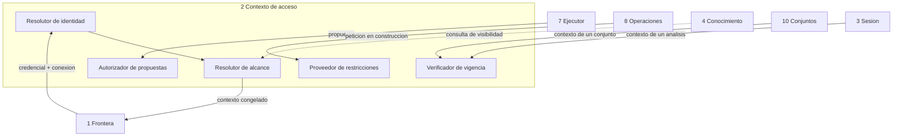

<!-- docs/04_parte_contexto_acceso.md -->
<!-- Bloque 2 - Contrato semantico. Nivel de formato pendiente (Bloque 3). -->

# Parte 2 — Contexto de acceso

> **Responsabilidad**
> Determinar identidad, alcance de datos y operaciones permitidas para cada turno.

> **Invariante propio**
> Un turno tiene un unico contexto vigente, **congelado durante toda su ejecucion**.
> Nada sale del sistema sin haber pasado por esta parte.

> **Consumidor mas exigente**
> Operaciones analiticas: no le basta con "puede o no puede". Necesita restricciones
> **incorporables a la peticion de datos antes de ejecutarla**. Un contrato booleano
> obligaria a filtrar despues de obtener, que es exactamente el modo de falla que este
> diseno evita.

---

## 1. Principio

> **La restriccion viaja antes de la consulta, nunca despues del resultado.**

Si Juan solo puede ver sus clientes y pregunta cuanto vendieron todos los vendedores,
el sistema no debe traer todo y ocultar lo ajeno: **el modelo nunca debe recibir esos
datos y la consulta nunca debe pedirlos**. Esconderlos en la interfaz no es control de
acceso.

De ahi que esta parte no sea una capa de autorizacion en la frontera, sino un
participante del analisis: aporta restricciones que se incorporan a la peticion, y
condiciona el catalogo que el modelo llega a ver.

---

## 2. Modelo

```
Usuario
 ├─ identidad
 ├─ rol
 ├─ conexiones permitidas
 ├─ alcance de datos
 ├─ conceptos ocultos
 ├─ operaciones habilitadas
 └─ limites propios
```

| Elemento | Contenido |
|---|---|
| **Identidad** | Quien es, de forma estable y auditable |
| **Rol** | Agrupacion de permisos. En el MVP: administrador, analista, usuario restringido |
| **Conexiones permitidas** | Sobre que bases puede preguntar |
| **Alcance de datos** | Restriccion de filas expresada en dimensiones canonicas |
| **Conceptos ocultos** | Metricas o dimensiones que no existen para este usuario |
| **Operaciones habilitadas** | Subconjunto del catalogo de operaciones |
| **Limites propios** | Maximo de filas exportables, y otros topes por rol |

El alcance de datos se expresa **en vocabulario canonico del dominio**, no en columnas
fisicas: `salesperson = u_ana`, no `ventas.id_vendedor = 47`. Eso lo hace incorporable a
una peticion de datos sin que esta parte conozca el esquema.

### Roles del MVP

| Rol | Alcance |
|---|---|
| Administrador | Toda la conexion. Gestiona usuarios y accesos |
| Analista | Toda la conexion, sin gestion |
| Usuario restringido | Alcance acotado por una dimension, con conceptos ocultos |

Un unico caso de restriccion implementado alcanza para demostrar que la arquitectura
nacio considerando el control de acceso. No se construye un sistema de identidades
completo en el MVP.

**Integrador y administrador son roles distintos**, aunque en una empresa chica sean
la misma persona: uno ensena la semantica de la fuente, el otro administra quien
accede. Separarlos conceptualmente evita que la interfaz del integrador se convierta
en una consola de administracion.

---

## 3. Servicios que presta

| Servicio | Quien lo consume | Devuelve |
|---|---|---|
| Resolver el contexto de un turno | Frontera | Contexto congelado |
| Autorizar una propuesta | Ejecutor | Aceptacion, o rechazo con causa |
| Aportar restricciones a una peticion | Operaciones | Restricciones en vocabulario canonico |
| Declarar conceptos visibles | Conocimiento | Lista para filtrar el catalogo |
| Verificar vigencia de un contexto anterior | Conjuntos de datos, Sesion | Vigente o no vigente, con causa |

### Ejemplo 1 — Contexto sin restriccion

```
ctx_884
  user:            u_juan
  role:            gerente comercial
  connection:      conn_distrib
  data_scope:      sin restriccion
  hidden_concepts: unit_cost, total_cost, margin
  operations:      catalogo base completo
  export:          permitida
  issued_at:       2026-08-15 14:31
```

### Ejemplo 2 — Contexto restringido

```
ctx_912
  user:            u_ana
  role:            usuario restringido
  connection:      conn_distrib
  data_scope:      salesperson = u_ana
  hidden_concepts: unit_cost, margin
  operations:      catalogo base menos calculate_share, compare_against_peers
  export:          permitida hasta 5.000 filas
  issued_at:       2026-08-15 09:12
```

### Ejemplo 3 — Verificacion de vigencia

```
Entrada:  ctx_884, momento 2026-08-15 17:10
Salida:   vigente, sin cambios desde su emision

Entrada:  ctx_912, momento 2026-08-16 08:00, tras reasignacion de cartera
Salida:   no vigente
          causa:  alcance de datos modificado
          accion: rehacer bajo contexto actual
```

---

## 4. Reglas

### 4.1 La dimension no se oculta por restriccion de filas

Tener acceso a un solo vendedor **no convierte la dimension `salesperson` en informacion
sensible**. Ana puede agrupar por vendedor; simplemente obtendra un solo grupo.

Lo que debe impedirse son las **operaciones que necesitan el universo no autorizado**
para comparar, rankear contra terceros o calcular derivados. Una dimension se oculta
solo cuando existe una regla explicita que declara su existencia como sensible.

Esta distincion importa porque la alternativa —ocultar toda dimension sobre la que hay
restriccion— degrada el producto sin ganar seguridad.

### 4.2 El denominador es el punto de fuga

> Una operacion que necesita un total, un denominador o un universo mayor que el
> autorizado **se rechaza**. Jamas se calcula sobre el subconjunto autorizado y se
> presenta como si fuera el total.

El modo de fuga tipico no es mostrar filas prohibidas: es mostrar un **porcentaje
sobre un total prohibido**, del cual el total se deduce por aritmetica.

### 4.3 Declaracion de alcance obligatoria

Toda operacion ejecutada sobre universo autorizado publica su alcance, y la respuesta
lo refleja: "los diez mejores **entre tus clientes**". Un resultado correcto presentado
sin su alcance es enganoso, aunque ningun dato prohibido haya salido.

### 4.4 Silencio selectivo

Un rechazo por concepto oculto se informa como limitacion de alcance **sin nombrar el
concepto**. Decir "no podes ver el margen" confirma que el margen existe y esta
calculado. Coherente con el filtrado del catalogo: si no aparece en el catalogo,
tampoco aparece en el rechazo.

### 4.5 Congelamiento por turno

El contexto se resuelve una vez al inicio del turno y no cambia durante su ejecucion,
aunque los permisos se modifiquen mientras tanto. Un analisis a mitad de camino no
puede ejecutar dos pasos bajo reglas distintas.

Los cambios se detectan en los limites: al reanudar, al exportar, al abrir un analisis
compartido.

### 4.6 Nunca se re-filtra

Un conjunto de datos pertenece al contexto que lo produjo. Cuando el contexto cambia o
cuando otro usuario abre un analisis compartido, **no se filtra el conjunto
existente**: se re-ejecuta bajo el contexto vigente.

Compartir un analisis comparte su **definicion reproducible** —pregunta, plan,
alcance— no sus filas.

---

## 5. Puntos de aplicacion

| Momento | Comprobacion |
|---|---|
| Inicio de turno | Resolucion y congelamiento del contexto |
| Entrega de catalogos al modelo | Filtrado de conceptos y operaciones visibles |
| Validacion de propuesta | Autorizacion, antes de cualquier otra validacion cara |
| Construccion de peticion | Incorporacion de restricciones de filas |
| Materializacion de conjunto | Ligadura del conjunto al contexto |
| Reutilizacion de conjunto | Verificacion de vigencia |
| Reanudacion de analisis | Verificacion de vigencia; si cambio, se reinicia |
| Exportacion | Verificacion de vigencia y de limite propio de filas |
| Apertura de analisis compartido | Resolucion bajo el contexto del lector |

La autorizacion ocupa el **segundo lugar en el orden de validaciones** del Ejecutor,
inmediatamente despues de comprobar que el objetivo existe: es la validacion mas
restrictiva y una de las mas baratas, y un rechazo por permisos nunca debe haber
consultado la fuente.

---

## 6. Estructura interna



| Sub-bloque | Responsabilidad |
|---|---|
| Resolutor de identidad | De credencial a usuario y rol |
| Resolutor de alcance | De usuario y conexion a alcance, conceptos ocultos y limites |
| Autorizador de propuestas | Acepta o rechaza con causa, sin revelar lo oculto |
| Proveedor de restricciones | Entrega restricciones en vocabulario canonico |
| Verificador de vigencia | Compara un contexto emitido contra el estado actual |

---

## 7. Verificacion

| Nivel | Que verifica |
|---|---|
| Filtrado | Un concepto oculto no aparece en el catalogo entregado al modelo |
| Rechazo | Una propuesta sobre concepto oculto se rechaza sin nombrarlo |
| Restriccion | La peticion construida bajo contexto restringido lleva la restriccion de filas |
| Universo | `calculate_share` se rechaza bajo contexto restringido |
| Dimension | Una dimension con restriccion de filas **sigue disponible** para agrupar |
| Alcance | El resultado bajo contexto restringido declara su alcance |
| Congelamiento | Un cambio de permisos a mitad de turno no altera el turno en curso |
| Vigencia | Un conjunto de un contexto invalidado no se reutiliza ni se exporta |
| Reanudacion | Con contexto cambiado se reinicia, no se reanuda |
| Compartido | Un analisis abierto por otro usuario se re-ejecuta bajo su contexto |

Las tres ultimas filas son las que demuestran que el control de acceso no es
cosmetico. Conviene que existan desde el primer dia, aunque el modelo de roles sea
minimo.

---

## 8. Decisiones registradas

| Decision | Supuesto | Senal de invalidacion | Tipo |
|---|---|---|---|
| Contexto de acceso es entidad del dominio desde el inicio, no capa agregada | Agregarlo despues obligaria a atravesar todas las partes | El modelo de permisos resulta innecesario incluso en uso real | Sistema |
| La restriccion viaja antes de la consulta | Toda restriccion es expresable en vocabulario canonico | Aparece una regla de acceso no expresable como filtro de dimension | Sistema |
| Alcance en vocabulario canonico, no en columnas fisicas | Conocimiento puede traducirlo a estructura fisica | Una regla necesita referirse a una columna sin concepto de negocio | Sistema |
| Rechazo de operaciones sobre universo no autorizado | Es preferible no responder a responder con un total enganoso | El rechazo bloquea un uso legitimo y frecuente | Sistema |
| Dimension disponible pese a restriccion de filas | La existencia de la dimension no es sensible por si misma | Aparece un caso donde la sola existencia revela informacion | Sistema |
| Contexto congelado por turno | Un turno es suficientemente corto | Turnos largos conviven con cambios frecuentes de permisos | Sistema |
| Modelo de roles minimo en el MVP | Tres roles alcanzan para demostrar la arquitectura | Un usuario real necesita permisos que los tres roles no expresan | Implementacion |

---

## 9. Puntos abiertos

1. **Origen de la identidad**: usuarios propios del sistema, o delegacion a un
   proveedor externo. Se cierra en el Bloque 3.
2. **Granularidad de conceptos ocultos**: por metrica completa, o por combinacion de
   metrica y dimension.
3. **Alcance con mas de una dimension** (region **y** canal): soportado desde el
   inicio o diferido.
4. **Analisis compartidos**: si se comparte a usuarios concretos o por enlace, y como
   se comporta cuando el lector no tiene acceso a la conexion.


---

## Ubicacion en el proyecto

| Aspecto | Valor |
|---|---|
| Caja del diagrama | **2 Contexto de acceso** |
| Codigo | `src/querypilot/access_context/` |
| Tests | `tests/access_context/` — subcarpetas: unit/ contract/ |
| Sub-peldano de implementacion | 5.6 de `MAPA_AVANCE.md` |
| Estado actual | Pendiente |

### Modulos que la componen

| Modulo | Proposito |
|---|---|
| `identity_resolver` | De credencial a usuario y rol |
| `scope_resolver` | Alcance, conceptos ocultos y limites por rol |
| `proposal_authorizer` | Acepta o rechaza con causa, sin revelar lo oculto |
| `restriction_provider` | Restricciones en vocabulario canonico |
| `validity_checker` | Compara un contexto emitido contra el estado actual |

Las firmas concretas se definen al implementar. Este documento fija **el contrato**, no
la implementacion: cualquier firma que lo respete es valida.

### Pasos de implementacion

1. Modelo de usuario, rol, alcance y conceptos ocultos.
2. Resolucion de identidad desde la clave de API.
3. Emision del contexto congelado por turno.
4. Proveedor de restricciones en vocabulario canonico.
5. Autorizador de propuestas, con silencio selectivo.
6. Verificador de vigencia.

### Nivel de formato

Los modelos canonicos que esta parte recibe y entrega estan definidos en
`14_contratos_formato.md`. La **regla de herencia estricta** sigue vigente: si un formato
no puede transportar algo de este contrato, se revisa este contrato, no el formato.
