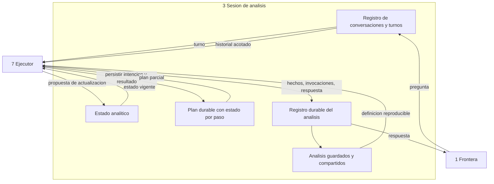

<!-- docs/05_parte_sesion_analisis.md -->
<!-- Bloque 2 - Contrato semantico. Nivel de formato pendiente (Bloque 3). -->

# Parte 3 — Sesion de analisis

> **Responsabilidad**
> Conservar **que ocurrio**: conversacion, estado analitico, plan con estado por paso,
> invocaciones, hechos, respuestas y analisis guardados.

> **Invariante propio**
> El plan sobrevive a la caida del proceso. Nada de lo necesario para reanudar o
> auditar vive en memoria.

> **Consumidor mas exigente**
> El Ejecutor, en la reanudacion: necesita distinguir un paso que **no se ejecuto** de
> uno que **se ejecuto y cuyo resultado se desconoce**. Un registro que solo guarde
> resultados no permite esa distincion y haria repetir operaciones ya ejecutadas.

---

## 1. Sesion frente a Ejecutor

Dos cajas vecinas que se confunden con facilidad:

| Parte | Responde |
|---|---|
| **Sesion** | Que ocurrio. Estado durable |
| **Ejecutor** | Que hay que hacer ahora. Comportamiento y orquestacion |

El Ejecutor **decide que persistir y cuando**; Sesion **es quien lo persiste**. La
separacion permite que el Ejecutor sea reemplazable sin perder historia, y que la
historia sea consultable sin ejecutar nada.

### Dueno del estado

> **Sesion es la unica duena del estado analitico.** El Ejecutor propone su
> actualizacion; no lo modifica por su cuenta.

Sin esa regla, dos partes podrian modificar el mismo estado y el orden de las
escrituras determinaria el resultado. Es la respuesta explicita a la pregunta
adversarial de quien es dueno del estado cuando dos partes quieren cambiarlo.

---

## 2. Que conserva

| Entidad | Contenido |
|---|---|
| **Conversacion** | Turnos de un usuario sobre una conexion |
| **Turno** | Pregunta, contexto de acceso usado, estado, momento |
| **Aclaracion** | Ambiguedad detectada, opciones ofrecidas y respuesta del usuario |
| **Estado analitico** | Periodo, filtros, metrica, dimension, definiciones vigentes y ultima referencia |
| **Plan de analisis** | Objetivos, pasos, condiciones, criterio de suficiencia y estado por paso |
| **Invocacion** | Operacion, parametros, momento de inicio y de fin, duracion, resultado |
| **Hechos** | Con su `objective_id` y su referencia a la invocacion que los produjo |
| **Respuesta** | Afirmaciones, alcance, drafting_origin, sugerencias |
| **Analisis guardado** | Un turno marcado para conservarse mas alla de la conversacion |
| **Referencias a conjuntos** | Identificadores, no las filas |

Sesion **no guarda filas de datos**: las filas viven en Conjuntos de datos. Guarda las
referencias y los descriptores necesarios para saber que existio.

---

## 3. Estado analitico

Es lo que da sentido a "saca esos tres y compara de nuevo". No es el historial de
mensajes: es un objeto estructurado.

| Campo | Ejemplo |
|---|---|
| Periodo | junio y julio de 2026 |
| Filtros | ninguno |
| Metrica | net_revenue |
| Dimension | customer |
| Definiciones aplicadas | facturacion = ventas menos notas de credito |
| Ultima referencia | ds_301, con sus tres contribuyentes principales |
| Version semantica | sem_v7 |

> **Nota de implementacion.** `AnalyticalState` ya esta modelado en
> `canonical_language/shared_values.py`, antes de que `analysis_session/` exista como
> caja: `07_parte_interpretacion.md` (`reference_resolver`, bloque 1.6) lo necesita
> como entrada antes que Sesion llegue a persistirlo. Vive en `canonical_language/`
> por el mismo motivo que el resto del vocabulario compartido -- lo consumen dos
> partes que no deben depender una de la otra.

### Reglas de actualizacion

| Situacion | Efecto sobre el estado analitico |
|---|---|
| Turno `answered` | Se actualiza con el alcance efectivamente usado |
| Turno `rejected` | **No se actualiza.** Un rechazo no cambia el contexto de trabajo |
| `awaiting_clarification` | No se actualiza hasta que el turno se complete |
| Turno con multiples objetivos | Se actualiza con el ultimo objetivo satisfecho, o queda sin cambio si ninguno lo fue |
| Turno declarado `new` por Interpretacion | Se reemplaza, no se combina |
| Turno `continuation` | Se actualiza solo en lo que la continuacion declaro heredar y modificar |

**El estado analitico vigente siempre es visible para el usuario.** Es un invariante
del sistema, no una caracteristica de interfaz: el usuario debe poder ver sobre que
alcance esta trabajando sin tener que deducirlo de la conversacion.

### Historial conversacional

Distinto del estado analitico y con otro proposito: resolver referencias del lenguaje
("esos tres", "y en junio"). Se entrega **acotado** a Interpretacion. Guardar toda la
conversacion y entregarla entera encarece cada turno sin mejorar la resolucion de
referencias, que casi siempre apuntan a los ultimos turnos.

---

## 4. Plan durable y reanudacion

El plan no es una estructura en memoria del proceso que lo ejecuta: es estado
persistido con **estado por paso**.

| Estado de paso | Significado |
|---|---|
| `pending` | Declarado, no iniciado |
| `skipped` | Su condicion no se cumplio |
| `started` | Hay registro previo, no hay registro posterior |
| `completed` | Con hechos y resultado registrados |
| `rejected` | Con causa |
| `not_executed` | Dependia de un objetivo que fallo o fue rechazado |

### Registro antes y despues

> Registrar **antes** de invocar es lo que distingue "no se ejecuto" de "se ejecuto y
> no sabemos el resultado".

Un paso en estado `started` tras un reinicio es exactamente el caso que un registro
solo-de-resultados no puede detectar, y el que produce operaciones repetidas.

### Concurrencia

> **Una conversacion ejecuta un turno por vez.** Un segundo turno sobre la misma
> conversacion se rechaza con causa `turn_in_progress`, informando cual esta en ejecucion.
> Conversaciones distintas del mismo usuario si son concurrentes.

Sin esta regla, dos turnos simultaneos —un usuario con dos pestanas— leerian el mismo
estado analitico y ambos propondrian actualizarlo al terminar: el resultado dependeria
del orden de escritura, y una continuacion podria heredar de un turno que todavia no
termino.

> **Un turno en `recoverable` admite una sola reanudacion en curso.** La primera la
> toma; una segunda recibe rechazo con causa `resumption_in_progress`.

Dos reanudaciones simultaneas no corrompen datos —toda operacion es lectura— pero
duplican coste y pueden producir dos conjuntos con capturas distintas para el mismo
paso, que es justo lo que la coherencia de captura viene a evitar.

### Ventanas de validez

| Estado | Ventana | Al vencer |
|---|---|---|
| `recoverable` | Derivada (ver abajo) | Pasa a `failed`; solo puede rehacerse |
| `awaiting_clarification` | Mas larga, configurable | Pasa a `failed` |

La asimetria es deliberada: una aclaracion espera a una persona, que puede tardar; una
interrupcion tecnica espera a que los conjuntos sigan vivos, y esos vencen antes.

### La ventana de `recoverable` se deriva, no se inventa

> La ventana de `recoverable` de un turno **no excede la vigencia mas corta entre los
> conjuntos referenciados por su plan**. Si el plan no referencia ningun conjunto que
> aporte esa cota, se aplica un maximo operativo configurable.

Motivo: reanudar solo tiene sentido mientras vivan los conjuntos que evitarian repetir
pasos. Si vencieron, los pasos "validos" se re-ejecutan igual, su evidencia pasa a ser
**reconstruida**, y la reanudacion deja de ser mas barata que rehacer — conservando en
cambio la ilusion de continuidad.

### El turno como frontera de consistencia

> **Un turno es una frontera de consistencia.** Reanudar conserva el mismo `turn_id`;
> rehacer crea uno nuevo. Dentro de un turno se mantienen constantes **el contexto de
> acceso, la version semantica y el espacio de evidencia**.

La version semantica se congela al inicio del turno igual que el contexto. Si el
integrador publica una version nueva mientras un turno esta ejecutando, **el turno en
curso no se ve afectado**: de lo contrario un paso se calcularia con una definicion de
facturacion y el siguiente con otra, y ambos hechos serian validos por separado.

El cambio se detecta en los limites: al reanudar, al reutilizar conjuntos y al abrir
analisis guardados.

De ahi se derivan, sin necesidad de reglas adicionales: que el contexto se congele por
turno, que un turno rehecho no pueda citar hechos del turno fallido, y que los conjuntos
de un turno pertenezcan a su contexto y no se re-filtren.

---

## 5. Registro durable del analisis — auditoria

Distincion que separa dos cosas que se confunden:

| Concepto | Sirve a | Puede expirar |
|---|---|---|
| **Telemetria / observabilidad** | El operador: por que tarda, cuanto cuesta | Si |
| **Registro durable del analisis** | La trazabilidad del producto: por que el sistema dijo lo que dijo | No |

El registro durable **vive en Sesion** y forma parte del producto.

### Que conserva permanentemente

```
usuario
pregunta original y aclaraciones
contexto de acceso utilizado
version semantica vigente
objetivos, plan y condiciones
invocaciones con sus parametros
hechos producidos
respuesta entregada y su origen de redaccion
marcas de tiempo: de los datos y de la respuesta
```

### Que puede ser efimero

Las filas. La evidencia por registros es temporal; si fue descartada, solo se recupera
por re-ejecucion explicita y **se identifica como evidencia reconstruida, no como
original**.

Formulacion del invariante correspondiente:

> Toda afirmacion presentada como dato conserva permanentemente su **trazabilidad
> logica** —que operacion la produjo, con que parametros, sobre que alcance y en que
> momento—. La evidencia detallada basada en registros puede ser temporal.

Reconstruir tres horas despues, con la base cambiada, no produce "la evidencia
original": produce una reconstruccion con datos potencialmente distintos, y el sistema
lo dice.

---

## 6. Analisis guardados y compartidos

Un analisis guardado conserva pregunta, plan, contexto usado, version semantica, cifras
finales y referencias a invocaciones.

### Compartir

> Compartir un analisis comparte **su definicion reproducible** —pregunta, plan,
> alcance— **no sus filas**.

Al abrirlo, otro usuario lo **re-ejecuta bajo su propio contexto de acceso**. Nunca se
filtra el conjunto ajeno: un conjunto pertenece al contexto que lo produjo.

Consecuencia visible: dos personas pueden abrir el mismo analisis y ver cifras
distintas, cada una correcta dentro de su alcance, y cada una con su alcance declarado.

### Conservacion de evidencia

Fuera del MVP, pero previsto: un analisis marcado como importante o incorporado a un
informe podria conservar su evidencia original en lugar de dejarla vencer. No se hace
obligatorio porque implicaria retener conjuntos indefinidamente.

---

## 7. Estructura interna



| Sub-bloque | Responsabilidad |
|---|---|
| Registro de conversaciones y turnos | Historia conversacional y estados de turno |
| Estado analitico | Unico dueno; aplica las reglas de actualizacion |
| Plan durable | Plan con estado por paso; base de la reanudacion |
| Registro durable del analisis | Auditoria permanente del producto |
| Analisis guardados y compartidos | Definiciones reproducibles, no filas |

---

## 8. Verificacion

| Nivel | Que verifica |
|---|---|
| Durabilidad | Cortando el proceso en cada punto, el plan se recupera completo |
| Estados de paso | Un paso `started` se distingue de uno `pending` |
| Reanudacion | No se repiten pasos ya completados |
| Estado analitico | Un turno rechazado no lo modifica |
| Estado analitico | Una `continuation` actualiza solo lo declarado |
| Estado analitico | Es siempre consultable por el usuario |
| Ventanas | `recoverable` y `awaiting_clarification` vencen de forma independiente |
| Auditoria | Un analisis de hace meses se reconstruye con su version semantica |
| Evidencia | La reconstruida se identifica como tal, nunca como original |
| Compartido | Abrirlo con otro contexto produce re-ejecucion, no filtrado |
| Historial | Se entrega acotado, no completo |

La primera y la octava son las que sostienen las dos promesas de esta parte:
sobrevivir a un reinicio y poder explicar meses despues por que el sistema dijo lo que
dijo.

---

## 9. Decisiones registradas

| Decision | Supuesto | Senal de invalidacion | Tipo |
|---|---|---|---|
| Estado conversacional y analitico en el servidor | El cliente no tiene logica de negocio | Aparece una capacidad util que exige estado en el cliente | Sistema |
| Estado analitico como objeto estructurado, separado del historial | El contexto de calculo no es una pila de mensajes | Resulta suficiente re-deducir el alcance del texto en cada turno | Sistema |
| Sesion es la unica duena del estado analitico | Un solo dueno evita escrituras concurrentes ambiguas | El Ejecutor necesita modificarlo dentro de un turno | Sistema |
| Plan durable con estado por paso | La reanudacion debe evitar repetir operaciones | La reanudacion resulta tan infrecuente que no justifica el registro | Sistema |
| Registro antes y despues de cada invocacion | El coste de escritura es despreciable frente al turno | La persistencia domina la latencia | Sistema |
| Trazabilidad logica permanente, evidencia por filas efimera | Conservar filas indefinidamente es caro y rara vez necesario | Auditorias reales exigen las filas originales | Sistema |
| Compartir comparte la definicion reproducible, no las filas | Re-ejecutar bajo el contexto del lector es viable | Re-ejecutar resulta prohibitivamente caro | Sistema |
| Un turno rechazado no altera el estado analitico | El rechazo no representa un avance del trabajo | Los usuarios esperan que un rechazo cambie el alcance | Implementacion |
| El turno es frontera de consistencia | Un turno es corto y coherente; reanudar lo conserva, rehacer lo reemplaza | Aparece un caso legitimo que necesita evidencia de dos turnos | Sistema |
| Ventana de `recoverable` derivada de la vigencia de los conjuntos | Reanudar sin conjuntos vivos no es mas barato que rehacer | La reanudacion tardia resulta valiosa igual | Sistema |
| Version semantica congelada por turno | Un turno es corto frente a la frecuencia de cambios semanticos | Los cambios semanticos son tan frecuentes que congelar produce respuestas obsoletas | Sistema |
| Un turno activo por conversacion | El uso natural es secuencial dentro de una conversacion | Los usuarios necesitan lanzar analisis en paralelo sobre el mismo hilo | Sistema |
| Una reanudacion en curso por turno | Reanudar dos veces solo duplica coste | — | Sistema |
| Historial conversacional acotado | Las referencias apuntan a turnos recientes | Aparecen referencias a turnos lejanos con frecuencia | Implementacion |

---

## 10. Puntos abiertos

1. **Profundidad del historial** entregado a Interpretacion.
2. **Retencion del registro durable**: cuanto tiempo se conserva un analisis no
   guardado explicitamente.
2bis. **Durabilidad de los conjuntos frente al reinicio del proceso**. La reanudacion
   tras reinicio solo se promete si los conjuntos sobreviven; de lo contrario la ventana
   de `recoverable` colapsa a cero. Ver `10_parte_conjuntos_datos.md`.
3. **Maximo operativo** de la ventana de `recoverable` cuando el plan no referencia
   conjuntos que aporten cota, y duracion de `awaiting_clarification`.
4. **Modelo de compartido**: a usuarios concretos o por enlace, y comportamiento cuando
   el lector no tiene acceso a la conexion.
5. **Conservacion explicita de evidencia** para analisis importantes. Fuera del MVP,
   pero condiciona el modelo de retencion.


---

## Ubicacion en el proyecto

| Aspecto | Valor |
|---|---|
| Caja del diagrama | **3 Sesion de analisis** |
| Codigo | `src/querypilot/analysis_session/` |
| Tests | `tests/analysis_session/` — subcarpetas: unit/ durability/ concurrency/ |
| Sub-peldano de implementacion | 5.6 de `MAPA_AVANCE.md` |
| Estado actual | Pendiente |

### Modulos que la componen

| Modulo | Proposito |
|---|---|
| `conversation_store` | Conversaciones, turnos y aclaraciones |
| `analytical_state` | Unico dueno del estado analitico |
| `durable_plan` | Plan con estado por paso |
| `analysis_ledger` | Registro durable: auditoria del producto |
| `saved_analyses` | Definiciones reproducibles, no filas |
| `concurrency_guard` | Un turno activo por conversacion; una reanudacion por turno |

Las firmas concretas se definen al implementar. Este documento fija **el contrato**, no
la implementacion: cualquier firma que lo respete es valida.

### Pasos de implementacion

1. Esquema y migraciones de conversaciones, turnos y estado analitico.
2. Reglas de actualizacion del estado analitico.
3. Plan durable con estado por paso; registro previo y posterior.
4. Registro durable del analisis con version semantica y de prompt.
5. Ventanas de validez y transiciones a `failed`.
6. Guarda de concurrencia.
7. Analisis guardados y compartidos.

### Nivel de formato

Los modelos canonicos que esta parte recibe y entrega estan definidos en
`14_contratos_formato.md`. La **regla de herencia estricta** sigue vigente: si un formato
no puede transportar algo de este contrato, se revisa este contrato, no el formato.
