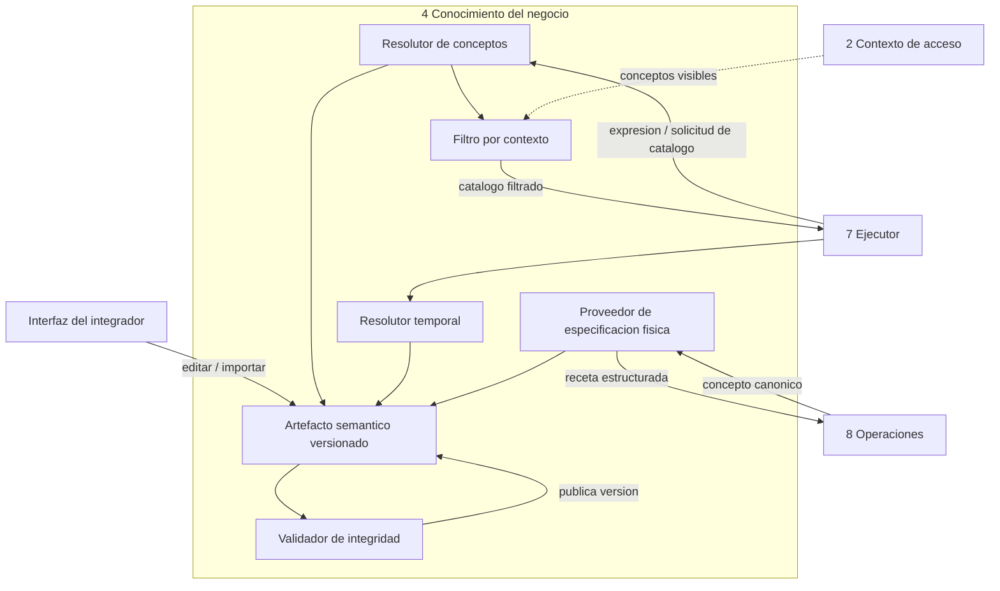

<!-- docs/06_parte_conocimiento_negocio.md -->
<!-- Bloque 2 - Contrato semantico. Nivel de formato pendiente (Bloque 3). -->

# Parte 4 — Conocimiento del negocio

> **Responsabilidad**
> Ser la unica fuente de verdad sobre que significan los conceptos del negocio y de
> donde se obtienen.

> **Invariante propio**
> Ningun otro componente infiere significado ni ubicacion fisica. Un concepto que no
> esta declarado aqui no existe para el sistema.

> **Consumidor mas exigente**
> Operaciones analiticas: necesita una especificacion ejecutable —fuentes, campos,
> relaciones, expresiones, granularidad— y no prosa. Si el contrato se escribiera
> pensando en Interpretacion, que solo necesita vocabulario, Operaciones no podria
> usarlo.

---

## 1. Frontera de la parte

Esta caja responde **que significa** y **donde esta**. No responde **como se obtiene**.

| Hace | No hace |
|---|---|
| Declara metricas, dimensiones y su significado | Genera consultas |
| Declara de que fuentes, campos y relaciones se obtienen | Conoce el dialecto del motor |
| Resuelve expresiones de negocio a conceptos canonicos | Ejecuta nada |
| Resuelve expresiones temporales a fechas | Decide que calculo hacer |
| Declara umbrales y acepciones por defecto | Aplica permisos |

Reparto de las tres responsabilidades vecinas:

```
Conocimiento     -> que significa y donde esta
Operaciones      -> que calculo analitico realizar
Acceso a datos   -> como ejecutar la obtencion contra la fuente concreta
```

> **Una metrica no es un nombre: es una definicion de negocio vinculada a una receta
> fisica reproducible para obtenerla.**

---

## 2. El artefacto semantico

La fuente de verdad es un **documento versionado**, no una base de configuracion
opaca. Es importable y exportable, y por lo tanto revisable en control de versiones,
comparable entre versiones y discutible como cualquier otro artefacto de ingenieria.

La interfaz del integrador es un **editor delgado** sobre ese documento, mas el
probador de interpretacion. No oculta el modelo ni es la fuente de verdad.

### Dos caras, una sola version

| Cara | Contenido |
|---|---|
| **Modelo semantico** | Que significan los conceptos en el lenguaje del negocio |
| **Mapeo fisico** | De que fuentes, campos, relaciones y expresiones se obtienen |

Se mantienen en la misma caja y **se versionan juntas** porque son dos caras de la
misma verdad: cambiar la definicion de una metrica sin cambiar su receta produce un
sistema que dice una cosa y calcula otra.

### Contenido declarado

| Elemento | Campos |
|---|---|
| **Conexion** | Identificador, descripcion, motor, calendario aplicable |
| **Metrica** | Nombre canonico, nombre de negocio, definicion, sinonimos, acepcion por defecto, unidad, agregaciones validas, dimensiones combinables, granularidad minima, fuente, expresion de medida, exclusiones permanentes |
| **Dimension** | Nombre canonico, nombre de negocio, sinonimos, atributos, cardinalidad esperada, jerarquia, fuente y relacion |
| **Calendario** | Civil o fiscal, mes de cierre, definicion de semana, criterio de trimestre |
| **Umbrales** | Contexto, vista previa, materializacion maxima, cobertura minima, frescura, cardinalidad maxima |
| **Sensibilidad** | Que conceptos son sensibles y bajo que condicion. Alimenta a Contexto de acceso |
| **Casos de evaluacion** | Pares pregunta / interpretacion esperada (seccion 7) |

### Acepcion por defecto

Campo que convierte una ambiguedad en no material. Si `ventas` se declara como
acepcion por defecto de `net_revenue`, Interpretacion resuelve sin preguntar y la
respuesta declara la definicion aplicada en su alcance. Sin acepcion declarada, la
misma expresion produce una aclaracion.

Es la palanca principal para regular la fricción del producto: cada acepcion por
defecto declarada es una pregunta que el usuario deja de recibir.

---

## 3. Servicios que presta

| Servicio | Quien lo consume |
|---|---|
| Entregar el catalogo semantico, filtrado por contexto | Ejecutor, para Interpretacion |
| Resolver una expresion de negocio a concepto canonico | Ejecutor |
| Resolver una expresion temporal a rango de fechas | Ejecutor |
| Entregar la especificacion semantico-fisica de conceptos | Operaciones |
| Declarar umbrales vigentes | Ejecutor, Conjuntos de datos |
| Declarar la version semantica vigente | Todos |

### Ejemplo 1 — Resolucion de concepto

```
Entrada:  "facturacion"

Salida:
  id:                    net_revenue
  business_name:         Facturacion
  definition:            ventas menos notas de credito
  synonyms:              ventas, ingresos, facturado
  default_sense_of:      ventas
  unit:                  ARS
  combinable_dimensions: customer, region, product, salesperson, category
  min_granularity:       day
  aggregations:          sum
  semantic_version:      sem_v7
```

### Ejemplo 2 — Resolucion temporal

```
Entrada:  "julio", fecha de referencia 2026-08-15

Salida:
  range:                    2026-07-01 .. 2026-07-31
  calendar:                 calendar
  applicable_temporal_field: fecha de emision
  assumed_interpretation:   ano en curso
  discarded_alternatives:   julio 2025
  closed_period:            si
```

El campo `closed_period` no es decorativo: determina la frescura exigida a un
conjunto que cubra ese rango.

### Ejemplo 3 — Especificacion semantico-fisica

```
Entrada:  metric net_revenue, dimension customer

Salida:
  main_source:             ventas
  measure_expression:      suma de importe neto
  relation:                ventas -> clientes, por identificador de cliente
  temporal_field:          fecha de emision
  dimension_attribute:     nombre de cliente
  permanent_exclusion:     comprobantes anulados
  available_granularity:   day
```

Es una **receta estructurada**, no una consulta. No contiene sintaxis de ningun motor.

### Ejemplo 4 — Rechazo con causa

```
Entrada:  "margen", contexto ctx_884 (costo oculto)

Salida:
  rejection
  cause:         concept_not_available_in_context
  alternatives:  facturacion neta, unidades vendidas
```

Es la **segunda barrera**: el catalogo entregado a Interpretacion ya no contenia el
concepto. La primera barrera evita que se proponga; esta evita que se ejecute si se
propuso igual.

---

## 4. Resolucion temporal

Se aisla aqui por una razon concreta: **es una fuente clasica de error silencioso**. Un
modelo de lenguaje produce una fecha plausible sin senal de duda, y un ano equivocado
o un cierre fiscal ignorado producen una respuesta correcta sobre el periodo
equivocado.

Reglas:

- Toda resolucion parte de una **fecha de referencia explicita**, nunca del reloj del
  proceso en un punto indeterminado.
- El calendario aplicable lo declara la conexion. Un negocio con cierre fiscal en
  junio no interpreta "el ultimo trimestre" como el trimestre civil.
- La interpretacion asumida y las alternativas descartadas se declaran. Es lo que
  permite que la respuesta explique su alcance y que el usuario detecte un
  malentendido.
- Si la expresion es genuinamente ambigua bajo el calendario declarado, se rechaza con
  las opciones concretas. Esa ambiguedad la detecta esta parte, no Interpretacion.

---

## 5. Versionado

Toda respuesta del sistema queda ligada a una **version semantica**. Esa version viaja
en el descriptor de cada conjunto materializado y en el registro de auditoria de cada
analisis.

| Cambio | Genera nueva version | Efecto |
|---|---|---|
| Definicion de una metrica | Si | Invalida conjuntos activos para uso operativo |
| Mapeo fisico de un concepto | Si | Idem |
| Alta de metrica o dimension | Si | No invalida conjuntos existentes |
| Sinonimo o acepcion por defecto | Si | No invalida conjuntos; puede alterar interpretaciones |
| Umbral de configuracion | No | Aplica desde el proximo turno |

### Validez operativa y validez historica

> Un conjunto capturado bajo `sem_v7` **no es valido para nuevos analisis** bajo
> `sem_v8`, pero **sigue siendo evidencia original** del analisis que lo produjo.

Un analisis del pasado no se reescribe porque hoy la facturacion se defina distinto:
se lee con la version bajo la que fue hecho. Esta distincion es lo que permite auditar
un analisis meses despues sin falsearlo.

### Publicar no afecta a los turnos en curso

La version semantica se **congela al inicio de cada turno**. Publicar una version nueva
no altera los turnos en ejecucion: el cambio se detecta al reanudar, al reutilizar
conjuntos y al abrir analisis guardados.

Sin esta regla, un turno podria calcular su primer paso con una definicion y el segundo
con otra, y ambos hechos serian validos por separado pero incoherentes entre si.

### Regresion obligatoria

**Todo cambio de version semantica dispara la re-corrida del banco de casos de
evaluacion.** Un sinonimo agregado puede romper una interpretacion que funcionaba, y
sin regresion eso se descubre en produccion.

---

## 6. Validacion del artefacto

El artefacto se valida como una unidad antes de publicarse. Comprobaciones de
integridad:

| Comprobacion |
|---|
| Toda metrica declarada tiene mapeo fisico completo |
| Toda dimension referenciada como combinable existe y tiene mapeo |
| La granularidad minima declarada es coherente con el campo temporal disponible |
| Ninguna metrica declara agregaciones incompatibles con su naturaleza |
| Los sinonimos no colisionan entre conceptos distintos |
| Toda acepcion por defecto apunta a un concepto existente |
| Las relaciones entre fuentes forman un grafo sin ambiguedad de camino |
| Los umbrales son coherentes entre si: contexto < vista previa < materializacion |

Un artefacto que no valida **no se publica**. La version vigente anterior sigue
sirviendo, y el sistema no queda a medio configurar.

La ultima comprobacion merece nota: si el umbral de contexto superara al de vista
previa, el modelo veria mas de lo que ve el usuario, lo que contradice el diseno.

---

## 7. Casos de evaluacion

El banco de casos **vive en el artefacto semantico**, porque depende de el: cambiar el
vocabulario cambia las interpretaciones esperadas. Su ejecucion la orquesta el entorno
de prueba del integrador; su definicion pertenece aqui.

```
case:
  question:  "¿Quienes fueron nuestros mejores clientes este trimestre?"
  expected:
    objective: rank
    metric:    net_revenue
    dimension: customer
    temporal:  "este trimestre"
    order:     descending
    limit:     10
```

Un caso no declara la respuesta esperada en cifras —eso depende de los datos— sino la
**interpretacion esperada**, que depende solo de la capa semantica.

Este banco es el argumento tecnico mas fuerte del proyecto: demuestra que la capa
semantica no es un archivo de configuracion sino un artefacto con regresion, y que el
comportamiento del modelo se mide en vez de suponerse.

---

## 8. Estructura interna



| Sub-bloque | Responsabilidad |
|---|---|
| Artefacto semantico | El documento. Es dato versionado, no logica |
| Validador de integridad | Comprueba el artefacto antes de publicar una version |
| Resolutor de conceptos | Expresion de negocio a concepto canonico, con causa si rechaza |
| Resolutor temporal | Expresion temporal a rango, con calendario e interpretacion declarada |
| Proveedor de especificacion fisica | Entrega la receta estructurada a Operaciones |
| Filtro por contexto | Recorta el catalogo segun lo visible para el usuario |

---

## 9. Verificacion

| Nivel | Que verifica |
|---|---|
| Integridad | Un artefacto con metrica sin mapeo no se publica |
| Integridad | Umbrales incoherentes se rechazan |
| Resolucion | Sinonimos y acepciones por defecto resuelven al concepto correcto |
| Resolucion | Un concepto inexistente se rechaza con alternativas |
| Temporal | "julio" con referencia en agosto resuelve al ano en curso |
| Temporal | Un calendario fiscal con cierre en junio resuelve el trimestre distinto del civil |
| Temporal | Una expresion ambigua bajo el calendario declarado se rechaza |
| Filtrado | Un concepto sensible no aparece en el catalogo de un contexto restringido |
| Versionado | Un cambio de definicion genera version nueva e invalida conjuntos operativos |
| Regresion | El banco se re-corre y detecta interpretaciones rotas por un sinonimo nuevo |

Todo se verifica **sin base de datos y sin modelo de lenguaje**: esta parte no consulta
la fuente ni razona. Es la caja mas facil de probar del sistema, y conviene que siga
siendolo.

---

## 10. Decisiones registradas

| Decision | Supuesto | Senal de invalidacion | Tipo |
|---|---|---|---|
| Capa semantica explicita en vez de descubrimiento automatico del esquema | El significado de negocio no es deducible del esquema fisico | El integrador declara que configurar cuesta mas de lo que ahorra | Sistema |
| Modelo semantico y mapeo fisico en la misma caja, versionados juntos | Son dos caras de la misma verdad y no pueden divergir | Un cambio de mapeo resulta rutinario y el versionado conjunto estorba | Sistema |
| Conocimiento no genera consultas ni conoce el dialecto | El mapeo fisico es expresable de forma portable entre motores | Un concepto real no puede describirse sin sintaxis de motor | Sistema |
| Artefacto versionado como fuente de verdad; interfaz como editor delgado | El integrador acepta trabajar sobre un modelo explicito | El artefacto resulta inmanejable sin una interfaz que lo abstraiga | Sistema |
| Resolucion temporal fuera del modelo de lenguaje | El calendario del negocio no es deducible del texto | Aparecen expresiones temporales que el artefacto no puede resolver | Sistema |
| Banco de casos dentro del artefacto | Los casos dependen del vocabulario y deben versionarse con el | Los casos resultan utiles independientemente de la version semantica | Implementacion |
| Acepcion por defecto como palanca de friccion | Declarar acepciones reduce aclaraciones sin producir errores | Las acepciones por defecto producen respuestas sobre la metrica equivocada | Implementacion |

---

## 11. Puntos abiertos

1. **Formato del artefacto** y su granularidad de archivos: uno por conexion, o
   separado por metricas, dimensiones y calendario. Se cierra en el Bloque 3.
2. **Migracion entre versiones semanticas**: si un cambio requiere transformar
   analisis guardados o basta con leerlos bajo su version.
3. **Jerarquias de dimension** (region contiene ciudad, categoria contiene producto):
   declaradas desde el inicio, o diferidas hasta que una operacion las necesite.
4. **Metricas derivadas de otras metricas** (ticket promedio como facturacion sobre
   operaciones): si se declaran como metricas o como calculo de una operacion.


---

## Ubicacion en el proyecto

| Aspecto | Valor |
|---|---|
| Caja del diagrama | **4 Conocimiento del negocio** |
| Codigo | `src/querypilot/business_knowledge/` |
| Tests | `tests/business_knowledge/` — subcarpetas: unit/ integrity/ time/ versioning/ |
| Sub-peldano de implementacion | 5.1 de `MAPA_AVANCE.md` |
| Estado actual | Pendiente |

### Modulos que la componen

| Modulo | Proposito |
|---|---|
| `semantic_artifact` | Carga del YAML versionado: modelo semantico + mapeo fisico |
| `artifact_validator` | Integridad; sin validar no se publica |
| `concept_resolver` | Expresion de negocio a concepto canonico |
| `time_resolver` | Expresion temporal a rango, con calendario del negocio |
| `physical_spec_provider` | Receta estructurada para Operaciones |
| `context_filter` | Recorta el catalogo segun lo visible |
| `evaluation_cases` | Banco de casos, versionado con el artefacto |
| `commands` | Validar, publicar y evaluar |

Las firmas concretas se definen al implementar. Este documento fija **el contrato**, no
la implementacion: cualquier firma que lo respete es valida.

### Pasos de implementacion

1. Modelos del artefacto semantico en Pydantic.
2. Carga desde YAML y validador de integridad.
3. Resolutor de conceptos con sinonimos y acepciones por defecto.
4. Resolutor temporal con calendario del negocio.
5. Proveedor de especificacion fisica.
6. Filtro por contexto.
7. Comandos: validar, publicar, evaluar.
8. Publicacion de version derivada del contenido.

### Nivel de formato

Los modelos canonicos que esta parte recibe y entrega estan definidos en
`14_contratos_formato.md`. La **regla de herencia estricta** sigue vigente: si un formato
no puede transportar algo de este contrato, se revisa este contrato, no el formato.
