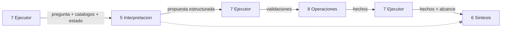

<!-- docs/07_parte_interpretacion.md -->
<!-- Bloque 2 - Contrato semantico. Nivel de formato pendiente (Bloque 3). -->

# Parte 5 — Interpretacion y planificacion

> **Responsabilidad**
> Convertir una pregunta en lenguaje natural en una propuesta estructurada y
> verificable: objetivo, conceptos canonicos, plan de pasos y condiciones.

> **Invariante propio**
> Nunca ejecuta operaciones ni produce conclusiones de negocio. Unicamente transforma
> intencion en estructuras que otros componentes pueden validar.

> **Aislamiento**
> No se comunica con Sintesis de respuesta. El Ejecutor es el unico intermediario.
> Sintesis jamas puede ver una intencion que no haya sobrevivido a las validaciones
> deterministas.

> **Consumidor mas exigente**
> El Ejecutor, en su validacion estatica del plan: necesita condiciones que referencien
> hechos que los pasos previos declaran publicar. Un plan que no soporta esa
> comprobacion es inutil aunque la interpretacion sea correcta.

---

## 1. Posicion en el sistema



La flecha tachada es una prohibicion del diseno, no una omision.

---

## 2. Entradas

| Entrada | De quien | Nota |
|---|---|---|
| Pregunta en lenguaje natural | Ejecutor | Texto crudo |
| Catalogo de objetivos | Ejecutor (via Operaciones) | Cerrado, con su criterio de suficiencia |
| Catalogo semantico filtrado | Ejecutor (via Conocimiento) | Solo conceptos visibles en este contexto |
| Catalogo de operaciones filtrado | Ejecutor (via Operaciones) | Fichas con parametros **y hechos que publican** |
| Estado analitico vigente | Ejecutor (via Sesion) | Periodo, filtros y definiciones en curso |
| Historial conversacional acotado | Ejecutor (via Sesion) | Para resolver referencias |
| Aclaracion previa, si existe | Ejecutor | Complementa la pregunta original |
| Causa de rechazo, si es reintento | Ejecutor | Motivo concreto de la propuesta anterior |
| Plan ejecutado, hechos y causa de insuficiencia | Ejecutor | Solo en replanificacion |

### Consecuencia de contrato

El catalogo de operaciones que recibe **debe incluir los tipos de hecho que cada
operacion publica**. Sin eso, Interpretacion no puede escribir condiciones validas y
todo plan condicional fallaria la validacion estatica. Es una dependencia real entre
la ficha de operacion y esta parte, y es la razon por la que "hechos publicados" es un
campo obligatorio de la ficha.

### Lo que no recibe

- Datos de negocio. Ni filas, ni cifras, ni muestras.
- Conjuntos de datos activos. La reutilizacion no es decision suya.
- Reglas de permisos. Los catalogos ya llegan filtrados; no debe conocer que se le
  oculto ni por que.

---

## 3. Salida — propuesta estructurada

| Campo | Contenido |
|---|---|
| Objetivo | Uno del catalogo cerrado |
| Continuidad | `nueva` o `continuacion`, con lo que hereda del estado analitico |
| Conceptos | Metricas y dimensiones canonicas, cada una con la expresion original que la origino |
| Expresiones temporales | Sin resolver: "julio", "el ultimo trimestre" |
| Filtros | Dimension canonica, operador y valores literales |
| Referencias resueltas | Que significa "esos tres", "eso", "y en junio" |
| Premisas | Lo que la pregunta da por supuesto |
| Plan | Pasos ordenados con operacion, argumentos y condicion de activacion |
| Ambiguedades | Las materiales no resueltas, con opciones concretas |
| Fuera de alcance | Si corresponde, con que si puede hacerse |

### Frontera con Conocimiento del negocio

| Interpretacion resuelve | Conocimiento resuelve |
|---|---|
| Que expresion del usuario corresponde a que concepto del catalogo | Que significa el concepto y de donde se obtiene |
| Que expresion temporal se menciono | A que fechas corresponde, segun el calendario del negocio |

**Las fechas nunca las resuelve el modelo.** "Julio" sin ano, cierres fiscales,
"el ultimo trimestre" y "este mes" son fuente clasica de error silencioso: el modelo
produce una fecha plausible y nadie lo nota. Interpretacion informa la expresion;
Conocimiento la traduce.

Los conceptos si se eligen del catalogo recibido, porque el catalogo esta ahi
precisamente para eso. La expresion original se conserva para poder explicar la
eleccion y para formular la aclaracion cuando haga falta.

### Continuidad explicita

`continuacion` declara **que** hereda: periodo, filtros, metrica, dimension. Nunca se
hereda por omision. Un estado analitico que se arrastra en silencio produce respuestas
correctas sobre el alcance equivocado, que es el error mas dificil de detectar para el
usuario.

### Premisas

Una pregunta como *"¿por que cayo la facturacion?"* **presupone** la caida. La premisa
se declara para que el plan pueda condicionarse a ella y para que la respuesta pueda
corregirla. Sin esta declaracion, el sistema explicaria una caida que no ocurrio.

---

## 4. Forma del plan

Pasos ordenados. Cada paso declara operacion, argumentos y, opcionalmente, una
condicion de activacion que referencia un hecho de un paso anterior.

Ejemplo de la traza nominal — *"Compara la facturacion de julio contra junio y decime
que clientes explican la caida"*:

```
objetivo:      explicar_variacion
continuidad:   nueva
conceptos:     facturacion_neta  (de "facturacion")
               cliente           (de "clientes")
temporales:    "julio", "junio"
premisas:      existe una caida entre ambos periodos
plan:
  paso 1  comparar_periodos
          metrica = facturacion_neta
          periodo_actual = "julio"
          periodo_comparacion = "junio"
          condicion: (ninguna)

  paso 2  descomponer_variacion
          metrica = facturacion_neta
          periodo_actual = "julio"
          periodo_comparacion = "junio"
          dimension = cliente
          condicion: hecho(variacion_relativa) < 0
ambiguedades:  (ninguna)
```

El paso 2 es condicional porque la premisa puede ser falsa. Si julio subio, el paso no
se ejecuta y la respuesta corrige la premisa en vez de explicar una caida inexistente.

---

## 5. Ambiguedad material

Preguntar demasiado arruina la experiencia; preguntar de menos produce respuestas
correctas a la pregunta equivocada. La regla que separa ambos casos:

> Una ambiguedad es **material** cuando distintas resoluciones producen respuestas
> distintas **y** no existe un valor por defecto declarado en la capa semantica.

| Caso | Material | Comportamiento |
|---|---|---|
| "ventas", con `facturacion_neta` declarada como acepcion por defecto | No | Se resuelve y se declara en el alcance |
| "los mejores clientes", sin criterio declarado | Si | Aclaracion con opciones concretas |
| "el ultimo trimestre" con calendario fiscal ambiguo | Si | La detecta Conocimiento, no Interpretacion |
| "este mes" | No | Resuelve Conocimiento con la fecha de referencia |
| "esos tres" sin referente localizable en el historial | Si | Aclaracion |

Una ambiguedad material **detiene la propuesta**: no se propone un plan tentativo
junto con la pregunta. Proponer y preguntar a la vez invita a ejecutar la propuesta
por defecto, que es exactamente lo que la aclaracion venia a evitar.

Las opciones ofrecidas se construyen **con conceptos del catalogo recibido**, por lo
que nunca ofrecen algo que el usuario no puede ver.

---

## 6. Ejemplos concretos

### 6.1 Aclaracion por ambiguedad material

Pregunta: *"Mostrame los mejores clientes de este trimestre."*

```
objetivo:      rankear
conceptos:     cliente
temporales:    "este trimestre"
ambiguedades:  criterio de "mejores"
               opciones: facturacion neta, unidades vendidas, cantidad de operaciones
plan:          (no se propone)
```

Tras la respuesta *"por facturacion"*, la aclaracion **complementa** la pregunta
original; no la reemplaza. El registro conserva ambas.

### 6.2 Referencia conversacional

Estado analitico vigente: periodo julio-junio, dimension cliente, conjunto `ds_301`.
Pregunta: *"Saca esos tres y compara de nuevo."*

```
objetivo:            comparar
continuidad:         continuacion (hereda metrica, ambos periodos y dimension)
referencias:         "esos tres" = los tres contribuyentes principales del turno anterior,
                     identificados nominalmente
filtros:             cliente distinto de [los tres identificados]
plan:
  paso 1  comparar_periodos con el filtro aplicado
```

Los tres clientes se nombran explicitamente en la propuesta. Si el referente no fuera
localizable, corresponde aclaracion, no suposicion.

### 6.3 Fuera de alcance

Pregunta: *"¿Nos conviene abrir una sucursal en Cordoba?"*

```
objetivo:        (ninguno aplicable)
fuera_de_alcance: la pregunta requiere proyeccion y criterio de negocio, no analisis
                  de datos existentes
alternativas:     facturacion por region, evolucion mensual de la region Centro,
                  ranking de clientes por region
```

Declarar el limite y ofrecer lo adyacente es una salida legitima y frecuente. No es un
fallo del sistema.

### 6.4 Premisa falsa

Pregunta: *"¿Por que cayeron las ventas en julio?"*, con julio en alza.

El plan es el mismo del ejemplo de la seccion 4. La condicion del paso 2 no se cumple,
el paso no se ejecuta, y la respuesta corrige la premisa con el hecho obtenido. La
correccion es posible **porque la premisa se declaro**; si no se hubiera declarado, el
sistema habria descompuesto una variacion positiva como si fuera una caida.

---

## 6bis. Turno con multiples objetivos

Una pregunta puede contener mas de una intencion legitima y compatible. No se obliga
al usuario a separarlas.

Pregunta: *"Compara julio contra junio y decime tambien el ranking anual."*

```
turno:
  objetivo_1: comparar
    plan: comparar_periodos(facturacion_neta, "julio", "junio")
    continuidad: nueva

  objetivo_2: rankear
    plan: rankear(facturacion_neta, cliente, "ano actual", n = 10)
    continuidad: nueva
    dependencia: (ninguna)
```

### Reglas

- Cantidad de objetivos por turno **pequena y configurable**.
- Cada objetivo mantiene su propio plan y su propio criterio de suficiencia. El
  Ejecutor los evalua por separado.
- **No se fusionan en un objetivo compuesto.** Un megaobjetivo sin criterio de
  suficiencia propio rompe el control de terminacion.
- **Un objetivo no hereda periodo, filtros ni alcance de otro**, salvo dependencia
  declarada explicitamente. En el ejemplo, "julio" pertenece al primero; el segundo
  usa el ano. Suponer lo contrario es la misma herencia silenciosa que la continuidad
  explicita viene a impedir.
- Si las intenciones son contradictorias, mutuamente ambiguas, o exceden el limite del
  turno, corresponde aclaracion pidiendo separacion.

### Dependencia explicita entre objetivos

Pregunta: *"Compara julio contra junio y para esos mismos clientes dame el ranking
anual."*

```
  objetivo_2: rankear
    dependencia: filtro cliente proveniente de los elementos del objetivo_1
```

Una dependencia declarada obliga a ordenar los objetivos y hace que el segundo no
pueda ejecutarse si el primero fallo o fue rechazado. Sin declaracion, los objetivos
son independientes y el fallo de uno no impide responder el otro.

---

## 7. Replanificacion

Entrada acotada: objetivo original, plan ejecutado, hechos obtenidos, causa de
insuficiencia, catalogos.

| Puede | No puede |
|---|---|
| Proponer otra dimension de descomposicion | Cambiar el objetivo |
| Proponer operaciones adicionales del catalogo | Proponer una tercera ronda |
| Declarar que no hay via para satisfacer el criterio | Reinterpretar la pregunta original |

Si el objetivo estaba mal elegido, el camino valido es `espera_aclaracion`, no
replanificar hacia otra cosa. Reinterpretar en la segunda ronda equivale a responder
una pregunta distinta de la que el usuario hizo.

Declarar que no hay via es una salida util: evita gastar una ronda para llegar a la
misma insuficiencia.

---

## 8. Lo que esta parte no hace

- No resuelve fechas.
- No ejecuta ni calcula nada.
- No decide si los datos alcanzan: eso es cobertura, y la verifica codigo.
- No decide si el objetivo esta satisfecho: eso es el criterio de suficiencia.
- No elige entre conjuntos activos.
- No aplica ni conoce reglas de permisos.
- No redacta texto para el usuario, salvo las opciones de una aclaracion.
- No se comunica con Sintesis.

---

## 9. Riesgos propios

| Riesgo | Manifestacion | Contencion |
|---|---|---|
| Intencion mal entendida | Responde correctamente otra pregunta | Aclaracion ante ambiguedad material; alcance declarado en la respuesta |
| Concepto inventado | Propone una metrica que no existe | Catalogo cerrado + validacion semantica |
| Operacion inventada | Propone un calculo inexistente | Catalogo cerrado + validacion de firma |
| Condicion mal formada | Referencia un hecho que nadie publica | Validacion estatica del plan |
| Herencia silenciosa de estado | Responde sobre el periodo anterior | Continuidad explicita obligatoria |
| Premisa no declarada | Explica algo que no ocurrio | Campo de premisas obligatorio |
| Exceso de aclaraciones | Fricción; el usuario abandona | Criterio de materialidad + valores por defecto en la capa semantica |
| Valor de filtro inexistente | "region Centro" cuando no existe esa region | Rechazo al ejecutar, con las regiones disponibles como opciones |

El ultimo caso merece nota: los **valores** de filtro son datos, no esquema.
Interpretacion no puede validarlos contra ningun catalogo, y su inexistencia solo se
descubre al consultar. La causa `valor_de_filtro_inexistente` deriva en aclaracion con
los valores reales disponibles, no en un resultado vacio presentado como respuesta.

---

## 10. Verificacion y evaluacion

Dos cosas distintas que conviene no confundir.

### Verificacion de contrato — determinista, sin modelo

Con un doble del modelo que devuelve propuestas fijas:

| Que verifica |
|---|
| Una propuesta con objetivo fuera de catalogo se rechaza |
| Una propuesta con concepto fuera del catalogo filtrado se rechaza |
| Una condicion sobre un hecho no publicado se rechaza en validacion estatica |
| Una `continuacion` declara explicitamente que hereda |
| Una ambiguedad material no viene acompanada de plan |
| La replanificacion que cambia el objetivo se rechaza |

### Evaluacion de interpretacion — con modelo, contra el banco de casos

Cada caso declara pregunta e interpretacion esperada:

```
Pregunta:
  "¿Quienes fueron nuestros mejores clientes este trimestre?"

Interpretacion esperada:
  objetivo:     rankear
  metrica:      facturacion_neta        (con acepcion por defecto declarada)
  dimension:    cliente
  temporal:     "este trimestre"
  orden:        descendente
  limite:       10
```

Metricas del banco:

| Metrica | Que mide |
|---|---|
| Acierto de objetivo | Proporcion de casos con el objetivo correcto |
| Acierto de conceptos | Metrica y dimension correctas |
| Validez de plan | Proporcion de planes que pasan la validacion estatica |
| Tasa de aclaracion | Cuantas veces pregunta; alta arruina la experiencia, baja oculta errores |
| Falsos fuera de alcance | Preguntas respondibles declaradas fuera de alcance |
| Herencia correcta | Continuaciones que heredan lo que corresponde |

El banco se re-corre **cada vez que cambia la capa semantica**, porque un cambio de
vocabulario puede romper interpretaciones que antes funcionaban. Esa regresion es el
motivo principal por el que existe el banco.

---

## 11. Decisiones registradas

| Decision | Supuesto | Senal de invalidacion | Tipo |
|---|---|---|---|
| Interpretacion y Sintesis separadas y sin comunicacion | Ambos usos del modelo tienen riesgos distintos y se evaluan mejor por separado | Un caso legitimo requiere que Sintesis conozca la intencion cruda | Sistema |
| Conceptos se eligen del catalogo; fechas las resuelve Conocimiento | El calendario del negocio no es deducible del texto | Aparece un caso temporal que el catalogo no puede resolver | Sistema |
| Continuidad explicita, sin herencia por omision | El costo de declararla es menor que el de un alcance equivocado | La declaracion explicita produce continuaciones incorrectas frecuentes | Sistema |
| Premisas declaradas como campo obligatorio | Las preguntas de negocio presuponen con frecuencia | Las premisas resultan siempre vacias en el banco | Sistema |
| Ambiguedad material detiene la propuesta | Proponer y preguntar a la vez induce a ejecutar por defecto | La tasa de aclaracion resulta inaceptable para el usuario | Sistema |
| Una propuesta por turno, no varias alternativas rankeadas | Elegir entre planes alternativos es trabajo del modelo, no del usuario | Los casos ambiguos se resolverian mejor mostrando dos planes | Implementacion |

---

## 12. Relacion con el supuesto mas riesgoso del proyecto

Esta parte es donde vive el supuesto que sostiene el producto entero:

> **Un modelo de lenguaje puede convertir preguntas reales de negocio en propuestas
> estructuradas validas, con confiabilidad suficiente, si dispone de una capa semantica
> bien definida y un catalogo cerrado de objetivos y operaciones.**

Si es falso, ninguna otra decision de arquitectura salva el producto: seria un sistema
correcto que responde la pregunta equivocada. El experimento minimo y su criterio de
aceptacion se definen en `01_metodo_solucion.md`, y el banco de casos de esta parte es
el instrumento con el que se mide.

---

## 13. Puntos abiertos

1. **Profundidad del historial conversacional** que se entrega para resolver
   referencias. Demasiado poco rompe las continuaciones; demasiado encarece cada turno.
2. **Como se declara una acepcion por defecto** en la capa semantica, que es lo que
   convierte una ambiguedad en no material.
3. **Tamano minimo del banco de casos** para que la regresion sea significativa.
4. **Umbral de materialidad** de una ambiguedad: hasta que punto una diferencia de
   resolucion justifica molestar al usuario.


---

## Ubicacion en el proyecto

| Aspecto | Valor |
|---|---|
| Caja del diagrama | **5 Interpretacion y planificacion** |
| Codigo | `src/querypilot/interpretation/` |
| Tests | `tests/interpretation/` — subcarpetas: contract/ evaluation/ |
| Sub-peldano de implementacion | 5.1 de `MAPA_AVANCE.md` |
| Estado actual | Pendiente |

### Modulos que la componen

| Modulo | Proposito |
|---|---|
| `proposal_builder` | Objetivo, conceptos, premisas y continuidad |
| `plan_builder` | Pasos, argumentos, condiciones y `derives_from` |
| `reference_resolver` | Resolucion de referencias conversacionales |
| `ambiguity_detector` | Materialidad y opciones concretas |
| `replanner` | Entrada acotada; no puede cambiar el objetivo |

Las firmas concretas se definen al implementar. Este documento fija **el contrato**, no
la implementacion: cualquier firma que lo respete es valida.

### Pasos de implementacion

1. Modelos de salida estructurada.
2. Puerto del modelo con doble determinista.
3. Construccion del material: catalogos filtrados, estado, historial acotado.
4. Propuesta: objetivo, conceptos, premisas, continuidad.
5. Plan con condiciones y `derives_from`.
6. Deteccion de ambiguedad material y resolucion de referencias.
7. Replanificador acotado.
8. Banco de casos y reporte de metricas.

### Nivel de formato

Los modelos canonicos que esta parte recibe y entrega estan definidos en
`14_contratos_formato.md`. La **regla de herencia estricta** sigue vigente: si un formato
no puede transportar algo de este contrato, se revisa este contrato, no el formato.
