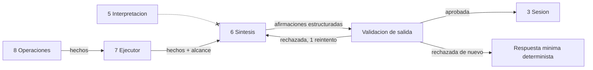
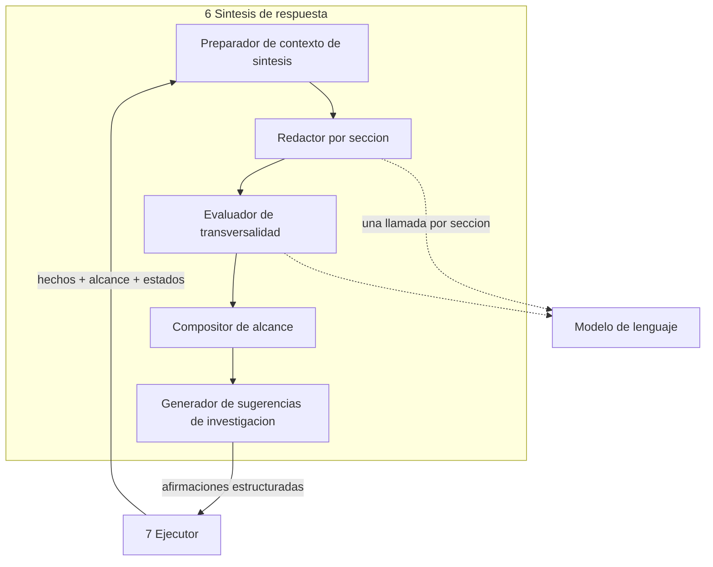

<!-- docs/08_parte_sintesis.md -->
<!-- Bloque 2 - Contrato semantico. Nivel de formato pendiente (Bloque 3). -->

# Parte 6 — Sintesis de respuesta

> **Responsabilidad**
> Convertir hechos, alcance y evidencia en una respuesta legible, con cada afirmacion
> vinculada explicitamente a lo que la respalda.

> **Invariante propio**
> No introduce ningun dato ni afirmacion factual que no pueda vincularse con la
> evidencia recibida.

> **Aislamiento**
> No se comunica con Interpretacion y planificacion. El Ejecutor es el unico
> intermediario. Sintesis **jamas ve una intencion que no haya sobrevivido a las
> validaciones deterministas**: solo conoce hechos que fueron efectivamente producidos.

> **Consumidor mas exigente**
> La validacion de salida del Ejecutor, que debe poder comprobar mecanicamente cada
> afirmacion. Una respuesta en prosa libre seria imposible de validar; por eso la
> salida de esta parte es estructurada, y el texto es un campo dentro de esa
> estructura.

---

## 1. Posicion en el sistema



La flecha tachada es una prohibicion del diseno. Si Sintesis conociera la intencion
cruda del usuario, podria redactar lo que el usuario queria oir en vez de lo que los
datos dijeron.

---

## 2. Entradas

| Entrada | Contenido |
|---|---|
| Hechos | Identificador, `objective_id`, tipo, valor, unidad, alcance, referencia a la invocacion que lo produjo |
| Alcance del turno | Periodo, filtros, definiciones aplicadas, alcance de universo, momento de captura, version semantica |
| Naturaleza de la evidencia | Original o reconstructed |
| Estado de cada objetivo | Satisfecho, insuficiente, rechazado o no ejecutado |
| Premisas declaradas | Y si los hechos las confirman o las contradicen |
| Pregunta del usuario | Texto original, para que la respuesta sea pertinente |
| Estructura de objetivos | Cuales hay y si existe dependencia declarada entre ellos |

### Lo que no recibe

- Filas de datos. Solo hechos ya producidos.
- La propuesta de Interpretacion, ni el plan, ni los argumentos de las invocaciones.
- La respuesta minima determinista. Se construye en paralelo y de forma independiente
  (ver seccion 8): si Sintesis la recibiera, la tarea degeneraria en parafrasear y las
  dos rutas dejarian de ser independientes.
- Conjuntos de datos ni capacidad de consultarlos.

---

## 3. Salida — afirmaciones estructuradas

La salida no es texto: es una estructura cuyos campos contienen texto.

| Campo | Contenido |
|---|---|
| Secciones | Una por objetivo, en el orden en que fueron planteados |
| Afirmaciones | Identificador, `objective_id`, tipo, texto, evidencia referenciada |
| Conclusion transversal | Opcional y condicionada (seccion 5) |
| Alcance | Declaracion obligatoria (seccion 6) |
| Sugerencias de investigacion | Preguntas nuevas que el sistema si puede responder, nunca ejecutadas solas |

### Ejemplo

```
section objective_1 (explain_variance)

  a1  type: data
      text: "La facturacion neta de julio fue 4.176.900 ARS frente a
             4.812.400 ARS en junio, una caida de 635.500 ARS (-13,2 %)."
      evidence: [h1, h2, h3, h4]

  a2  type: interpretation
      text: "La caida esta concentrada: tres clientes explican el 72 % de la
             variacion total."
      evidence: [h5, h6, h7, h8]

  a3  type: hypothesis
      text: "Una concentracion asi suele responder a un cambio puntual en pocas
             cuentas antes que a una tendencia general."
      evidence: []

scope:
  period:      junio y julio de 2026
  definition:  facturacion = ventas menos notas de credito
  universe:    todos los clientes
  data:        capturados el 15/08/2026 a las 14:32
  evidence:    original
```

---

## 4. Los tres tipos de afirmacion

La clasificacion no es estilistica: **es el mecanismo de seguridad del sistema**, porque
determina que se valida mecanicamente y que no.

| Tipo | Que es | Requisito | Como se valida |
|---|---|---|---|
| **Dato** | Un hecho, tal como fue producido | Toda cifra existe entre sus hechos | Mecanicamente, cifra por cifra |
| **Interpretacion** | Una lectura de esos hechos | Cita los hechos que relaciona | Solo que la evidencia exista y este en alcance |
| **Hipotesis** | Una explicacion posible no verificada | Evidencia vacia, y etiquetado visible | Que no contenga cifras nuevas |

### Reglas por tipo

**Dato.** Ninguna cifra del texto puede faltar entre los valores de sus hechos, dentro
de la tolerancia de redondeo declarada. **No puede combinar hechos de objetivos
distintos ni de turnos distintos.** No puede omitir el alcance cuando el hecho lo trae
restringido.

**Interpretacion.** Debe citar los hechos que relaciona. No puede introducir cifras
ausentes de esos hechos. Los **calificadores de magnitud** —"fuerte", "leve",
"significativo", "concentrado"— son interpretacion, nunca dato, salvo que exista un
umbral declarado en la capa semantica que los defina.

**Hipotesis.** Evidencia vacia por definicion. No puede contener cifras. Debe ser
distinguible visualmente del resto.

### Limite conocido de la validacion

> La validacion comprueba que las cifras existen y que las referencias son legitimas.
> **No puede comprobar que la relacion afirmada sea cierta.**

"La caida se concentra en tres clientes" pasa la validacion aunque sus hechos digan lo
contrario. Por eso la distincion entre tipos importa: los datos se validan
mecanicamente; las interpretaciones solo en cuanto a que su evidencia exista.

**Supuesto:** el modelo no produce interpretaciones contradictorias con su propia
evidencia con frecuencia significativa.
**Senal de invalidacion:** aparecen en el banco de evaluacion interpretaciones
contradictorias con los hechos citados.
**Correccion prevista:** acotar la sintesis a plantillas para las relaciones
frecuentes, dejando prosa libre solo para hipotesis.

---

## 5. Multiples objetivos y conclusion transversal

Este es el punto de mayor riesgo de la parte.

### Secciones independientes

> **Cada seccion usa unicamente hechos de su propio `objective_id`.**

Es una comprobacion mecanica y no admite excepcion. Un dato de la seccion del ranking
no puede citar un hecho de la comparacion de periodos.

### El problema de la conclusion transversal

Con dos objetivos independientes, el modelo **vera** relaciones entre sus resultados y
tendera a enunciarlas. Pero ninguna operacion produjo un hecho que vincule ambos: no
existe evidencia de la relacion, solo coincidencia de vocabulario.

> Una afirmacion transversal **nunca puede ser un dato**, porque ninguna operacion la
> produjo.

### Regla

| Situacion | Conclusion transversal |
|---|---|
| Existe **dependencia declarada** entre los objetivos | Permitida como `interpretation`, citando hechos de ambos |
| Objetivos independientes | **Prohibida.** Se ofrece continuacion sugerida |

### Sugerencia de investigacion

Cuando el modelo detecta una relacion potencialmente valiosa entre objetivos
independientes, la salida correcta no es afirmarla sino **proponer la pregunta que la
verificaria**. Ese producto tiene nombre propio:

> **Sugerencia de investigacion**: propuesta de una nueva pregunta, derivada de un
> patron observado durante la sintesis, que **no forma parte de la respuesta factual
> actual** y requiere un objetivo nuevo para verificarse.

```
sugerencias de investigacion:
  - "¿Los tres clientes que explican la caida de julio estan entre los diez
     primeros del ranking anual?"
```

Se distingue de una `hypothesis`: la hipotesis vive **dentro** de una seccion y comenta
los hechos de ese objetivo; la sugerencia vive **fuera** de las secciones y no afirma
nada, solo propone.

Esa pregunta el sistema si la puede responder deterministamente, con un objetivo propio
y su criterio de suficiencia. La observacion del modelo se convierte asi en una
hipotesis operacionalizable en vez de una conclusion sin respaldo, y el usuario obtiene
un camino accionable en lugar de una afirmacion que no puede comprobar.

### Prohibicion: una sugerencia nunca se ejecuta sola

> **Una sugerencia de investigacion no hereda estado y no se ejecuta automaticamente.
> Requiere aceptacion explicita del usuario.**

```
Sugerencia  ->  el usuario acepta  ->  nuevo objetivo  ->  nuevo plan
```

Nunca:

```
Sugerencia  ->  el Ejecutor continua por su cuenta
```

Motivo: si el modelo dice "seria interesante comprobar X" y el sistema lo convierte en
una ronda adicional, se le devuelve al modelo la capacidad de extender su propio
analisis **por fuera del criterio de suficiencia**. Eso deshace el control de
terminacion que sostiene toda la arquitectura.

Aceptada por el usuario, la sugerencia entra como pregunta nueva y recorre el ciclo
completo: interpretacion, validaciones, plan, criterio propio.

### Estados heterogeneos

Un turno puede tener un objetivo satisfecho y otro rechazado. Cada seccion declara su
propio estado. El fallo de uno no contamina la respuesta del otro, salvo dependencia
declarada, en cuyo caso el dependiente se reporta como `not_executed` con la causa.

---

## 6. Declaracion de alcance

Obligatoria en toda respuesta. Sin ella, una cifra correcta puede ser enganosa.

| Elemento | Cuando aparece |
|---|---|
| Periodo | Siempre |
| Filtros aplicados | Siempre que existan |
| Definiciones aplicadas | Cuando hubo acepcion por defecto o definicion no obvia |
| Alcance de universo | Siempre que el contexto sea restringido |
| Momento de captura de los datos | Siempre. **Rango** —el mas antiguo y el mas reciente— cuando los hechos difieren entre si |
| Momento de la respuesta | Cuando difiere del anterior |
| Naturaleza de la evidencia | Cuando es reconstructed |
| Origen del analisis | Cuando es `reanudado` o `rehecho`, con la causa |
| Insuficiencia | Cuando algun objetivo no alcanzo su criterio |
| Version semantica | En analisis guardados y exportaciones |

### Rango de captura

Una respuesta puede apoyarse en hechos capturados en momentos distintos: ocurre al
reanudar un analisis y al reutilizar un conjunto activo de un turno anterior, que es el
caso frecuente. Cada hecho conserva su propio momento; el alcance declara el mas antiguo
y el mas reciente.

```
Alcance
  Periodo:    junio y julio de 2026
  Universo:   todos los clientes
  Datos:      capturados entre las 16:41 y las 16:48 del 15/08/2026
  Evidencia:  original
```

Declarar un unico momento haria que la mitad de las cifras apareciera fechada de forma
incorrecta.

### Origen del analisis

Cuando un analisis no pudo reanudarse y se rehizo bajo condiciones actuales, el alcance
lo declara. De lo contrario, un cambio de alcance del **observador** parecera un cambio
en los **datos**.

```
Alcance
  Universo:   region Centro (tu alcance actual)
  Datos:      capturados el 16/08/2026 a las 09:12
  Origen:     rehecho — el analisis anterior no pudo reanudarse porque tu alcance
              de datos cambio. Las cifras pueden diferir de las mostradas antes.
```

Dos casos mas que se pasan por alto con facilidad:

- **Reutilizacion de conjunto.** Si la respuesta se apoya en datos capturados hace
  veinte minutos, la marca de captura y la de la respuesta **no coinciden**, y ambas
  deben ser visibles.
- **Alcance restringido.** "Los diez mejores clientes" bajo contexto restringido se
  responde como "los diez mejores **entre tus clientes**". Correcto sin alcance sigue
  siendo enganoso.

---

## 7. Insuficiencia y premisas falsas

### Insuficiencia declarada

Un objetivo que agoto sus rondas sin alcanzar el criterio **no es un fallo**: es una
respuesta que declara hasta donde se llego.

```
  a1  tipo: dato
      texto: "La facturacion cayo 8,4 % respecto de junio."
      evidencia: [h1, h2]

  a2  tipo: dato
      texto: "Ningun cliente individual explica mas del 3 % de la caida; los
              factores identificados cubren el 28 % de la variacion."
      evidencia: [h3, h4]

  estado: insuficiente para explain_variance (umbral: 70 %)
```

Prohibido presentar un resultado insuficiente como si fuera una explicacion completa.
La insuficiencia se enuncia, no se disimula con prosa afirmativa.

### Premisa contradicha

Si la pregunta presuponia una caida y los hechos muestran un alza, **la respuesta
corrige la premisa antes de cualquier otra cosa**:

```
  a1  tipo: dato
      texto: "La facturacion de julio no cayo: subio 6,1 % respecto de junio."
      evidencia: [h1, h2, h3]
```

No se explica una caida que no ocurrio. Esta correccion es posible porque las premisas
se declaran en la propuesta de Interpretacion.

---

## 8. Degradacion — la respuesta minima

> **La calidad linguistica puede degradarse; la integridad factual no.**

La respuesta minima determinista **se construye en todos los turnos**, en paralelo y de
forma independiente de Sintesis, por plantilla segun el tipo de hecho. Motivos:

1. Una ruta de recuperacion que solo se ejecuta ante fallo es codigo que nadie prueba,
   y estara rota justo el dia que haga falta.
2. Construirla siempre la convierte en camino ejercitado.
3. Al no depender de Sintesis, es una ruta genuinamente independiente y no una
   parafrasis de una salida potencialmente contaminada.

Consecuencia arquitectonica: **Sintesis nunca es camino critico**. La caida del
proveedor del modelo durante esta etapa no interrumpe el turno; solo lo deja sin
elocuencia.

Cadena de degradacion:

| Intento | Resultado |
|---|---|
| Sintesis, primer intento | Si valida, sale |
| Sintesis, reintento con la causa concreta | Si valida, sale |
| Respuesta minima determinista | Sale siempre |

Un solo reintento. La causa que se devuelve es concreta —"la afirmacion a2 contiene
una cifra que no corresponde a los hechos; usa unicamente h1 a h5"— no un rechazo
generico.

---

## 9. Estilo

Reglas de forma, subordinadas a las de integridad:

- **Conclusion primero.** El usuario debe poder leer la primera linea y tener la
  respuesta. La evidencia sostiene, no precede.
- **Brevedad.** Longitud maxima configurable por seccion. Una respuesta larga esconde
  la conclusion.
- Sin adornos ni preambulos. Nada de "excelente pregunta" ni recapitulaciones de lo
  que el usuario pidio.
- Los rechazos **no los redacta Sintesis**: se construyen deterministamente a partir de
  causa y accion sugerida. Un rechazo redactado por el modelo es un lugar innecesario
  donde puede inventar.

---

## 10. Riesgos propios

| Riesgo | Manifestacion | Contencion |
|---|---|---|
| Cifra inventada | Un numero que no esta en los hechos | Validacion mecanica de correspondencia |
| Hecho inexistente | Referencia a evidencia que no se produjo | Validacion de existencia |
| Sobre-afirmacion | Una hipotesis redactada como dato | Tipos obligatorios + revision del banco |
| Relacion falsa | Interpretacion contradictoria con sus hechos | Limite conocido; supuesto registrado en seccion 4 |
| Conclusion transversal sin respaldo | Vincula objetivos independientes | Prohibicion + sugerencia de investigacion |
| Alcance omitido | Cifra correcta presentada como si fuera del total | Declaracion de alcance obligatoria |
| Insuficiencia disimulada | Prosa afirmativa sobre evidencia parcial | Estado por seccion obligatorio |
| Calificador sin respaldo | "Caida fuerte" sin umbral declarado | Calificadores clasificados como interpretacion |
| Mezcla entre objetivos | Un dato cita hechos de dos objetivos | Comprobacion mecanica por `objective_id` |
| Mezcla entre turnos | Un turno rehecho cita evidencia del turno fallido | Comprobacion mecanica por `turn_id`. Ademas de trazabilidad, es fuga de permisos |
| Fecha unica enganosa | Hechos de momentos distintos bajo una sola marca | Rango de captura en el alcance |

---

## 11. Verificacion y evaluacion

### Verificacion de contrato — determinista, sin modelo

Con un doble que devuelve salidas fijas:

| Que verifica |
|---|
| Una afirmacion `data` sin evidencia se rechaza |
| Una cifra ausente de los hechos se detecta |
| Una referencia a un hecho inexistente se detecta |
| Un `data` que cita hechos de dos objetivos se rechaza |
| Un `data` que cita un hecho de otro turno se rechaza |
| Con hechos de momentos distintos, el alcance declara el rango |
| Un analisis rehecho declara su origen y su causa |
| Una conclusion transversal sin dependencia declarada se rechaza |
| Una respuesta sin declaracion de alcance se rechaza |
| Con el modelo caido, sale la respuesta minima |
| El reintento se produce una sola vez |

### Evaluacion de sintesis — con modelo, contra el banco

Los casos de este banco son **distintos** de los de interpretacion: parten de hechos
conocidos, no de preguntas.

```
Caso:
  hechos:    h1..h8 (valores conocidos)
  alcance:   periodo, definiciones, universo restringido
  esperado:  conclusion correcta, sin cifras ajenas,
             alcance restringido mencionado,
             concentracion etiquetada como interpretacion
```

| Metrica | Que mide |
|---|---|
| Afirmaciones sin respaldo | Cuantas fallan la validacion |
| Tasa de degradacion | Cuantos turnos terminan en respuesta minima |
| Sobre-afirmacion | Hipotesis presentadas como datos, por revision humana |
| Cobertura de alcance | Respuestas que declaran todo lo exigible |
| Fidelidad de relacion | Interpretaciones coherentes con sus hechos, por revision humana |

Separar este banco del de interpretacion es lo que permite saber, cuando algo sale
mal, **si el sistema entendio mal o explico mal**. Con un solo banco conjunto ese
diagnostico se pierde.

---

## 12. Estructura interna



| Sub-bloque | Responsabilidad |
|---|---|
| Preparador | Agrupa hechos por objetivo y arma el material de cada seccion |
| Redactor por seccion | Produce afirmaciones tipificadas usando solo hechos de su objetivo |
| Evaluador de transversalidad | Decide si corresponde conclusion transversal o continuacion sugerida |
| Compositor de alcance | Arma la declaracion de alcance. **Determinista**, no pasa por el modelo |
| Generador de sugerencias | Propone preguntas verificables; no afirma relaciones |

El compositor de alcance es deliberadamente determinista: el alcance es la garantia de
honestidad de la respuesta y no debe depender de que el modelo se acuerde de
mencionarlo.

---

## 13. Decisiones registradas

| Decision | Supuesto | Senal de invalidacion | Tipo |
|---|---|---|---|
| Salida estructurada en afirmaciones tipificadas | La validacion mecanica exige estructura | La estructura degrada demasiado la calidad del texto | Sistema |
| Sintesis no recibe la respuesta minima | Recibirla convertiria la tarea en parafraseo y perderia independencia | La calidad sin esa referencia resulta inaceptable | Sistema |
| Sintesis no recibe la propuesta de Interpretacion | Conocer la intencion cruda invita a redactar lo esperado | Un caso legitimo requiere la intencion para redactar bien | Sistema |
| Conclusion transversal solo con dependencia declarada | Sin evidencia que vincule objetivos, la relacion es especulacion | Los usuarios necesitan sistematicamente esa sintesis global | Sistema |
| Sugerencia de investigacion en vez de afirmacion transversal | Convertir la observacion en pregunta verificable es mejor producto | Las sugerencias resultan ignoradas o molestas | Sistema |
| Una sugerencia nunca se ejecuta automaticamente | La aceptacion explicita preserva el control de terminacion | La friccion de aceptar resulta desproporcionada | Sistema |
| Una llamada de sintesis por turno con aislamiento por contrato | El contrato mas la validacion bastan para evitar mezcla entre objetivos | La contaminacion cruzada supera el umbral configurado | Implementacion |
| Alcance compuesto deterministamente | El alcance no debe depender de que el modelo lo recuerde | El alcance determinista resulta ilegible o redundante | Sistema |
| Rechazos redactados deterministamente | Un rechazo no necesita elocuencia | Los rechazos deterministas resultan incomprensibles | Implementacion |
| Un solo reintento de sintesis | Un segundo reintento rara vez corrige lo que el primero no corrigio | El reintento unico degrada con frecuencia alta | Implementacion |
| Calificadores de magnitud son interpretacion | No hay umbral objetivo salvo que se declare | Los umbrales declarados cubren la mayoria de los casos | Implementacion |

---

## 14. Aislamiento con una sola llamada

**Decision:** Sintesis usa **una llamada por turno**, con salida estructurada y
aislamiento determinista por `objective_id`.

El aislamiento no requiere llamadas separadas: se consigue con contrato mas
validacion. El material entregado declara, por seccion, que hechos puede referenciar:

```
seccion obj_1   hechos permitidos: h1, h2, h3
seccion obj_2   hechos permitidos: h4, h5, h6
sugerencias     (sin permiso de afirmar)
```

Y la validacion impone mecanicamente `assertion.objective_id == fact.objective_id`,
salvo dependencia declarada entre objetivos.

Ventajas frente a una llamada por seccion: menor coste, menor latencia, texto
estilisticamente coherente, sin repetir contexto compartido, y un turno mas simple.

**Ventaja adicional:** con una sola llamada el modelo puede producir *sugerencias*
transversales sin poder producir *conclusiones* transversales. La tercera seccion
carece de permiso para afirmar relaciones; solo puede proponer preguntas.

### Criterio de cambio

La alternativa —una llamada por objetivo— no se descarta: queda condicionada a
medicion, no a preferencia.

> Si mas de un umbral configurado de las sintesis multiobjetivo falla validacion por
> contaminacion cruzada, se adopta sintesis independiente por objetivo.

Coste y latencia se miden en paralelo y entran en la misma decision.

---

## 15. Puntos abiertos

1. **Umbrales de calificadores** en la capa semantica: si se declaran, cuales, y si
   convierten "fuerte" en dato o siguen siendo interpretacion.
2. **Longitud maxima por seccion** y comportamiento cuando el contenido excede.
3. **Cuantas sugerencias de investigacion** por respuesta antes de volverse ruido.
4. **Idioma de la respuesta**: fijo por configuracion o siguiendo el idioma de la
   pregunta.
5. **Umbral de contaminacion cruzada** que dispara el cambio a sintesis por objetivo.


---

## Ubicacion en el proyecto

| Aspecto | Valor |
|---|---|
| Caja del diagrama | **6 Sintesis de respuesta** |
| Codigo | `src/querypilot/synthesis/` |
| Tests | `tests/synthesis/` — subcarpetas: contract/ evaluation/ |
| Sub-peldano de implementacion | 5.5 de `MAPA_AVANCE.md` |
| Estado actual | Pendiente |

### Modulos que la componen

| Modulo | Proposito |
|---|---|
| `synthesis_context` | Agrupa hechos por objetivo y declara hechos permitidos |
| `section_writer` | Afirmaciones tipificadas por seccion |
| `cross_objective_gate` | Conclusion transversal o sugerencia de investigacion |
| `scope_composer` | **Determinista.** No pasa por el modelo |
| `research_suggestions` | Propone preguntas; no afirma relaciones |

Las firmas concretas se definen al implementar. Este documento fija **el contrato**, no
la implementacion: cualquier firma que lo respete es valida.

### Pasos de implementacion

1. Modelos de afirmacion, seccion y sugerencia.
2. Preparador: agrupa hechos por objetivo y declara hechos permitidos.
3. Redactor por seccion, con una sola llamada por turno.
4. Compositor de alcance, **determinista**.
5. Compuerta de transversalidad y sugerencias de investigacion.
6. Banco de sintesis con hechos conocidos.

### Nivel de formato

Los modelos canonicos que esta parte recibe y entrega estan definidos en
`14_contratos_formato.md`. La **regla de herencia estricta** sigue vigente: si un formato
no puede transportar algo de este contrato, se revisa este contrato, no el formato.
