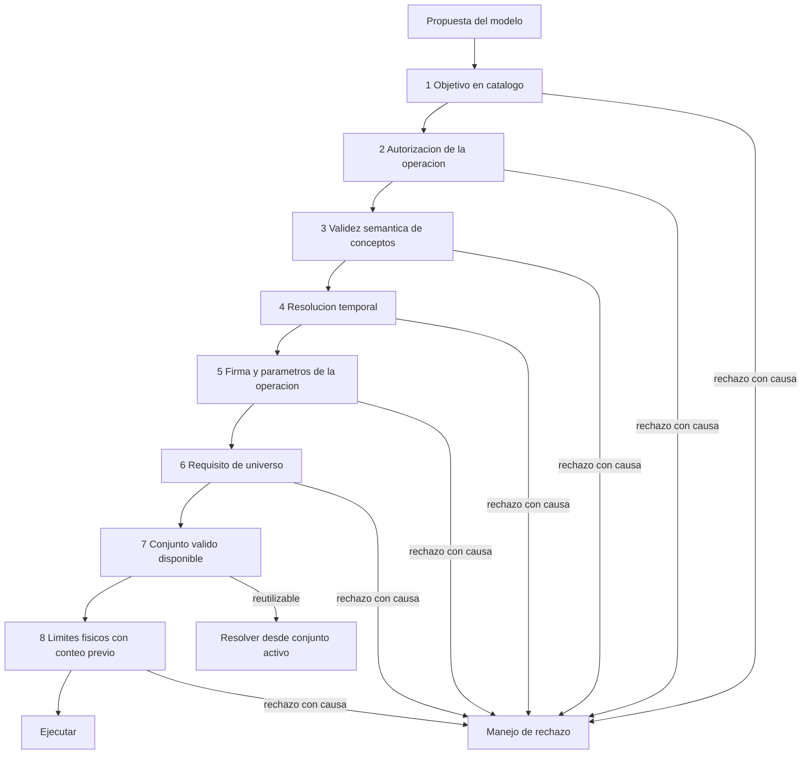
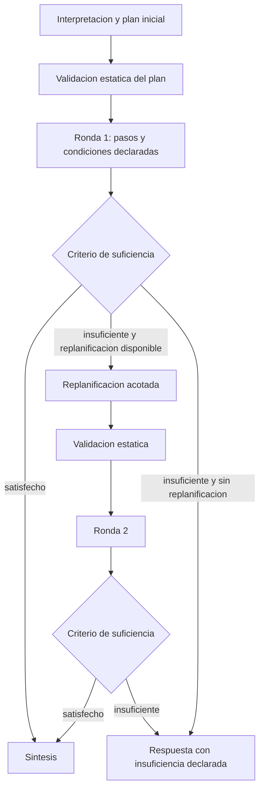
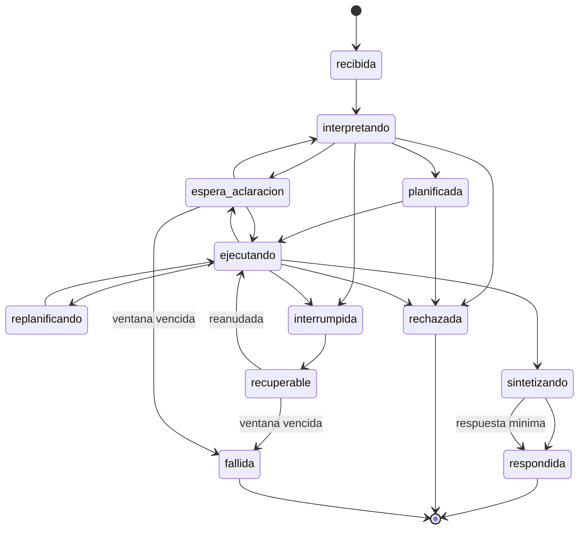
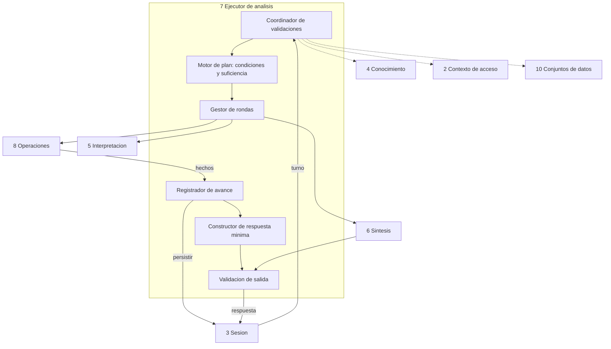

<!-- docs/09_parte_ejecutor.md -->
<!-- Bloque 2 - Contrato semantico. Nivel de formato pendiente (Bloque 3). -->

# Parte 7 — Ejecutor de analisis

> **Responsabilidad**
> Conducir el ciclo completo de un turno: coordinar validaciones, ejecutar el plan,
> decidir terminacion, sostener la reanudacion y controlar que sale hacia el usuario.

> **Invariante propio**
> Toda invocacion queda registrada con sus parametros y su momento, antes y despues de
> ejecutarse. El Ejecutor no contiene conocimiento propio del dominio: solo sabe a
> quien preguntar y en que orden.

> **Consumidor mas exigente**
> La Frontera de servicio, que necesita una salida util en todos los casos, incluidos
> aquellos donde el modelo de lenguaje no esta disponible.

---

## 1. Riesgo estructural declarado

Esta es la caja con mas autoridad del sistema y, por lo tanto, la candidata natural a
convertirse en el componente que lo sabe todo. Se registra explicitamente para poder
vigilarlo durante la implementacion.

La defensa es una sola regla, y todo el contrato se deriva de ella:

> **El Ejecutor coordina decisiones que no toma. Cada componente es autoridad sobre
> sus propias reglas; el Ejecutor solo pregunta, ordena las preguntas, y ejecuta
> cuando todas las autoridades requeridas aceptaron.**

Prueba de que la regla se esta cumpliendo: **agregar una operacion, una metrica, una
regla de permisos o un motor de base de datos no debe requerir tocar el Ejecutor**. Si
lo requiere, la regla se rompio.

Contrapartida: si el Ejecutor crece, **Validacion de salida** es el corte natural para
separarlo. Se nombra como responsabilidad propia dentro de esta parte, no como caja
independiente, hasta tener evidencia de que hace falta.

---

## 2. Entradas del turno

| Entrada | De quien | Nota |
|---|---|---|
| Pregunta en lenguaje natural | Sesion | Texto crudo del usuario |
| Contexto de acceso vigente | Contexto de acceso | Congelado para todo el turno |
| Estado analitico vigente | Sesion | Periodo, filtros, definiciones y ultima referencia |
| Historial conversacional acotado | Sesion | Para resolver referencias como "esos tres" |
| Catalogo semantico filtrado por contexto | Conocimiento | Solo conceptos visibles para este usuario |
| Catalogo de operaciones filtrado | Operaciones | Solo operaciones habilitadas para este contexto |
| Aclaracion previa, si existe | Sesion | Complementa la pregunta original, no la reemplaza |
| Plan parcial, si se reanuda | Sesion | Con estado por paso y hechos ya obtenidos |

**El Ejecutor no recibe conjuntos de datos.** Recibe la capacidad de preguntarle a
Conjuntos de datos cual es el adecuado. La diferencia es deliberada: si recibiera los
conjuntos, tendria que compararlos, y comparar es decidir.

---

## 3. Autoridades — que coordina y que no decide

| Pregunta | Autoridad | El Ejecutor... |
|---|---|---|
| ¿Este objetivo existe y cual es su criterio? | Operaciones analiticas | Consulta |
| ¿Que significa este concepto y donde esta? | Conocimiento del negocio | Consulta |
| ¿A que fechas corresponde "julio"? | Conocimiento del negocio | Consulta |
| ¿Este usuario puede hacer esto? | Contexto de acceso | Consulta |
| ¿Esta operacion admite estos parametros? | Operaciones analiticas | Consulta |
| ¿Esta operacion necesita universo completo? | Operaciones analiticas | Consulta |
| ¿Hay un conjunto valido para esta peticion? | Conjuntos de datos | Consulta |
| ¿Esta consulta entra en los limites? | Acceso a datos | Consulta |
| ¿El objetivo esta satisfecho? | Criterio del objetivo | **Evalua** (comparacion, no juicio) |
| ¿Se cumple la condicion de este paso? | Condicion declarada en el plan | **Evalua** |
| ¿Que se persiste y cuando? | — | **Decide** |
| ¿Se habilita replanificacion? | — | **Decide**, segun regla fija |
| ¿La sintesis puede salir? | Validacion de salida | **Decide**, segun reglas mecanicas |

Las cuatro filas finales son la autoridad real del Ejecutor. Todas son mecanicas: no
hay ninguna que requiera conocer el significado de un dato.

### Lo que el Ejecutor nunca hace

- Interpretar un resultado para fabricar un hecho. Los hechos los publica cada operacion.
- Comparar conjuntos para elegir el mejor. Eso lo decide Conjuntos de datos.
- Construir o modificar una Peticion de datos. Eso lo hace Operaciones.
- Traducir expresiones de negocio. Eso lo hace Conocimiento.
- Filtrar resultados por permisos despues de obtenerlos. La restriccion viaja antes.
- Inventar un objetivo, una operacion o un criterio de suficiencia.

---

## 4. Orden de validaciones

El orden no es indiferente: va **de mas barata a mas cara** y **de mas restrictiva a
menos**. Un rechazo por permisos nunca debe haber consultado la base.



| Paso | Autoridad | Coste | Motivo de esta posicion |
|---|---|---|---|
| 1 | Operaciones (catalogo de objetivos) | Nulo | Consulta a catalogo, sin acceso a datos |
| 2 | Contexto de acceso | Nulo | Lo mas restrictivo primero; nada se consulta sin permiso |
| 3 | Conocimiento | Bajo | Descarta conceptos inexistentes antes de resolver nada mas |
| 4 | Conocimiento | Bajo | La resolucion temporal puede fallar aun con conceptos validos |
| 5 | Operaciones | Bajo | Firma y tipos, ya con conceptos resueltos |
| 6 | Operaciones + Contexto | Bajo | Rechaza calculos que exigen universo no autorizado |
| 7 | Conjuntos de datos | Bajo | Puede evitar por completo el acceso a la fuente |
| 8 | Acceso a datos | **Alto** | Unico paso que toca la fuente. Siempre ultimo |

### Manejo de rechazo

Todo rechazo llega con causa y accion sugerida. El Ejecutor mapea la causa a una de
cuatro salidas, sin interpretar:

| Tipo de causa | Salida |
|---|---|
| Definitiva por permisos | Informar limitacion de alcance, sin nombrar el concepto |
| Corregible por el modelo | Un reintento de planificacion con la causa concreta |
| Resoluble por el usuario | Estado `espera_aclaracion` con opciones concretas |
| Requiere acotar | Informar el limite y ofrecer reduccion de alcance |

Un rechazo corregible consume el unico reintento de planificacion disponible. No hay
segundo.

---

## 5. Condiciones y criterio de suficiencia

Ambos se expresan en el mismo lenguaje cerrado, y ese lenguaje es deliberadamente
pobre para que la evaluacion sea mecanica.

**Forma de una condicion:** referencia a un hecho ya publicado, operador de
comparacion, y un valor literal o un umbral configurado.

Ejemplos de la traza nominal:

```
Condicion del paso 2:
  hecho(variacion_relativa) < 0

Criterio de suficiencia del objetivo explicar_variacion:
  hecho(cobertura_explicada) >= umbral_configurado(cobertura_minima)
  evaluado: 72 % >= 70 %  ->  satisfecho
```

Reglas:

- Una condicion solo referencia hechos de pasos **anteriores** del mismo plan.
- Una condicion referencia hechos **por identificador y tipo**, nunca por su
  significado. El Ejecutor compara valores; no sabe que es una variacion.
- Si una condicion referencia un hecho que no se publico, el plan es invalido y se
  rechaza antes de ejecutar. Esta comprobacion es estatica y ocurre al validar el plan.
- Un objetivo sin criterio de suficiencia evaluable no puede ejecutarse.

### Consecuencia: validacion estatica del plan

Antes de ejecutar el primer paso, el Ejecutor comprueba que **cada condicion es
satisfacible con los hechos que los pasos previos declaran publicar**. Como cada
operacion declara sus tipos de hecho en su ficha, esto se verifica sin ejecutar nada.
Un plan mal armado se detecta antes de tocar la base, no a mitad de camino.

---

## 6. Reutilizar o consultar

El Ejecutor no compara conjuntos. Delega:

```
Ejecutor  -> Conjuntos de datos:
             "¿Hay un conjunto valido para esta peticion de datos?"

Conjuntos -> Ejecutor:
             "Si: ds_301, derivable por agregacion sobre columnas presentes."
                   o
             "No: ningun conjunto activo cubre la dimension region."
                   o
             "No: ds_301 cubre la estructura pero su frescura vencio a las 15:32."
```

La respuesta llega **justificada**: identificador, si aplica, y causa cuando no. Esa
justificacion no es cortesia — alimenta el aviso al usuario ("necesito volver a
consultar la fuente porque los datos actuales solo contienen julio") y queda en el
registro de auditoria.

Las cuatro comprobaciones de validez —cobertura estructural, compatibilidad semantica,
contexto vigente y frescura suficiente— las hace Conjuntos de datos, no el Ejecutor.

### Coherencia de captura antes de un calculo derivado

Cuando un paso consume como insumo un hecho de otro paso —lo declara su ficha— el
Ejecutor comprueba que **ambos provengan de una captura compatible** antes de invocar.

Si no la comparten, **re-ejecuta los pasos necesarios bajo una captura comun**, aunque
alguno pudiera resolverse desde un conjunto activo valido. La reutilizacion cede ante la
coherencia numerica: dos hechos correctos obtenidos sobre estados distintos de la fuente
producen una respuesta que se contradice a si misma.

Es una comprobacion mecanica —comparacion de marcas de captura— y por lo tanto legitima
como autoridad del Ejecutor.

### Aviso y confirmacion

| Situacion | Comportamiento |
|---|---|
| Resuelto desde conjunto activo | Se informa la marca de captura de los datos |
| Nueva consulta de alcance similar | Se informa que se consulta la fuente |
| Nueva consulta de alcance mucho mayor o coste alto | Se pide confirmacion explicita antes de ejecutar |

El umbral que separa "informar" de "confirmar" es configurable y se expresa en filas
examinadas segun el conteo previo.

---

## 7. Rondas y replanificacion

Estructura fija. No es un ciclo de agente: es una secuencia con una sola oportunidad
de revision.



### Limites duros

| Limite | Valor | Motivo |
|---|---|---|
| Rondas maximas | 2 | Evita el agente recursivo |
| Replanificaciones | 1 | Una unica revision de estrategia |
| Invocaciones por ronda | Configurable | Acota coste y latencia |
| Reintentos de planificacion por rechazo corregible | 1 | Compartido con lo anterior |
| Reintentos de sintesis | 1 | Ver seccion 10 |

### Presupuesto de turno

Los limites anteriores son **por objetivo**. Un turno con tres objetivos, dos rondas cada
uno y cuatro invocaciones por ronda puede acumular veinticuatro consultas y seis llamadas
al modelo sin violar ningun limite individual.

> El turno tiene su propio presupuesto: **tiempo total** y **cantidad maxima de llamadas
> al modelo**. Al agotarse, el turno responde con lo obtenido y declara **insuficiencia
> por presupuesto**, causa distinta de la insuficiencia por criterio.

Es la diferencia entre un sistema acotado y uno que puede tardar un tiempo arbitrario.
La insuficiencia por presupuesto se declara al usuario como tal, porque su remedio es
distinto: acotar la pregunta, no cambiar los datos.

### Que recibe la replanificacion

Entrada acotada y explicita: objetivo original, plan ejecutado, hechos obtenidos,
causa de insuficiencia, catalogos filtrados. **No puede cambiar el objetivo.** Si el
objetivo era incorrecto, el camino valido es `espera_aclaracion`, no replanificar
hacia otra cosa.

Una insuficiencia que persiste tras la ronda 2 **no es un fallo**: es una respuesta
valida que declara hasta donde se pudo llegar, con los hechos obtenidos y su alcance.

### Turno con multiples objetivos

Un turno puede contener mas de un objetivo compatible (ver
`05_parte_interpretacion_planificacion.md`). El Ejecutor los trata **en paralelo
conceptual, no fusionados**:

- Cada objetivo tiene su propio plan, su propia secuencia de rondas y su propio
  criterio de suficiencia. Los limites duros de la tabla anterior se aplican **por
  objetivo**, salvo el numero de objetivos, que se limita por turno.
- Un objetivo insuficiente no invalida a los demas. La respuesta declara el resultado
  de cada uno por separado.
- Un objetivo rechazado no impide responder los otros, salvo que exista dependencia
  declarada.
- Una **dependencia declarada** ordena la ejecucion: si el objetivo del que se depende
  falla o es rechazado, el dependiente se marca `no_ejecutado` con esa causa.
- Ningun objetivo hereda periodo, filtros ni alcance de otro sin dependencia declarada.

Los hechos publicados llevan `objetivo_id` y `turno_id`, para que la respuesta minima y
la validacion de salida no mezclen evidencia entre objetivos ni entre turnos.

> **El turno es una frontera de consistencia.** Contexto de acceso, version semantica y
> espacio de evidencia son constantes dentro de un turno.
> Reanudar conserva el mismo `turno_id`;
> rehacer crea uno nuevo. Dentro de un turno se mantienen el mismo contexto de acceso y
> el mismo espacio de evidencia. Citar un hecho de otro turno no es solo un error de
> trazabilidad: ese hecho pudo producirse bajo otro contexto de acceso, y seria una fuga
> de permisos.

---

## 8. Persistencia y reanudacion

El Ejecutor no almacena: le pide a Sesion que persista. Pero decide **que** y
**cuando**, y eso es lo que hace posible la reanudacion.

### Puntos de persistencia

| Momento | Que se registra | Por que |
|---|---|---|
| Al recibir el turno | Pregunta, contexto, estado analitico inicial | Punto de partida reproducible |
| Al fijar el plan | Plan completo con condiciones y criterio | El plan es auditable aunque no se ejecute |
| **Antes** de cada invocacion | Intencion: operacion, parametros, momento | Detecta pasos iniciados y no terminados |
| **Despues** de cada invocacion | Hechos, resultado, referencia al conjunto, duracion | Permite continuar sin repetir |
| Al evaluar suficiencia | Resultado de la evaluacion y sus valores | El motivo de terminar queda explicito |
| Al construir respuesta minima | La respuesta minima | Disponible aunque falle todo lo demas |
| Al validar la sintesis | Resultado de la validacion y causa si fallo | Auditoria de que salio y por que |

### Resultados de un intento superado

Toda llamada al modelo y toda consulta a la fuente llevan `turno_id` e **`intento_id`**.

> Un resultado cuyo `intento_id` ya no es el vigente **se descarta sin procesar** y se
> registra como llegada tardia.

Sin esto, una respuesta del modelo que llega despues del limite —cuando el turno ya paso
a `recuperable` y quizas ya fue reanudado— se procesaria como si fuera actual, con dos
resultados en vuelo para el mismo paso.

Registrar **antes** de invocar es lo que distingue "no se ejecuto" de "se ejecuto y no
sabemos el resultado". Sin ese registro, la reanudacion puede repetir una operacion ya
ejecutada.

### Protocolo de reanudacion

1. Verificar que el contexto de acceso sigue vigente. Si cambio: **no se reanuda**, se
   reinicia bajo el contexto actual.
2. Verificar que la ventana de `recuperable` no vencio. Si vencio: pasa a `fallida` y
   solo puede rehacerse.
3. Verificar que la version semantica no cambio. Si cambio: se rehace.
4. Localizar el ultimo paso con registro posterior completo.
5. Para los pasos ya ejecutados, verificar la validez de sus conjuntos. Los que sigan
   validos se reutilizan; los vencidos se re-ejecutan y sus hechos se marcan como
   **evidencia reconstruida**.
6. Continuar desde el paso siguiente.

Una reanudacion que reconstruyo evidencia lo declara en la respuesta. Nunca se
presenta evidencia reconstruida como original.

---

## 9. Fallas

Tres clases con estrategias distintas. La distincion importa porque un rechazo no es
una falla.

| Clase | Ejemplo | Estrategia |
|---|---|---|
| **Rechazo** | Concepto inexistente, limite excedido, sin permiso | Esperado y deterministico. Informa, aclara o acota. No interrumpe |
| **Interrupcion** | Modelo no disponible, fuente caida, tiempo agotado | `interrumpida` -> `recuperable`. Conserva lo obtenido |
| **Fallo definitivo** | Ventana vencida, contexto cambiado, version semantica cambiada | `fallida`. Solo puede rehacerse |

### Por origen

| Origen | Comportamiento |
|---|---|
| Modelo no responde en interpretacion | `recuperable` sin nada ejecutado. Reintento de turno completo |
| Modelo no responde en replanificacion | Se responde con lo obtenido en ronda 1, declarando insuficiencia |
| Modelo no responde en sintesis | Sale la respuesta minima determinista. **No es interrupcion** |
| Modelo propone algo invalido | Rechazo corregible. Un reintento con la causa |
| Operacion falla por parametros | Rechazo corregible |
| Fuente no disponible | `recuperable`, conservando pasos previos |
| Fuente supera limite de tiempo | Rechazo: informar y ofrecer acotar el periodo |
| Contexto cambia durante interrupcion | `fallida`. Se rehace bajo contexto vigente |

La fila mas importante es la tercera: **la caida del modelo durante la sintesis no
degrada el sistema a un estado de error**, porque la respuesta minima ya existe.

---

## 10. Respuesta minima y validacion de salida

### Respuesta minima

> **Se construye en todos los turnos, no solo ante fallo.**

Motivo: una ruta de recuperacion que solo se ejecuta cuando algo falla es codigo que
nadie prueba, y estara rota justo el dia que haga falta. Construirla siempre la
convierte en camino ejercitado y, ademas, en la referencia contra la cual se valida la
sintesis.

Se construye por plantilla a partir del **tipo de hecho**, sin logica por operacion.
Cada tipo de hecho tiene una forma de enunciado; el Ejecutor los ordena y concatena.

Ejemplo de la traza nominal:

```
La facturacion neta de junio 2026 fue 4.812.400 ARS y la de julio 2026 fue
4.176.900 ARS, una variacion de -635.500 ARS (-13,2 %). Los tres clientes con mayor
contribucion a la caida representan el 72 % de la variacion total.
Alcance: todos los clientes. Datos consultados el 15/08/2026 a las 14:32.
```

Correcta, completa y sin elocuencia. **La calidad linguistica puede degradarse; la
integridad factual no.**

### Validacion de salida

Sintesis devuelve afirmaciones estructuradas: tipo, texto, referencias a hechos. La
validacion es mecanica:

| Comprobacion | Regla |
|---|---|
| Respaldo | Toda afirmacion de tipo `dato` referencia al menos un hecho |
| Correspondencia | Toda cifra del texto de un `dato` coincide con un valor de sus hechos, dentro de la tolerancia de redondeo declarada |
| Existencia | No referencia hechos que no fueron publicados en este turno |
| Aislamiento | Ninguna afirmacion mezcla hechos de objetivos distintos ni de turnos distintos |
| Alcance | No referencia evidencia fuera del contexto de acceso vigente |
| Declaracion de alcance | Si algun hecho trae alcance restringido, la respuesta lo refleja |
| Etiquetado | Las afirmaciones no respaldadas estan etiquetadas como `hipotesis` |
| Frescura | Si se reutilizo un conjunto, la marca de captura aparece en el alcance |

**Ante fallo:** un unico reintento, devolviendo a Sintesis la causa concreta y los
hechos disponibles. Si vuelve a fallar, sale la respuesta minima.

### Limite conocido de la validacion

La validacion comprueba que las cifras existen entre los hechos y que las referencias
son legitimas. **No puede comprobar que la relacion afirmada sea cierta.** Una
interpretacion como "la caida se concentra en tres clientes" pasa la validacion aunque
sus hechos digan lo contrario.

Por eso la distincion `dato` / `interpretacion` / `hipotesis` es un mecanismo de
seguridad y no una decoracion: los datos se validan mecanicamente; las
interpretaciones solo en cuanto a que su evidencia exista y este en alcance.

**Supuesto:** el modelo no produce interpretaciones contradictorias con su propia
evidencia con frecuencia significativa.
**Senal de invalidacion:** aparecen en el banco de evaluacion interpretaciones
contradictorias con los hechos citados. **Correccion prevista:** acotar la sintesis a
plantillas para las relaciones frecuentes.

---

## 11. Estados y causas de terminacion



| Terminacion | Significado |
|---|---|
| `respondida` | Con sintesis validada, o con respuesta minima |
| `respondida` con insuficiencia | Se agotaron las rondas sin alcanzar el criterio; se declara |
| `rechazada` | Causa determinista informada, con accion sugerida |
| `fallida` | Ventana vencida, contexto o version semantica cambiados |

`espera_aclaracion` tiene su propia ventana de validez, igual que `recuperable`.

### Dos familias de estados

La distincion importa para la observabilidad: una tasa alta de rechazos no significa
que el servicio tenga errores.

| Familia | Estados | Que indican |
|---|---|---|
| **Resultados normales del dominio** | `respondida`, `rechazada`, `espera_aclaracion` | El sistema funciono. Una tasa alta de rechazos senala catalogo insuficiente o preguntas fuera de alcance, no fallas |
| **Situaciones operativas** | `interrumpida`, `recuperable`, `fallida` | Algo fallo: modelo, fuente, o vencimiento |

Las metricas de producto y las de operacion se leen por separado, y esta clasificacion
es la que lo permite.

### Sugerencias de investigacion

Sintesis puede producir **sugerencias de investigacion**: preguntas nuevas derivadas de
patrones observados. El Ejecutor las transporta hacia la respuesta y **nunca las
ejecuta**.

> Una sugerencia no hereda estado, no habilita una ronda adicional y no se convierte en
> objetivo hasta que el usuario la acepta explicitamente. Aceptada, entra como pregunta
> nueva y recorre el ciclo completo.

Ejecutarlas automaticamente devolveria al modelo la capacidad de extender su analisis
por fuera del criterio de suficiencia, que es justamente el control que sostiene esta
parte.

---

## 12. Estructura interna



| Sub-bloque | Responsabilidad |
|---|---|
| Coordinador de validaciones | Ejecuta la secuencia de la seccion 4 y mapea rechazos |
| Motor de plan | Validacion estatica, evaluacion de condiciones y de suficiencia |
| Gestor de rondas | Aplica los limites duros de la seccion 7 |
| Registrador de avance | Decide que persistir y cuando; delega el almacenamiento a Sesion |
| Constructor de respuesta minima | Plantillas por tipo de hecho |
| Validacion de salida | Comprobaciones de la seccion 10. Corte natural si la caja crece |

---

## 13. Verificacion de la parte

Propiedad central del diseno: **el Ejecutor es completamente testeable sin base de
datos y sin modelo de lenguaje**, sustituyendo las autoridades por dobles que
devuelven respuestas fijas.

| Nivel | Que verifica |
|---|---|
| Orden de validaciones | Un rechazo por permisos no consulto la fuente |
| Validacion estatica | Un plan con condicion sobre un hecho no publicado se rechaza antes de ejecutar |
| Condiciones | La rama condicional se ejecuta o se omite segun el valor del hecho |
| Suficiencia | Con cobertura por debajo del umbral se habilita replanificacion; por encima no |
| Limites de ronda | Nunca hay tercera ronda ni segunda replanificacion |
| Persistencia | Tras cortar el proceso en cada punto, la reanudacion continua sin repetir pasos |
| Reanudacion con contexto cambiado | Se reinicia, no se reanuda |
| Respuesta minima | Se construye en todos los turnos, incluidos los exitosos |
| Validacion de salida | Cifra inventada, hecho inexistente y evidencia fuera de alcance se detectan |
| Degradacion | Con el modelo caido en sintesis, la respuesta sale igual |

Los ultimos tres renglones son los que demuestran la regla central del sistema y
conviene que existan desde el primer dia.

---

## 14. Decisiones registradas

| Decision | Supuesto | Senal de invalidacion | Tipo |
|---|---|---|---|
| El Ejecutor coordina pero no decide | Cada regla tiene un dueno natural identificable | Aparece una decision sin autoridad clara | Sistema |
| Orden de validaciones fijo, de barato a caro | El conteo previo es la unica validacion cara | Otra validacion resulta costosa y desordena la secuencia | Sistema |
| Lenguaje de condiciones cerrado y pobre | Las bifurcaciones reales se expresan con comparaciones simples | Un objetivo legitimo necesita una condicion compuesta | Sistema |
| Validacion estatica del plan antes de ejecutar | Las fichas declaran fielmente los hechos que publican | Una operacion publica hechos no declarados | Sistema |
| Maximo dos rondas y una replanificacion | Dos rondas cubren las preguntas reales | Mas del 20 % de las preguntas del banco termina con insuficiencia | Sistema |
| Registro antes y despues de cada invocacion | El coste de escritura es despreciable frente al turno | La persistencia domina la latencia | Implementacion |
| Respuesta minima en todos los turnos | Construirla es barato comparado con el analisis | Su construccion resulta costosa en turnos grandes | Sistema |
| Validacion de salida como responsabilidad interna | No crecera lo suficiente para justificar caja propia | Aparecen reglas de validacion con estado o configuracion propia | Implementacion |
| Presupuesto global de turno ademas de limites por objetivo | Los limites por objetivo no acotan el turno completo | El presupuesto corta turnos legitimos con frecuencia | Sistema |
| `intento_id` en toda llamada externa | Resultados tardios de intentos superados son posibles | — | Sistema |
| La coherencia de captura prevalece sobre la reutilizacion | Es preferible re-consultar a mostrar cifras que no cierran | El coste de re-ejecutar domina el turno | Sistema |

---

## 15. Puntos abiertos

1. **Invocaciones maximas por ronda.** Pendiente de la revision adversarial.
2. **Ventana de validez** de `recuperable` y de `espera_aclaracion`. Probablemente
   distintas: una aclaracion admite mas espera que una interrupcion tecnica.
3. **Tolerancia de redondeo** en la comprobacion de correspondencia entre el texto de
   la sintesis y los valores de los hechos.
4. **Umbral que separa informar de confirmar** ante una nueva consulta costosa,
   expresado en filas examinadas.
5. **Politica de reintento** ante indisponibilidad del modelo: cantidad y espera entre
   intentos, antes de pasar a `recuperable`.


---

## Ubicacion en el proyecto

| Aspecto | Valor |
|---|---|
| Caja del diagrama | **7 Ejecutor de analisis** |
| Codigo | `src/querypilot/executor/` |
| Tests | `tests/executor/` — subcarpetas: unit/ plan/ coherence/ rounds/ degradation/ attempts/ |
| Sub-peldano de implementacion | 5.3 de `MAPA_AVANCE.md` |
| Estado actual | Pendiente |

### Modulos que la componen

| Modulo | Proposito |
|---|---|
| `validation_coordinator` | Secuencia de validaciones y mapeo de rechazos |
| `plan_engine` | Validacion estatica, condiciones y suficiencia |
| `capture_coherence` | Captura comun antes de un calculo derivado |
| `round_manager` | Rondas, replanificacion y presupuesto de turno |
| `progress_recorder` | Que persistir y cuando; delega en Sesion |
| `minimal_answer` | Plantillas por tipo de hecho. En todos los turnos |
| `output_validation` | Corte natural si la caja crece |
| `attempt_tracker` | `intento_id`; descarta resultados superados |

Las firmas concretas se definen al implementar. Este documento fija **el contrato**, no
la implementacion: cualquier firma que lo respete es valida.

### Pasos de implementacion

1. Coordinador de validaciones en el orden fijo.
2. Motor de plan: validacion estatica, condiciones y suficiencia.
3. Registrador de avance con registro previo y posterior.
4. Constructor de respuesta minima por plantilla.
5. Gestor de rondas, replanificacion y presupuesto de turno.
6. Coherencia de captura.
7. Validacion de salida.
8. Seguimiento de intentos y reanudacion.

### Nivel de formato

Los modelos canonicos que esta parte recibe y entrega estan definidos en
`14_contratos_formato.md`. La **regla de herencia estricta** sigue vigente: si un formato
no puede transportar algo de este contrato, se revisa este contrato, no el formato.
