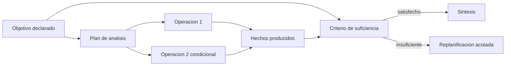
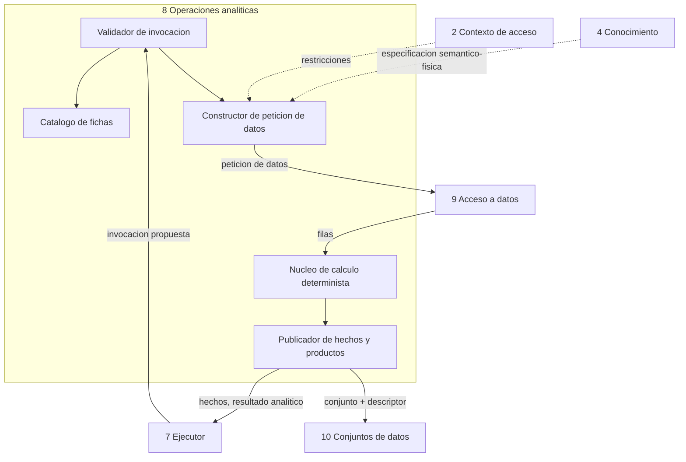

<!-- docs/10_parte_operaciones.md -->
<!-- Bloque 2 - Contrato semantico. Nivel de formato pendiente (Bloque 3). -->

# Parte 8 — Operaciones analiticas

> **Responsabilidad**
> Definir y custodiar el **catalogo cerrado de objetivos y operaciones**, y ejecutar
> los calculos analiticos que el sistema sabe hacer. Es el techo de lo que el producto puede responder: nada que no este en este
> catalogo puede ser preguntado con exito.

> **Invariante propio**
> Ningun objetivo ni operacion existe fuera del catalogo, y ninguna operacion manipula
> tablas, columnas ni joins.

> **Consumidor mas exigente**
> El Ejecutor, cuando evalua condiciones de plan y criterios de suficiencia sobre los
> productos de una operacion.

> **Convencion de nomenclatura**
> Corregido segun `16_instrucciones_ia.md` seccion 7: todo identificador interpretado
> por software va en **ingles** -- nombres de objetivo y operacion (`net_revenue`,
> `compare_periods`, `decompose_variance`), parametros, tipos de hecho, causas de
> rechazo. El **espanol** queda para lo que lee una persona: `business_name`,
> `description`, `synonyms`, preguntas tipicas, prosa explicativa. La version anterior
> de esta nota decia lo contrario; quedaba desactualizada desde que se corrigio la
> regla general.

---

## 1. Que constituye una operacion

Una operacion es una **unidad de calculo analitico nombrada, cerrada y verificable en
aislamiento**. No es una funcion cualquiera: es un elemento del vocabulario del
producto.

Para que algo sea una operacion debe cumplir las cinco condiciones:

1. **Es invocable por el modelo pero no definible por el.** El modelo elige cual usar
   y con que argumentos; no puede crear una nueva ni alterar su comportamiento.
2. **Declara sus parametros en conceptos del dominio**, nunca en estructura fisica.
   Recibe `metric = net_revenue`, jamas `tabla = ventas, campo = importe_neto`.
3. **Expresa su necesidad de datos como una o mas Peticiones de datos.** No accede a
   la fuente: la describe.
4. **Su calculo es determinista y reproducible.** Con las mismas entradas produce
   siempre la misma salida. No consulta al modelo de lenguaje en ningun momento.
5. **Declara que produce**: hechos, resultado analitico, conjunto de datos, o una
   combinacion.

### Que NO es una operacion

| No es operacion | Por que | A quien pertenece |
|---|---|---|
| Ejecutar SQL arbitrario | Rompe la cerradura del catalogo | A nadie: prohibido |
| Resolver que significa "facturacion" | Es conocimiento semantico | Conocimiento del negocio |
| Resolver que tabla contiene las ventas | Es mapeo fisico | Conocimiento del negocio |
| Traducir una peticion al dialecto del motor | Es ejecucion | Acceso a datos |
| Decidir si hace falta una segunda ronda | Es orquestacion | Ejecutor |
| Redactar la explicacion del resultado | Es sintesis | Sintesis de respuesta |

### Regla de extension

Agregar una capacidad al producto significa **agregar una ficha de operacion, su
calculo, sus tests y sus casos de evaluacion**. Nunca significa tocar el Ejecutor, el
Conocimiento ni el Acceso a datos. Si agregar una operacion obliga a modificar otra
caja, la operacion esta mal definida o la caja esta mal cortada.

Esta es la via principal de escalabilidad del sistema y conviene protegerla: es lo
que permite que el producto crezca sin que crezca su riesgo.

---

## 2. Objetivo, operacion y criterio de suficiencia

Tres conceptos que se confunden con facilidad y que aqui se separan de forma estricta.

| Concepto | Que es | Quien lo elige | Quien lo evalua |
|---|---|---|---|
| **Objetivo** | Que se quiere lograr con el turno | El modelo, de un catalogo cerrado | El Ejecutor |
| **Operacion** | Un paso de calculo concreto | El modelo, de un catalogo cerrado | Operaciones (validez) |
| **Criterio de suficiencia** | Cuando el objetivo esta satisfecho | Nadie: lo declara el objetivo | El Ejecutor, deterministamente |

El punto central: **el criterio de suficiencia pertenece al objetivo, no a la
operacion ni al modelo**. Es lo que impide que el sistema entre en bucle o se rinda
temprano, y lo que convierte "ya se lo suficiente" en una comparacion numerica en vez
de un juicio.

### Duenez del catalogo de objetivos

El catalogo de objetivos **pertenece a esta parte**, junto con el de operaciones. No es
un artefacto suelto ni vive en el Ejecutor.

Razon: el criterio de suficiencia de un objetivo se expresa **sobre hechos**, y los
hechos los publican las operaciones. Objetivos y operaciones se versionan juntos por el
mismo motivo por el que el modelo semantico y el mapeo fisico viven en una sola caja:
cambiar uno sin el otro produce un sistema incoherente.

No pertenece a Conocimiento del negocio: los objetivos no son vocabulario del negocio
del cliente, son **capacidades del producto**. Son los mismos para todas las conexiones.

### Catalogo de objetivos (version inicial)

| Objetivo | Pregunta tipica | Criterio de suficiencia | Umbral configurable |
|---|---|---|---|
| `query_metric` | "¿Cuanto vendimos en julio?" | La metrica se obtuvo para el alcance completo pedido | — |
| `compare` | "¿Julio contra junio?" | Ambos terminos obtenidos, comparables y con igual definicion | — |
| `rank` | "¿Los diez mejores clientes?" | Se obtuvieron N elementos ordenados sobre el universo autorizado completo | N por defecto = 10 |
| `explain_variance` | "¿Por que cayo la facturacion?" | La contribucion acumulada de los factores identificados alcanza el umbral | 70 % por defecto |
| `detect_anomaly` | "¿Hay algo raro esta semana?" | Se evaluo la serie completa del periodo con el criterio declarado | Sensibilidad |
| `describe_dataset` | "¿Quienes fueron los invitados?" | Se obtuvo el conteo total y una vista previa determinista y acotada | — |
| `explore` | "¿Como viene el negocio?" | Se cubrieron todas las dimensiones declaradas del panorama | Dimensiones del panorama |

Un objetivo que no esta en el catalogo no puede ser propuesto. Si el modelo interpreta
una intencion que no mapea a ningun objetivo, la salida correcta es
`out_of_scope`, con explicacion de que si puede hacerse.

### Relacion entre los tres



---

## 3. Que declara una operacion — ficha de operacion

Toda operacion se define mediante una ficha con los mismos trece campos. La ficha es
parte del contrato: sin ella la operacion no existe para el sistema.

> **Sin versionado de ficha por ahora.** Ninguna version de operacion se declara todavia
> porque ningun artefacto la transporta ni la consume: no hay campo `version` en
> `Fact`, `AnalysisPlan` ni en ningun otro modelo de `14_contratos_formato.md` que la
> reciba. Si mas adelante hace falta trazabilidad historica de resultados frente a
> cambios de una operacion, se disena junto con el formato que la transporte -- no se
> agrega un campo que nadie lee.

| Campo | Contenido |
|---|---|
| Nombre canonico | Identificador estable de la operacion |
| Proposito | Una frase, en lenguaje de negocio |
| Parametros | Nombre, tipo de dominio, obligatorio u opcional, valor por defecto |
| Precondiciones semanticas | Que debe confirmar Conocimiento antes de ejecutar |
| Requisito de universo | Autorizado, o completo (ver seccion 4) |
| Peticiones de datos | Cuantas emite y con que forma |
| Calculo | Que hace deterministamente sobre los datos recibidos |
| Productos | Hechos, resultado analitico, conjunto de datos |
| Hechos publicados | Tipos de hecho que emite, con su forma |
| Condiciones de rechazo | Causas propias, ademas de las genericas |
| Coste | Numero de accesos a la fuente en el peor caso |
| Verificacion | Como se prueba en aislamiento |
| Reutilizable | Si puede resolverse desde un conjunto activo valido |

### Nota sobre "hechos publicados" — cambio respecto de la traza nominal

En la traza, los hechos los armaba el Ejecutor a partir de los resultados. Se corrige:
**cada operacion declara y publica sus propios hechos**. Motivos:

- El Ejecutor deja de necesitar conocimiento sobre que significa cada resultado, lo
  que era su principal riesgo estructural.
- La respuesta minima determinista se vuelve construible por plantilla a partir del
  tipo de hecho, sin logica especial por operacion.
- La validacion de salida puede comprobar tipos de hecho, no solo cifras sueltas.
- Agregar una operacion no obliga a tocar el Ejecutor. Coherente con la regla de
  extension.

Un hecho declara:

| Campo | Contenido |
|---|---|
| Identificador | Estable dentro del turno |
| `turn_id` | Turno que lo produjo. **Frontera de consistencia** |
| `objective_id` | Objetivo al que pertenece |
| Tipo | Tipo de hecho declarado en la ficha |
| Valor | Magnitud, texto o elemento, segun el tipo |
| Unidad | Cuando aplica |
| Alcance | Universo al que corresponde, incluido el alcance autorizado |
| Momento de captura | De los datos que lo produjeron, no de su publicacion |
| Naturaleza de la evidencia | Original o reconstructed |
| Invocacion | Referencia a la invocacion que lo produjo |

`turn_id` y `objective_id` son los dos ejes de aislamiento de la evidencia, y ambos se
comprueban mecanicamente en la validacion de salida. El **momento de captura por hecho**
es necesario porque una misma respuesta puede apoyarse en hechos capturados en momentos
distintos: reanudaciones y reutilizacion de conjuntos activos lo producen de forma
rutinaria.

---

## 4. Requisito de universo

El punto donde permisos y analisis se cruzan, y el mas facil de resolver mal.

Una operacion declara si su calculo es correcto sobre el **universo autorizado** del
usuario, o si exige el **universo completo** de la conexion.

### Regla dura

> Una operacion que necesita un denominador, un total o un universo mayor que el
> autorizado **se rechaza**. Jamas se calcula sobre el subconjunto autorizado y se
> presenta como si fuera el total.

Esta regla existe porque el modo de fuga tipico no es mostrar filas prohibidas: es
mostrar un **porcentaje sobre un total prohibido**, que permite deducirlo.

### Clasificacion

| Operacion | Universo | Motivo |
|---|---|---|
| `query_metric` | Autorizado | El resultado es correcto dentro del alcance y se declara como tal |
| `compare_periods` | Autorizado | Ambos terminos comparten alcance |
| `time_series` | Autorizado | Idem |
| `breakdown` | Autorizado | El desglose es del alcance autorizado y se declara como tal |
| `rank` | Autorizado | Un ranking dentro del alcance es valido si se declara el alcance |
| `decompose_variance` | Autorizado | La descomposicion es de la variacion observada dentro del alcance |
| `count` | Autorizado | — |
| `describe_dataset` | Autorizado | — |
| `detect_anomaly` | Autorizado | La serie autorizada es una serie legitima |
| `calculate_share` | **Completo** | El denominador es el total; si no esta autorizado, se rechaza |
| `compare_against_peers` | **Completo** | Requiere el universo de pares, que puede no estar autorizado |

### Regla de declaracion de alcance

Toda operacion sobre universo autorizado **publica el alcance como parte de sus
hechos**, y Sintesis esta obligada a reflejarlo. "Los diez mejores clientes" bajo un
contexto restringido se responde como "los diez mejores **entre tus clientes**". Un
resultado correcto presentado sin su alcance es un resultado enganoso.

---

## 5. Productos de una operacion

Tres productos posibles, no excluyentes.

| Producto | Que es | Destino |
|---|---|---|
| **Hechos** | Afirmaciones atomicas con valor, unidad y alcance | Sintesis, validacion de salida, respuesta minima |
| **Resultado analitico** | Cifras y metadatos del calculo | Respuesta, evaluacion de condiciones y suficiencia |
| **Conjunto de datos** | Filas materializadas con su descriptor | Vista previa, paginado, exportacion, reutilizacion |

### Regla de materializacion

> **Toda ejecucion de una Peticion de datos produce un conjunto materializado con su
> descriptor, sin importar el numero de filas.** El umbral de vista previa determina
> cuanto viaja dentro de la respuesta, no si el conjunto existe. El umbral de
> materializacion maxima es un limite superior: por encima, la operacion se rechaza.

Motivo de la correccion: si un resultado de doce filas no se materializa, exportarlo
obliga a re-ejecutar y el archivo puede no coincidir con lo que el usuario vio. La
consistencia del snapshot y la reutilizacion por cobertura exigen que el conjunto
exista siempre, no solo cuando es grande.

Consecuencia: **la existencia de un conjunto no es informacion**. Lo que informa al
usuario es la relacion entre filas totales y filas mostradas, que se declara siempre
de forma explicita.

### Descriptor en dos capas

Un conjunto materializado guarda datos obtenidos de la fuente y, con frecuencia,
columnas calculadas encima. Su descriptor refleja ambas cosas por separado:

| Capa | Contenido | Para que sirve |
|---|---|---|
| **Obtenido** | Vocabulario de Peticion de datos: metricas, dimensiones, periodo, granularidad, filtros, universo | Verificar cobertura de una peticion nueva |
| **Derivado** | Columnas calculadas en zona determinista y el calculo que las produjo | Verificar si una pregunta de seguimiento se resuelve reordenando, filtrando o recortando lo ya presentado |

La distincion importa: de una columna de contribucion ya calculada se puede derivar
"los diez de mayor caida", pero **no** se puede derivar una metrica nueva. Mezclar
ambas capas en un solo descriptor haria pasar por cubierta una peticion que no lo esta.

### Coherencia de captura en calculos derivados

> **Si varios hechos participan de un mismo calculo derivado, deben provenir de una
> captura compatible.** Si no la comparten, se re-ejecutan los pasos necesarios bajo una
> **captura comun** antes de calcular.

Es la unica regla del diseno que protege la **coherencia numerica entre hechos**. Todas
las demas protegen la correccion de cada hecho por separado, lo cual no alcanza: hechos
individualmente correctos obtenidos sobre estados distintos de la fuente producen
respuestas que se contradicen a si mismas.

Aparece de forma rutinaria en dos situaciones: cuando un paso reutiliza un conjunto
activo y otro consulta de nuevo, y cuando un analisis se reanuda y sus pasos se
ejecutaron en momentos distintos.

**Cuando aplica:** un calculo es derivado cuando uno de sus insumos es un hecho de otro
paso. La ficha de la operacion declara esa dependencia; el Ejecutor la comprueba antes
de invocar. Operaciones sin insumos de otros pasos no estan sujetas a esta regla, y sus
hechos pueden convivir con capturas distintas siempre que el alcance declare el rango.

### Conjuntos activos de la sesion

La sesion mantiene un numero acotado de conjuntos activos, no uno solo. La
verificacion de validez se evalua contra todos ellos y gana el mas reciente que la
satisfaga. El desalojo ocurre por vencimiento de frescura, por invalidacion semantica
o por capacidad, en ese orden de prioridad.

### Tabla de productos por operacion

Todas las operaciones materializan conjunto: la columna indica que contiene.

| Operacion | Hechos | Resultado analitico | Contenido del conjunto |
|---|---|---|---|
| `query_metric` | Si | Si | La cifra y su alcance |
| `compare_periods` | Si | Si | Los dos valores por periodo |
| `time_series` | Si | Si | Los puntos de la serie |
| `breakdown` | Si | Si | La metrica por cada elemento de la dimension |
| `rank` | Si | Si | Los elementos ordenados |
| `decompose_variance` | Si | Si | Elementos con variacion y contribucion |
| `count` | Si | Si | El conteo y sus filtros |
| `describe_dataset` | Si | Si | Las filas del universo descrito |
| `detect_anomaly` | Si | Si | La serie completa, con marca de anomalia |
| `calculate_share` | Si | Si | Elemento, total y participacion |

---

## 6. Peticion de datos — como una operacion expresa su necesidad

La Peticion de datos es el lenguaje interno canonico. Lo construye Operaciones, lo
traduce Acceso a datos, y **el Descriptor de cobertura usa exactamente el mismo
vocabulario**, que es lo que hace verificable la reutilizacion.

### Campos

| Campo | Contenido |
|---|---|
| Metricas | Conceptos canonicos ya resueltos por Conocimiento |
| Dimensiones | Conceptos canonicos de agrupacion |
| Periodo | Rango de fechas resuelto, con el campo temporal aplicable |
| Granularidad | Dia, semana, mes, trimestre, anio, o total |
| Filtros | Dimension canonica, operador, valores |
| Orden | Campo y sentido |
| Limite | Maximo de filas solicitadas |
| Universo requerido | Autorizado o completo |
| Restricciones de acceso | Inyectadas por Contexto de acceso, no negociables |

> **`filters` y `access_filters` nunca se confunden.** `filters` es el parametro que una
> operacion declara y que el modelo completa desde la pregunta; `access_filters` lo
> inyecta Contexto de acceso, no lo elige el modelo ni lo declara ninguna ficha. Una
> ficha de operacion **jamas** tiene `access_filters` entre sus parametros -- si lo
> tuviera, la restriccion dejaria de viajar antes de la consulta para pasar a depender
> de que la operacion la pida. `14_contratos_formato.md` seccion 3 ya los separa en
> `DataRequest` por la misma razon.

### Ejemplo concreto — de la traza nominal

Operacion `compare_periods`, primera peticion:

```
metrics:        net_revenue
dimensions:     (ninguna)
period:         2026-06-01 .. 2026-07-31, campo temporal: fecha de emision
granularity:    mes
filters:        (ninguno)
order:          periodo ascendente
limit:          (no aplica)
universe:       authorized
access_filters: (ninguna, contexto ctx_884 sin restriccion de filas)
```

Operacion `decompose_variance`, segunda peticion:

```
metrics:        net_revenue
dimensions:     customer
period:         2026-06-01 .. 2026-07-31, campo temporal: fecha de emision
granularity:    mes
filters:        (ninguno)
order:          (se ordena en el calculo, no en la fuente)
limit:          (no aplica)
universe:       authorized
access_filters: (ninguna)
```

Devuelve 1.240 filas por dos periodos. El calculo de variacion absoluta, contribucion
y contribucion acumulada ocurre en zona determinista, **no en la fuente**: eso lo hace
identico en cualquier motor y testeable sin base de datos.

### Ejemplo de descriptor de cobertura resultante

```
metrics:          net_revenue
dimensions:       customer
period:           2026-06-01 .. 2026-07-31
granularity:      mes
filters:          (ninguno)
universe:         todos los clientes con actividad en el rango
columns:          customer, net_revenue_june, net_revenue_july, variance, contribution
context_id:       ctx_884
semantic_version: sem_v7
captured_at:      2026-08-15 14:32
```

Mismo vocabulario que la peticion, mas cuatro campos de validez. La comparacion entre
una peticion nueva y este descriptor es una operacion mecanica, sin juicio.

---

## 7. Condiciones de rechazo

Toda operacion puede rechazar. **El rechazo siempre lleva causa y accion sugerida**,
nunca es un booleano: la causa determina si el sistema informa, pide aclaracion,
acota, o consulta de nuevo.

### Causas genericas

| Causa | Origen | Accion sugerida |
|---|---|---|
| `nonexistent_concept` | Conocimiento | Ofrecer conceptos disponibles |
| `unauthorized_concept` | Contexto de acceso | Informar limitacion, sin revelar el concepto |
| `incompatible_dimension` | Conocimiento | Ofrecer dimensiones combinables |
| `granularity_not_available` | Conocimiento | Ofrecer la granularidad minima real |
| `invalid_parameters` | Operaciones | Corregir la invocacion (reintento del plan) |
| `insufficient_universe` | Operaciones + Contexto | Informar que el calculo no es posible con el alcance |
| `row_limit_exceeded` | Acceso a datos | Pedir acotar o agregar |
| `time_limit_exceeded` | Acceso a datos | Pedir acotar el periodo |
| `period_without_data` | Acceso a datos | Ofrecer periodos cercanos con datos |
| `source_not_available` | Acceso a datos | Interrupcion recuperable |

### Regla de silencio selectivo

`unauthorized_concept` se informa como limitacion de alcance **sin nombrar el
concepto**. Decir "no podes ver el margen" confirma que el margen existe y esta
calculado. Coherente con el filtrado del catalogo entregado al modelo: si no aparece
en el catalogo, tampoco aparece en el rechazo.

---

## 8. Catalogo inicial — fichas

### 8.1 `compare_periods`

| Campo | Contenido |
|---|---|
| Proposito | Obtener una metrica en dos periodos y su variacion |
| Parametros | `metric` (obligatorio), `current_period` (obligatorio), `comparison_period` (obligatorio), `filters` (opcional) |
| Precondiciones | Metrica existente, comparable en el tiempo, ambos periodos resueltos a fechas |
| Universo | Autorizado |
| Peticiones | Una, con granularidad correspondiente a los periodos |
| Calculo | Diferencia absoluta y relativa |
| Productos | Hechos, resultado analitico |
| Hechos | `period_value` x2, `absolute_variance`, `relative_variance` |
| Rechazo propio | `overlapping_periods`, `periods_of_different_length` (advertencia, no rechazo) |
| Coste | 1 acceso |
| Verificacion | Datos fijos de dos periodos, comprobar variacion esperada |
| Reutilizable | Si, si el conjunto activo cubre ambos periodos y la granularidad es derivable |

**Ejemplo de salida (traza nominal):**
`period_value(2026-06) = 4.812.400 ARS` · `period_value(2026-07) = 4.176.900 ARS` ·
`absolute_variance = -635.500 ARS` · `relative_variance = -13,2 %` ·
alcance: todos los clientes.

---

### 8.2 `decompose_variance`

| Campo | Contenido |
|---|---|
| Proposito | Repartir una variacion observada entre los elementos de una dimension |
| Parametros | `metric`, `current_period`, `comparison_period`, `dimension`, `coverage_threshold` (por defecto del objetivo), `filters` (opcional) |
| Precondiciones | Metrica y dimension combinables; dimension con cardinalidad manejable |
| Universo | Autorizado |
| Peticiones | Una, con la dimension como agrupacion |
| Calculo | Variacion por elemento, contribucion sobre la variacion total, orden descendente por magnitud de contribucion, corte por contribucion acumulada |
| Productos | Hechos, resultado analitico, conjunto de datos |
| Hechos | `main_contributor` (uno por elemento sobre el corte), `explained_coverage`, `dimension_cardinality` |
| Rechazo propio | `excessive_cardinality` (dimension con demasiados elementos distintos), `zero_variance` (no hay nada que descomponer) |
| Coste | 1 acceso |
| Verificacion | Conjunto fijo con contribuciones conocidas; comprobar suma de contribuciones = 100 % |
| Reutilizable | Si, si el conjunto activo contiene la dimension como columna |

**Coherencia de captura (obligatoria):** la contribucion reparte **la variacion total**,
que proviene de otro paso. Si ese paso y este provienen de capturas distintas de la
fuente, la suma de contribuciones deja de dar el 100 % de la variacion informada: dos
cifras individualmente correctas que **no cierran entre si**. Ver la regla general en la
seccion 5bis.

**Nota de diseno:** la contribucion se calcula **sobre la variacion**, no sobre el
total. Un cliente que representa el 2 % de la facturacion puede explicar el 40 % de la
caida. Confundir ambas cosas es el error mas comun en este tipo de analisis.

**Ejemplo de salida (traza nominal):**
tres `main_contributor` · `explained_coverage = 72 %` ·
`dimension_cardinality = 1.240` · conjunto `ds_301`.

---

### 8.3 `rank`

| Campo | Contenido |
|---|---|
| Proposito | Ordenar elementos de una dimension por una metrica |
| Parametros | `metric`, `dimension`, `period`, `n` (por defecto 10), `direction` (por defecto descending), `filters` (opcional) |
| Precondiciones | Metrica y dimension combinables |
| Universo | Autorizado, con declaracion obligatoria de alcance |
| Peticiones | Una, con orden y limite en la fuente |
| Calculo | Ninguno adicional: el orden lo resuelve la fuente |
| Productos | Hechos, resultado analitico, conjunto de datos (siempre se materializa, seccion 5) |
| Hechos | `ranking_element` x n, `universe_total`, `universe_scope` |
| Rechazo propio | `excessive_n` |
| Coste | 1 acceso |
| Verificacion | Conjunto fijo con orden conocido; comprobar empates y estabilidad del orden |
| Reutilizable | Si, si el conjunto activo contiene la dimension y la metrica |

---

### 8.4 `query_metric`

| Campo | Contenido |
|---|---|
| Proposito | Valor de una metrica en un alcance |
| Parametros | `metric` (obligatorio), `period` (obligatorio), `filters` (opcional) |
| Precondiciones | Metrica existente |
| Universo | Autorizado |
| Peticiones | Una, sin agrupacion |
| Calculo | Ninguno adicional: el valor lo resuelve la fuente |
| Productos | Hechos, resultado analitico, conjunto de datos |
| Hechos | `metric_value` |
| Rechazo propio | Ninguna adicional a las genericas |
| Coste | 1 acceso |
| Verificacion | Datos fijos de un periodo, comprobar el valor esperado |
| Reutilizable | Si, si el conjunto activo cubre el periodo y la metrica |

---

### 8.5 `breakdown`

| Campo | Contenido |
|---|---|
| Proposito | Una metrica abierta por los elementos de una dimension, sin ordenar ni comparar |
| Parametros | `metric` (obligatorio), `dimension` (obligatorio), `period` (obligatorio), `filters` (opcional) |
| Precondiciones | Metrica y dimension combinables |
| Universo | Autorizado |
| Peticiones | Una, con la dimension como agrupacion |
| Calculo | Ninguno adicional: la apertura la resuelve la fuente |
| Productos | Hechos, resultado analitico, conjunto de datos |
| Hechos | `value_per_element` x n, `dimension_cardinality`, `universe_scope` |
| Rechazo propio | Ninguna propia. **No** comparte `excessive_cardinality` con `decompose_variance`: queda sujeta a los limites generales de filas y materializacion (seccion 5), porque no reparte una variacion ni corta por contribucion acumulada -- simplemente abre la metrica, sin importar cuantos elementos tenga la dimension |
| Coste | 1 acceso |
| Verificacion | Conjunto fijo con valores conocidos por elemento; comprobar que la suma coincide con el total |
| Reutilizable | Si, si el conjunto activo contiene la dimension y la metrica |

---

### 8.6 `time_series`

| Campo | Contenido |
|---|---|
| Proposito | Evolucion de una metrica por granularidad |
| Parametros | `metric` (obligatorio), `period` (obligatorio), `granularity` (**obligatorio**), `filters` (opcional) |
| Precondiciones | Metrica existente, con campo temporal disponible para la granularidad pedida |
| Universo | Autorizado |
| Peticiones | Una, con la granularidad pedida |
| Calculo | Ninguno adicional: la serie la resuelve la fuente |
| Productos | Hechos, resultado analitico, conjunto de datos |
| Hechos | `series_point` x n |
| Rechazo propio | Ninguna adicional a las genericas |
| Coste | 1 acceso |
| Verificacion | Serie fija con puntos conocidos; comprobar granularidad y orden temporal |
| Reutilizable | Si, si el conjunto activo cubre el periodo con igual o mayor granularidad |

**Sin `trend` en esta version.** La tabla de productos distintivos traia `trend` sin que
ningun documento definiera como se calcula. Publicar un hecho sin definicion matematica
es afirmar algo no definido solo porque quedo un nombre en una tabla: se retira hasta
que haya una definicion, igual criterio que el punto abierto 3 aplica a `detect_anomaly`.

---

### 8.7 `count`

| Campo | Contenido |
|---|---|
| Proposito | Cardinalidad de un universo bajo filtros |
| Parametros | `filters` (opcional). Sin `metric`: no mide una magnitud, cuenta filas |
| Precondiciones | Filtros expresables en vocabulario canonico, si existen |
| Universo | Autorizado |
| Peticiones | Una, sin metrica ni agrupacion, solo conteo |
| Calculo | Ninguno adicional |
| Productos | Hechos, resultado analitico, conjunto de datos |
| Hechos | `count` |
| Rechazo propio | Ninguna adicional a las genericas |
| Coste | 1 acceso |
| Verificacion | Universo fijo con conteo conocido |
| Reutilizable | Si, si el conjunto activo cubre el mismo universo y filtros |

---

### 8.8 `describe_dataset`

| Campo | Contenido |
|---|---|
| Proposito | Conteo, columnas y vista previa determinista y acotada de un universo |
| Parametros | `filters` (opcional). Sin `metric` |
| Precondiciones | Ninguna mas alla del universo autorizado |
| Universo | Autorizado |
| Peticiones | Una, sin agrupacion, con vista previa determinista y acotada |
| Calculo | Ninguno adicional |
| Productos | Hechos, resultado analitico, conjunto de datos |
| Hechos | `count`, `available_columns` |
| Rechazo propio | Ninguna adicional a las genericas |
| Coste | 1 acceso |
| Verificacion | Universo fijo; comprobar conteo, columnas disponibles, y que la vista previa es determinista y acotada -- no se exige representatividad estadistica, ninguna inferencia numerica se apoya en ella |
| Reutilizable | Si, si el conjunto activo cubre el mismo universo |

---

### 8.9 `detect_anomaly`

| Campo | Contenido |
|---|---|
| Proposito | Puntos fuera del comportamiento esperado de una serie |
| Parametros | `metric` (obligatorio), `period` (obligatorio), `sensitivity` (opcional; por defecto, valor configurado del objetivo) |
| Precondiciones | Metrica existente, con serie temporal disponible |
| Universo | Autorizado |
| Peticiones | Una, con granularidad de serie |
| Calculo | Aplica a la serie completa del periodo un criterio de anomalia configurado externamente y declara el criterio aplicado. **El metodo concreto que implementa ese criterio es el punto abierto 3 de la seccion 12** y no se fija en este bloque |
| Productos | Hechos, resultado analitico, conjunto de datos |
| Hechos | `anomalous_point` x n, `applied_criterion` |
| Rechazo propio | Ninguna propia definida en este bloque. Las causas especificas dependientes del metodo se incorporaran cuando se resuelva el punto abierto 3 |
| Coste | 1 acceso |
| Verificacion | Con una implementacion de prueba determinista del criterio (un doble de prueba, no un metodo estadistico real): comprobar que la operacion aplica el criterio recibido a toda la serie, marca los puntos que ese criterio senala y publica `applied_criterion` con el criterio efectivamente usado. Mismo enfoque que la verificacion de `compare_periods` con datos fijos: prueba el mecanismo de la operacion, no la validez estadistica de un metodo que todavia no se elige |
| Reutilizable | Si, si el conjunto activo cubre el periodo con la granularidad de la serie |

La operacion permanece en el catalogo porque su contrato **no depende** del metodo
concreto: declara que aplica un criterio configurado a la serie completa, que declara
el criterio aplicado y que publica `anomalous_point` y `applied_criterion`. Calculo y
verificacion ya quedan completos en terminos contractuales abstractos; solo el metodo
estadistico concreto y la causa de rechazo que dependa de el quedan pendientes del punto
abierto 3.

**Sobre `sensitivity`:** por analogia con `coverage_threshold` en `decompose_variance`
(8.2), el mismo valor configurado del objetivo puede alimentar tanto el criterio de
suficiencia del Ejecutor como el parametro de la operacion que lo consume. Lo que
**no** esta decidido es si Interpretacion (el modelo) puede proponer un valor propio de
`sensitivity` que sobrescriba el del objetivo -- ningun documento le otorga hoy esa
autoridad. Hasta que se decida explicitamente, `sensitivity` se documenta solo con su
valor por defecto; ver punto abierto 5 de la seccion 12.

---

### 8.10 `calculate_share`

| Campo | Contenido |
|---|---|
| Proposito | Peso de un elemento sobre un total |
| Parametros | `metric` (obligatorio), `dimension` (obligatorio), `element` (obligatorio; el valor puntual de `dimension` cuyo peso se calcula), `period` (obligatorio), `filters` (opcional; filtros generales, se aplican tanto al numerador como al denominador) |
| Precondiciones | Metrica y dimension combinables; universo completo autorizado para el denominador |
| Universo | **Completo** |
| Peticiones | **Dos**: la del numerador aplica `filters` mas el filtro puntual `dimension = element`; la del denominador aplica solo `filters`, agregado sobre todo el universo completo de `dimension` (sin la restriccion de `element`). Ambas bajo **captura compatible o comun** -- sin eso, el elemento y el total podrian provenir de estados distintos de la fuente y la participacion resultante seria incoherente (coherencia de captura, `01_metodo_solucion.md` seccion 9 invariante 12) |
| Calculo | Participacion del elemento sobre el total del universo completo |
| Productos | Hechos, resultado analitico, conjunto de datos |
| Hechos | `share`, `universe_total` |
| Rechazo propio | `insufficient_universe` (causa generica de la seccion 7; no se define una nueva) |
| Coste | **2 accesos** (numerador y denominador) |
| Verificacion | Con datos fijos, comprobar exactamente `share = numerator / universe_total`, que el denominador corresponde al universo completo autorizado, que los filtros generales se aplican a ambos lados, que `dimension = element` solo se aplica al numerador y que numerador y denominador provienen de captura compatible |
| Reutilizable | Si, si el conjunto activo cubre el universo completo con la dimension y la metrica |

---

Diez operaciones y siete objetivos. Deliberadamente pocas: coherente con el principio
de que un conjunto acotado de capacidades coherentes vale mas que un catalogo extenso
a medias. **El catalogo no crece hasta haber corrido el banco de preguntas reales**:
la evidencia de que falta una operacion es que preguntas legitimas caigan en
`out_of_scope`, no la intuicion de que podria hacer falta.

`breakdown` y `rank` se parecen y conviene no confundirlas: `breakdown` responde
"cuanto vendio cada region", `rank` responde "las cinco mejores regiones". La
primera devuelve el universo, la segunda un recorte ordenado. Una pregunta que pide
las dos cosas usa `breakdown` y ordena sobre el conjunto derivado.

---

## 9. Estructura interna de la parte



Ningun sub-bloque introduce entradas o salidas que la caja padre no tenga.

| Sub-bloque | Responsabilidad |
|---|---|
| Catalogo de fichas | Define que operaciones existen y que declaran. Es dato, no logica |
| Validador de invocacion | Comprueba nombre, parametros, tipos y precondiciones |
| Constructor de peticion | Combina calculo pedido + especificacion de Conocimiento + restricciones de acceso |
| Nucleo de calculo | Matematica del dominio sobre filas ya reducidas. Sin acceso a fuente ni a modelo |
| Publicador | Emite hechos, resultado analitico y, si corresponde, conjunto con descriptor |

El nucleo de calculo es la unica parte con logica de negocio real y es
**completamente testeable con datos fijos**, sin base de datos y sin modelo de
lenguaje. Esa propiedad es intencional y conviene defenderla en la implementacion.

---

## 10. Verificacion de la parte

| Nivel | Que verifica | Como |
|---|---|---|
| Ficha | Toda operacion del catalogo declara los trece campos | Prueba estructural sobre el catalogo |
| Validacion | Invocaciones invalidas se rechazan con la causa correcta | Casos de invocacion malformada |
| Construccion de peticion | La peticion generada corresponde al calculo y lleva las restricciones de acceso | Comparacion contra peticion esperada |
| Calculo | Resultados correctos sobre datos fijos | Datos de prueba con resultado conocido |
| Propiedades | Invariantes matematicos independientes de los datos | Suma de contribuciones = 100 %; ranking estable ante empates; variacion consistente con los valores |
| Universo | Operaciones de universo completo se rechazan bajo contexto restringido | Casos con contexto restringido |
| Productos | Materializacion ocurre exactamente al superar el umbral | Casos en el limite del umbral |

Las pruebas de propiedades son especialmente valiosas aqui: capturan errores que los
datos de ejemplo no revelan, y son el tipo de verificacion que distingue un calculo
analitico correcto de uno que funciona con el caso probado.

---

## 11. Decisiones registradas en esta parte

| Decision | Supuesto | Senal de invalidacion | Tipo |
|---|---|---|---|
| Catalogo cerrado de operaciones | Las preguntas reales de negocio se cubren con un catalogo acotado | Mas del 30 % de las preguntas de prueba caen en `out_of_scope` | Sistema |
| Catalogo cerrado de objetivos con criterio de suficiencia | La terminacion puede decidirse deterministamente | Aparecen objetivos legitimos sin criterio expresable numericamente | Sistema |
| Cada operacion publica sus propios hechos | El Ejecutor no necesita conocer la semantica de los resultados | Un tipo de hecho requiere logica de composicion en el Ejecutor | Sistema |
| Calculo derivado en zona determinista, no en la fuente | El resultado reducido cabe comodamente en memoria | Un calculo necesita operar sobre volumenes que no se pueden traer | Sistema |
| Rechazo de operaciones que exigen universo no autorizado | Es preferible no responder a responder con un total enganoso | Aparece un caso donde el rechazo bloquea un uso legitimo y frecuente | Sistema |
| Materializacion siempre, con descriptor en dos capas | El coste de conservar conjuntos pequenos es despreciable frente a la consistencia que garantiza | La sesion acumula conjuntos hasta volverse costosa en almacenamiento | Sistema |
| ~~Identificadores canonicos del dominio en espanol~~ **Invalidada** -- ver `16_instrucciones_ia.md` seccion 7 | El vocabulario de negocio es del cliente, no del codigo | Se corrigio: un consumidor externo de la API necesita identificadores en ingles, y el banco de casos ya se construyo en ingles | Sistema |
| El catalogo de objetivos pertenece a esta parte | El criterio de suficiencia se expresa sobre hechos, que publican las operaciones | Aparecen objetivos sin relacion con ninguna operacion | Sistema |
| Coherencia de captura obligatoria en calculos derivados | Hechos correctos sobre estados distintos producen respuestas incoherentes | Re-ejecutar por coherencia resulta prohibitivamente caro | Sistema |

---

## 12. Puntos abiertos

1. **Capacidad maxima de conjuntos activos por sesion.** Numero y tamano total
   pendientes de la revision adversarial, junto con la politica de desalojo.
2. **Cardinalidad maxima de una dimension** para `decompose_variance`: valor
   concreto pendiente de la revision adversarial.
3. **Criterio de `detect_anomaly`**: el metodo estadistico concreto es decision de
   implementacion, pero el criterio aplicado debe publicarse como hecho.
4. **Comparacion de periodos de distinta longitud**: definido como advertencia; falta
   decidir si ademas se normaliza.
5. **Autoridad para sobrescribir un umbral configurado del objetivo.** `sensitivity` en
   `detect_anomaly` (8.9) toma por defecto el valor configurado del objetivo, igual que
   `coverage_threshold` en `decompose_variance` (8.2). No esta decidido si Interpretacion
   puede proponer un valor propio que lo sobrescriba, ni bajo que condiciones. Hasta que
   se decida, ambos parametros se documentan solo con su valor por defecto.


---

## Ubicacion en el proyecto

| Aspecto | Valor |
|---|---|
| Caja del diagrama | **8 Operaciones analiticas** |
| Codigo | `src/querypilot/analytics/` |
| Tests | `tests/analytics/` — subcarpetas: unit/ properties/ request/ universe/ |
| Sub-peldano de implementacion | 5.2 de `MAPA_AVANCE.md` |
| Estado actual | Pendiente |

### Modulos que la componen

| Modulo | Proposito |
|---|---|
| `objective_catalog` | Objetivos y criterios de suficiencia |
| `operation_catalog` | Fichas: parametros, universo, hechos publicados |
| `invocation_validator` | Firma, tipos y precondiciones |
| `request_builder` | Construye la peticion de datos canonica |
| `fact_publisher` | Emite hechos, resultado analitico y conjunto |
| `computations/` | Nucleo determinista: un archivo por operacion |

Las firmas concretas se definen al implementar. Este documento fija **el contrato**, no
la implementacion: cualquier firma que lo respete es valida.

### Pasos de implementacion

1. Modelo de ficha de operacion y de objetivo.
2. Catalogos cargados como dato, no como logica.
3. Validador de invocacion.
4. Constructor de peticion de datos.
5. Nucleo de calculo, una operacion por vez, con sus propiedades.
6. Publicador de hechos y productos.
7. Requisito de universo y declaracion de alcance.

### Nivel de formato

Los modelos canonicos que esta parte recibe y entrega estan definidos en
`14_contratos_formato.md`. La **regla de herencia estricta** sigue vigente: si un formato
no puede transportar algo de este contrato, se revisa este contrato, no el formato.
