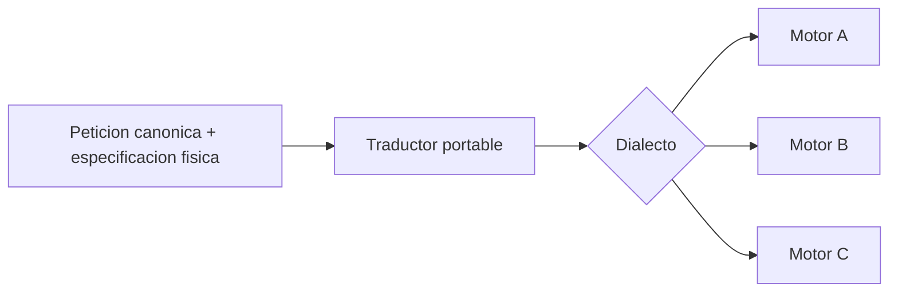
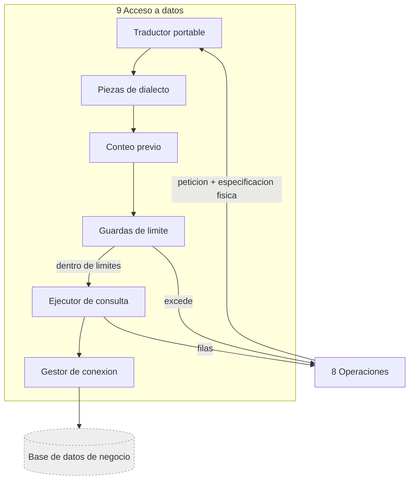

<!-- docs/11_parte_acceso_datos.md -->
<!-- Bloque 2 - Contrato semantico. Nivel de formato pendiente (Bloque 3). -->

# Parte 9 — Acceso a datos

> **Responsabilidad**
> Traducir una peticion de datos canonica al dialecto de la fuente concreta y
> ejecutarla dentro de limites.

> **Invariante propio**
> Nunca escribe sobre la base de negocio, y **nunca toma decisiones semanticas ni
> analiticas**. Es un traductor.

> **Consumidor mas exigente**
> Operaciones analiticas, que necesita que el mismo objeto canonico produzca resultados
> equivalentes en cualquier motor soportado. Si el contrato se escribiera contra un solo
> motor, agregar el segundo obligaria a reabrirlo.

---

## 1. Frontera de la parte

```
Conocimiento     -> que significa y donde esta
Operaciones      -> que calculo analitico realizar
Acceso a datos   -> como ejecutar la obtencion contra la fuente concreta
```

| Hace | No hace |
|---|---|
| Traduce peticion canonica a la sintaxis del motor | Decide que metricas o dimensiones usar |
| Resuelve diferencias de dialecto | Interpreta significado de negocio |
| Ejecuta el conteo previo | Decide si el resultado alcanza |
| Ejecuta la obtencion | Calcula variaciones, contribuciones ni rankings derivados |
| Aplica limites de tiempo y filas | Trunca resultados en silencio |
| Gestiona la conexion | Filtra por permisos despues de obtener |

Recibe **dos artefactos ya validados** y los combina sin interpretar ninguno:

| Artefacto | De quien | Contenido |
|---|---|---|
| Peticion de datos | Operaciones | Metricas, dimensiones, periodo, granularidad, filtros, orden, limite, universo, restricciones de acceso |
| Especificacion semantico-fisica | Conocimiento | Fuentes, campos, relaciones, expresiones de medida, campo temporal, exclusiones permanentes |

---

## 2. Solo lectura

| Regla |
|---|
| La conexion usa un **usuario propio de la base, con permiso de solo lectura** |
| El permiso se verifica al establecer la conexion, no se asume por configuracion |
| Ninguna capacidad del sistema construye sentencias de escritura o de definicion |
| Un intento de escritura es un defecto del sistema, no un caso de uso a controlar |

La verificacion al conectar importa: un usuario mal aprovisionado con permisos de
escritura no produciria ningun sintoma hasta que algo saliera mal.

### Consecuencia: la reanudacion es idempotente en efectos

Como todas las operaciones son lecturas, **re-ejecutar un paso que quedo iniciado y sin
resultado conocido es seguro**: no hay efectos parciales que compensar ni duplicados que
controlar. El invariante de solo lectura no es solo una garantia de seguridad; es lo que
hace barata la recuperacion.

> **Idempotencia de efectos no es igualdad de resultados.** Re-ejecutar no altera nada,
> pero puede devolver **datos distintos** si la base cambio entre ambos intentos. Por eso
> los hechos obtenidos en una re-ejecucion se marcan como **evidencia reconstruida** y no
> como original.

---

## 3. Conteo previo

> **Obligatorio antes de cada obtencion, y por operacion, no por pregunta.**

Un turno con dos operaciones ejecuta dos conteos.

| Uso | Que decide |
|---|---|
| Volumen del resultado | Si entra en el limite de materializacion |
| Volumen examinado | Si corresponde informar o pedir confirmacion al usuario |
| Existencia | Si el periodo o los filtros producen resultado vacio |

El conteo es la **unica validacion cara** del sistema y por eso ocupa el ultimo lugar
en el orden de validaciones del Ejecutor: nada llega hasta aca sin haber pasado
permisos, semantica, firma de operacion, universo y disponibilidad de conjuntos.

**Supuesto:** con tablas de decenas de miles a algunos millones de registros, el conteo
previo es barato.
**Senal de invalidacion:** aparecen conteos que superan el limite de tiempo con datos
realistas.
**Correccion prevista:** revisar indices o acotar el catalogo de operaciones, **no**
subir el limite ni pasar a conteos aproximados.

---

## 4. Limites

| Limite | Al excederse |
|---|---|
| Tiempo de consulta | Rechazo con causa `limite_tiempo_excedido`, accion: acotar el periodo |
| Filas del resultado | Rechazo con causa `limite_filas_excedido`, accion: agregar o filtrar |
| Filas examinadas | No rechaza: dispara aviso o pedido de confirmacion |

> **Ningun resultado se trunca en silencio.** Si excede, se rechaza y se explica.

Un `LIMIT` alto en la consulta es una red de seguridad contra peticiones mal
construidas, **no el mecanismo normal de trabajo**. El mecanismo normal es que la
reduccion la haga la agregacion en la fuente.

---

## 5. Portabilidad entre motores

Objetivo: **agregar un motor es implementar una pieza pequena, no reescribir el
sistema**.



| Capa | Contenido | Se reescribe por motor |
|---|---|---|
| Traductor portable | Seleccion, agrupacion, filtros, relaciones, orden, limite | No |
| Pieza de dialecto | Funciones de fecha, truncado por periodo, semana, ventanas, comillas e identificadores | Si |

Las diferencias que importan estan casi todas en **fechas**: truncar por mes o semana,
definir el inicio de semana, calcular trimestres. Es donde el SQL portable se rompe, y
por eso la pieza de dialecto existe desde el diseno y no como parche posterior.

Motor inicial: uno solo. **Multi-motor por diseno, no por implementacion en el MVP.**
La prueba de que el diseno es correcto no es soportar tres motores, sino que agregar el
segundo no toque el traductor portable.

---

## 6. Restricciones de acceso

Las restricciones llegan **ya incorporadas a la peticion**, expresadas en vocabulario
canonico, y se traducen como cualquier otro filtro.

> Esta parte **nunca filtra despues de obtener**. Si una restriccion llegara tarde, el
> defecto esta aguas arriba y no se corrige aqui.

Es la ultima linea donde la regla "la restriccion viaja antes de la consulta" se hace
efectiva, y por eso conviene que exista una prueba explicita de que la consulta
generada bajo contexto restringido contiene la restriccion.

---

## 7. Causas de rechazo propias

| Causa | Cuando | Accion sugerida |
|---|---|---|
| `fuente_no_disponible` | La conexion falla | Interrupcion recuperable |
| `limite_tiempo_excedido` | La consulta supera su tope | Acotar el periodo |
| `limite_filas_excedido` | El resultado supera el maximo | Agregar o filtrar |
| `periodo_sin_datos` | El rango no contiene registros | Ofrecer periodos cercanos con datos |
| `valor_de_filtro_inexistente` | El valor literal no existe en la dimension | Ofrecer los valores reales disponibles |
| `permiso_insuficiente_en_la_fuente` | La credencial no alcanza para leer algo declarado | Revisar el aprovisionamiento |

La quinta merece nota: **los valores de filtro son datos, no esquema**. "Region Centro"
no se puede validar contra ningun catalogo — si esa region no existe, solo se descubre
aqui. Deriva en aclaracion con los valores reales, nunca en un resultado vacio
presentado como respuesta.

La ultima distingue un problema de aprovisionamiento de un problema de permisos del
usuario: el sistema tiene reglas de acceso propias, y la base tiene las suyas.

---

## 8. Estructura interna



| Sub-bloque | Responsabilidad |
|---|---|
| Gestor de conexion | Conexiones, verificacion de solo lectura, disponibilidad |
| Traductor portable | De peticion canonica a consulta, sin sintaxis especifica |
| Piezas de dialecto | Lo que cada motor resuelve distinto. Una por motor |
| Conteo previo | Volumen esperado antes de obtener |
| Guardas de limite | Tiempo y filas; rechazan, no truncan |
| Ejecutor de consulta | Ejecuta y devuelve filas |

Las filas **vuelven a Operaciones**, nunca al modelo de lenguaje ni a la Frontera
directamente.

---

## 9. Verificacion

| Nivel | Que verifica |
|---|---|
| Solo lectura | La conexion rechaza si el usuario tiene permisos de escritura |
| Traduccion | La misma peticion canonica produce consultas equivalentes en dos motores |
| Dialecto | El truncado por mes y por semana coincide con lo esperado en cada motor |
| Restricciones | La consulta generada bajo contexto restringido contiene la restriccion |
| Conteo | Se ejecuta una vez por operacion, no por turno |
| Limites | Un resultado sobre el maximo se rechaza, no se trunca |
| Limites | Una consulta lenta se corta y devuelve la causa correcta |
| Vacios | Un periodo sin datos se distingue de un error |
| Filtros | Un valor de filtro inexistente devuelve los valores disponibles |
| Portabilidad | Agregar un motor nuevo no modifica el traductor portable |

La segunda y la ultima son las que demuestran que la separacion entre traductor y
dialecto no es decorativa. Conviene tener un segundo motor **solo en pruebas**, aunque
el MVP soporte uno: es la unica forma de comprobar que el diseno portable funciona.

---

## 10. Decisiones registradas

| Decision | Supuesto | Senal de invalidacion | Tipo |
|---|---|---|---|
| Acceso a datos es traductor puro | La peticion canonica y la especificacion fisica bastan para construir la consulta | Una consulta requiere una decision que ningun artefacto aporta | Sistema |
| Reduccion por agregacion en la fuente | El resultado agregado es pequeno y completo | Un calculo necesario no es expresable como agregacion | Sistema |
| Conteo previo obligatorio por operacion | El conteo es barato en el rango de volumen objetivo | Los conteos dominan la latencia | Sistema |
| Rechazo en vez de truncado | Un resultado truncado produce respuestas falsas | El rechazo bloquea usos legitimos frecuentes | Sistema |
| Traductor portable mas pieza de dialecto | Las diferencias entre motores se concentran en un conjunto acotado | Un motor requiere reescribir el traductor | Sistema |
| Usuario de base de solo lectura, verificado | El aprovisionamiento puede estar mal hecho sin dar sintomas | — | Sistema |
| La reanudacion se apoya en la idempotencia de efectos de la lectura | Ninguna operacion escribe, hoy ni despues | Aparece una capacidad que requiera escritura | Sistema |
| Multi-motor por diseno, un motor en el MVP | Agregar el segundo motor sera barato si el diseno es correcto | Agregar el segundo obliga a reabrir el contrato | Implementacion |
| Un segundo motor solo en pruebas | Es la unica forma de comprobar la portabilidad sin sostenerlo en produccion | El costo de mantener el segundo en pruebas no se justifica | Implementacion |

---

## 11. Puntos abiertos

1. **Motores soportados** mas alla del inicial, y en que orden.
2. **Valores concretos** de limite de tiempo y de filas, por operacion o globales.
3. **Estrategia de conexiones**: agrupacion, reutilizacion y comportamiento ante caida.
   Se cierra en el Bloque 3.
4. **Marca de ultima modificacion de la fuente**: si se puede obtener, habilita la
   correccion prevista para la frescura cuando existan cargas retroactivas.
5. **Manejo de valores nulos** en dimensiones al agrupar: categoria propia o exclusion.


---

## Ubicacion en el proyecto

| Aspecto | Valor |
|---|---|
| Caja del diagrama | **9 Acceso a datos** |
| Codigo | `src/querypilot/data_access/` |
| Tests | `tests/data_access/` — subcarpetas: unit/ dialects/ limits/ integration/ |
| Sub-peldano de implementacion | 5.2 de `MAPA_AVANCE.md` |
| Estado actual | Pendiente |

### Modulos que la componen

| Modulo | Proposito |
|---|---|
| `connection_manager` | Conexiones y verificacion de solo lectura |
| `portable_translator` | Peticion canonica a consulta, sin sintaxis de motor |
| `dialects/` | Una pieza por motor: fechas, truncado, semana, identificadores |
| `row_count` | Conteo previo |
| `limit_guards` | Rechazan; no truncan |
| `query_runner` | Ejecuta y devuelve filas |

Las firmas concretas se definen al implementar. Este documento fija **el contrato**, no
la implementacion: cualquier firma que lo respete es valida.

### Pasos de implementacion

1. Gestor de conexion con verificacion de solo lectura.
2. Traductor portable sobre el nucleo de SQLAlchemy.
3. Pieza de dialecto de PostgreSQL.
4. Conteo previo.
5. Guardas de tiempo y filas.
6. Ejecutor de consulta y mapeo de causas de rechazo.

### Nivel de formato

Los modelos canonicos que esta parte recibe y entrega estan definidos en
`14_contratos_formato.md`. La **regla de herencia estricta** sigue vigente: si un formato
no puede transportar algo de este contrato, se revisa este contrato, no el formato.
