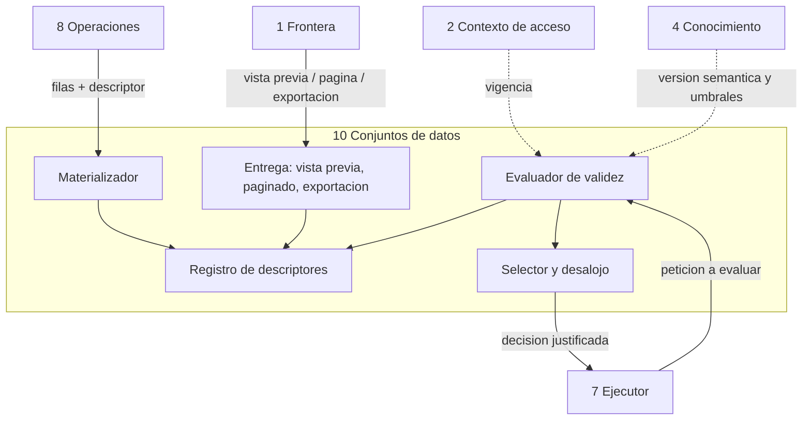

<!-- docs/12_parte_conjuntos_datos.md -->
<!-- Bloque 2 - Contrato semantico. Nivel de formato pendiente (Bloque 3). -->

# Parte 10 — Conjuntos de datos

> **Responsabilidad**
> Custodiar los conjuntos materializados y decidir deterministamente si alguno sirve
> para una necesidad nueva.

> **Invariante propio**
> Un conjunto pertenece al contexto de acceso que lo produjo y **no se re-filtra**.

> **Consumidor mas exigente**
> El Ejecutor, en la verificacion de validez: necesita una decision **ya justificada**
> —cual sirve, o por que ninguno— y no una lista de candidatos. Si recibiera
> candidatos, tendria que compararlos, y comparar es decidir.

---

## 1. Que es un conjunto materializado

Un conjunto es un **snapshot inmutable**: filas capturadas en un momento, bajo un
contexto y una version semantica determinados. Nunca se refresca en silencio.

| Componente | Contenido |
|---|---|
| Filas | El resultado completo de una peticion, mas las columnas calculadas encima |
| Descriptor | Dos capas: obtenido y derivado (seccion 2) |
| Contexto de acceso | El contexto bajo el cual fue producido |
| Version semantica | La vigente al momento de la captura |
| Momento de captura | Marca temporal de los datos, distinta de la de la respuesta |
| Plan de origen | Que analisis lo produjo |
| Vigencia | Hasta cuando sigue siendo operativamente valido |

### Regla de materializacion

> **Toda ejecucion de una peticion de datos produce un conjunto materializado, sin
> importar el numero de filas.** El umbral de vista previa determina cuanto viaja en la
> respuesta, no si el conjunto existe. El umbral de materializacion maxima es un limite
> superior: por encima, la operacion se rechaza.

Motivo: si un resultado de doce filas no se materializa, exportarlo obliga a
re-ejecutar y el archivo puede no coincidir con lo que el usuario vio. La consistencia
del snapshot y la reutilizacion exigen que el conjunto exista siempre.

Consecuencia: la existencia de un conjunto **no es informacion**. Lo que informa al
usuario es la relacion entre filas totales y filas mostradas, declarada siempre de
forma explicita.

---

## 2. Descriptor en dos capas

Un conjunto guarda lo obtenido de la fuente y, con frecuencia, columnas calculadas
encima. El descriptor las separa porque **habilitan derivaciones distintas**.

| Capa | Contenido | Habilita |
|---|---|---|
| **Obtenido** | Vocabulario de peticion de datos: metricas, dimensiones, periodo, granularidad, filtros, universo, columnas presentes | Verificar cobertura de una peticion nueva |
| **Derivado** | Columnas calculadas en zona determinista y el calculo que las produjo | Verificar si una pregunta de seguimiento se resuelve reordenando, filtrando o recortando lo ya presentado |

De una columna de contribucion ya calculada se puede derivar "los diez de mayor
caida", pero **no** se puede derivar una metrica nueva. Mezclar ambas capas en un solo
descriptor haria pasar por cubierta una peticion que no lo esta: un falso positivo
silencioso, del peor tipo.

### Ejemplo

```
ds_301
  capa obtenida:
    metricas:      facturacion_neta
    dimensiones:   cliente
    periodo:       2026-06-01 .. 2026-07-31
    granularidad:  mes
    filtros:       (ninguno)
    universo:      todos los clientes con actividad en el rango
    columnas:      cliente, facturacion junio, facturacion julio

  capa derivada:
    columnas:      variacion absoluta, contribucion, contribucion acumulada
    calculo:       descomponer_variacion sobre la capa obtenida

  contexto:            ctx_884
  version semantica:   sem_v7
  captura:             2026-08-15 14:32
  filas:               1.240
  plan de origen:      plan_57
  vigencia:            hasta 15:32 (periodo abierto: julio en curso al momento del analisis)
```

El descriptor usa **el mismo vocabulario que la peticion de datos**. Esa coincidencia
es deliberada: es lo que convierte la verificacion de cobertura en una comparacion
mecanica, sin juicio.

---

## 3. Validez de un conjunto

> **Validez = cobertura estructural + compatibilidad semantica + contexto vigente +
> frescura suficiente.**

Cuatro comprobaciones independientes. Un conjunto puede tener exactamente las columnas
y fechas necesarias y aun asi ser inutilizable.

| Comprobacion | Que verifica | Falla implica |
|---|---|---|
| Cobertura estructural | Lo pedido es derivable de lo presente | Nueva consulta, ampliada |
| Compatibilidad semantica | La version semantica del conjunto es la vigente | Re-ejecutar bajo version vigente |
| Contexto vigente | El contexto que lo produjo sigue siendo el del usuario | Rehacer bajo contexto actual, **sin re-filtrar** |
| Frescura suficiente | Los datos son lo bastante recientes para lo que se pregunta | Re-ejecutar, advirtiendo posible cambio |

Cada fallo devuelve **causa y accion**, nunca un booleano. La causa alimenta el aviso
al usuario y el registro de auditoria.

### Validez no implica coherencia

Un conjunto puede ser **valido** para una peticion y aun asi no poder usarse: si el
calculo que lo consume depende numericamente de un hecho obtenido en otra captura, la
reutilizacion produciria cifras que no cierran entre si.

Esa comprobacion no pertenece a esta parte —Conjuntos responde por la validez de un
conjunto frente a una peticion— sino al Ejecutor, que conoce las dependencias entre
pasos. Se registra aqui para dejar explicito que **una respuesta afirmativa de validez no
autoriza por si sola a reutilizar**.

---

## 4. Derivabilidad

Reglas de la cobertura estructural. Son la parte que mas se equivoca por intuicion.

| Situacion | Derivable | Motivo |
|---|---|---|
| Pedido mensual, conjunto diario | Si | Agregar hacia arriba siempre es valido |
| Pedido semanal, conjunto mensual | **No** | Desagregar es imposible |
| Filtro mas restrictivo, columna presente | Si | Se filtra sobre lo que ya esta |
| Filtro mas restrictivo, columna ausente | **No** | No hay forma de saber a que filas aplica |
| Periodo contenido en el del conjunto | Si | — |
| Periodo que excede el del conjunto | **No** | Faltan datos |
| Metrica nueva | **No** | No se calcula desde columnas derivadas |
| Reordenar o recortar sobre columnas derivadas | Si | La capa derivada lo habilita |

> **La granularidad manda sobre el periodo.** Un conjunto con ventas mensuales de julio
> cubre el periodo cuando se pide la semana del 14, pero no puede responder. Cubre si
> lo pedido es derivable **por agregacion**, nunca por desagregacion.

> **La cobertura depende de que columnas viajaron, no solo de que filas.** "Julio,
> region Centro" a partir de "julio, todas las regiones" es valido solo si la columna
> region esta presente. Si se filtro en la base y la columna no viajo, no hay forma de
> saberlo.

---

## 5. Frescura

La frescura requerida **la determina el periodo consultado, no la antiguedad del
conjunto**.

| Periodo consultado | Frescura exigida |
|---|---|
| Cerrado (julio, con agosto en curso) | Amplia: no cambia salvo carga retroactiva |
| Abierto (incluye hoy) | Corta y configurable |

Se distinguen dos vidas distintas:

| Concepto | Que es |
|---|---|
| **Vigencia analitica** | Hasta cuando los datos siguen sirviendo para responder |
| **Retencion tecnica** | Cuanto tiempo se conserva el conjunto almacenado |

Un conjunto puede estar tecnicamente retenido y analiticamente vencido: sirve como
evidencia historica, no para responder algo nuevo.

**Supuesto:** la base no admite modificaciones sobre periodos cerrados.
**Senal de invalidacion:** aparecen cargas retroactivas.
**Correccion prevista:** la frescura deja de derivarse del periodo y pasa a consultar
la marca de ultima modificacion de la fuente.

---

## 6. Seleccion entre conjuntos activos

La sesion mantiene **varios** conjuntos activos, no uno solo. El Ejecutor no los
compara: pregunta.

```
Ejecutor  -> Conjuntos de datos:
             "¿Hay un conjunto valido para esta peticion de datos?"

Conjuntos -> Ejecutor:
             "Si: ds_301, derivable por agregacion sobre columnas presentes."
                   o
             "No: ningun conjunto activo contiene la dimension region."
                   o
             "No: ds_301 cubre la estructura pero su frescura vencio a las 15:32."
```

Criterio de desempate cuando mas de uno es valido: **el mas reciente que satisfaga las
cuatro comprobaciones**. Si empatan en captura, el de menor cantidad de filas, por
coste de derivacion.

La justificacion viaja siempre. No es cortesia: alimenta el aviso al usuario
—"necesito volver a consultar la fuente porque los datos actuales solo contienen
julio"— y el registro de auditoria.

### Desalojo

Por orden de prioridad: vencimiento de frescura, invalidacion semantica, invalidacion
de contexto, capacidad. El desalojo por capacidad descarta primero el conjunto menos
recientemente utilizado.

### Prioridad de retencion de planes recuperables

> Los conjuntos referenciados por un plan en estado `recuperable` tienen **prioridad de
> retencion** frente al desalojo por capacidad, mientras dure su ventana.

Sin esta regla, un usuario que sigue preguntando mientras espera puede destruir la
reanudabilidad de su propio analisis sin enterarse: cada turno nuevo materializa
conjuntos y el desalojo por capacidad descartaria los del plan interrumpido.

> Si aun asi un conjunto de un plan recuperable no puede conservarse, **el turno deja de
> mostrarse como recuperable**. La capacidad de reanudar no se pierde en silencio: se
> informa y el turno pasa a poder rehacerse.

---

## 7. Validez operativa y validez historica

> Un conjunto invalidado **no se borra necesariamente**: deja de servir para nuevos
> analisis pero sigue siendo **evidencia original** del analisis que lo produjo.

De ahi dos terminos formales del dominio:

| Termino | Significado |
|---|---|
| **Evidencia original** | El conjunto que respaldo la respuesta en el momento en que se dio |
| **Evidencia reconstruida** | Filas obtenidas re-ejecutando la consulta despues, con datos potencialmente distintos |

Una respuesta apoyada en evidencia reconstruida **debe declararlo**. Llamar original a
una reconstruccion es afirmar algo falso sobre la trazabilidad.

Esto es coherente con el invariante de trazabilidad del sistema: toda afirmacion
presentada como dato conserva permanentemente su trazabilidad logica —operacion,
parametros, alcance y momento—, mientras que la evidencia por registros puede ser
temporal.

---

## 8. Vista previa, paginado y exportacion

| Servicio | Regla |
|---|---|
| Vista previa | Hasta el umbral configurado de filas y columnas. Siempre identificada como parcial cuando lo es |
| Paginado | Sobre el snapshot, sin volver a consultar la fuente |
| Exportacion | Corresponde exactamente al snapshot, sin nueva consulta |

### Reglas de exportacion

1. **Nunca contiene mas informacion que la que el usuario ya estaba autorizado a
   obtener.** No existe una segunda consulta mas permisiva para "exportar todo".
2. **Se revalida el contexto** antes de exportar. Si cambio, se rechaza y se ofrece
   re-ejecutar; no se re-filtra.
3. Si el conjunto ya fue descartado, exportar **implica re-ejecutar**, y se advierte
   que el archivo puede reflejar cambios posteriores en la base.
4. El limite propio de filas exportables del rol se aplica aqui.

La exportacion cubre la manipulacion manual —borrar columnas, reordenar, calculos
propios, graficos personalizados, auditoria externa— sin convertir el producto en una
herramienta de hojas de calculo.

> El sistema analiza y explica. Si el usuario quiere manipulacion manual libre,
> exporta.

---

## 9. Ejemplos de verificacion de validez

### 9.1 No cubre por columna ausente

```
Peticion:   facturacion_neta por cliente, julio, filtro region = Centro
Conjunto:   ds_301
Evaluacion: metrica presente, dimension presente, periodo contenido,
            granularidad derivable
            -> pero region no esta entre las columnas del conjunto
Salida:     no cubre
            causa:  dimension de filtro ausente
            accion: nueva consulta
```

### 9.2 Cubre por derivacion sobre capa derivada

```
Peticion:   los diez clientes de mayor caida
Conjunto:   ds_301
Evaluacion: derivable por ordenamiento y recorte sobre columnas derivadas presentes
Salida:     cubre, sin acceso a la fuente
```

### 9.3 No cubre por frescura

```
Peticion:   igual a la que produjo ds_301, a las 15:40
Salida:     no cubre
            causa:      conjunto vencido
            accion:     re-ejecutar
            advertencia: los datos pueden diferir de los mostrados a las 14:32
```

### 9.4 No cubre por version semantica

```
Peticion:   facturacion_neta por cliente, mismo periodo, bajo sem_v8
Conjunto:   ds_301, capturado bajo sem_v7
Salida:     no cubre
            causa:  version semantica cambiada
            accion: re-ejecutar bajo version vigente
            nota:   ds_301 sigue siendo evidencia original del analisis previo
```

---

## 10. Estructura interna



| Sub-bloque | Responsabilidad |
|---|---|
| Materializador | Guarda filas y descriptor, aplica el limite maximo |
| Registro de descriptores | Indice de conjuntos activos con sus dos capas |
| Evaluador de validez | Las cuatro comprobaciones, con causa |
| Selector y desalojo | Elige el mas adecuado; descarta por prioridad |
| Entrega | Vista previa, paginado y exportacion, con revalidacion de contexto |

---

## 11. Verificacion

| Nivel | Que verifica |
|---|---|
| Materializacion | Un resultado de doce filas se materializa igual que uno de mil |
| Limite | Un resultado sobre el maximo se rechaza, no se trunca |
| Derivabilidad | Mensual desde diario cubre; semanal desde mensual no |
| Derivabilidad | Filtro sobre columna ausente no cubre |
| Capas | Una metrica nueva no se deriva de columnas calculadas |
| Frescura | Periodo cerrado y periodo abierto reciben vigencias distintas |
| Semantica | Un cambio de version invalida para uso operativo y conserva valor historico |
| Contexto | Un conjunto de contexto invalidado no se reutiliza ni se exporta |
| Seleccion | Con dos conjuntos validos gana el mas reciente |
| Exportacion | Coincide exactamente con lo mostrado, sin consultar la fuente |
| Exportacion | Con contexto cambiado se rechaza y se ofrece re-ejecutar |
| Desalojo | El orden de prioridad se respeta |

Todo verificable **sin base de datos**: esta parte no consulta la fuente, solo custodia
lo que otros trajeron.

---

## 12. Decisiones registradas

| Decision | Supuesto | Senal de invalidacion | Tipo |
|---|---|---|---|
| Snapshot inmutable, sin refresco silencioso | Es preferible un dato fechado a un dato que cambia solo | Los usuarios esperan datos siempre actuales sin pedirlo | Sistema |
| Materializacion siempre | El coste de conservar conjuntos pequenos es despreciable frente a la consistencia | La sesion acumula conjuntos hasta volverse costosa | Sistema |
| Descriptor en dos capas | Las derivaciones posibles difieren segun el origen de la columna | La distincion no produce ninguna decision distinta en la practica | Sistema |
| Cobertura verificada por codigo, no por el modelo | La comparacion es expresable mecanicamente | Aparece un caso de cobertura que requiere juicio | Sistema |
| Conjunto ligado a su contexto, sin re-filtrado | Re-filtrar un conjunto ajeno es el patron que el diseno evita | Re-ejecutar resulta prohibitivamente caro al compartir | Sistema |
| Frescura derivada del periodo consultado | La base no admite cargas retroactivas sobre periodos cerrados | Aparecen modificaciones sobre periodos cerrados | Sistema |
| Varios conjuntos activos por sesion | Una sola pregunta puede apoyarse en resultados de varios turnos | La seleccion entre varios resulta confusa o costosa | Sistema |
| Exportacion sin nueva consulta | El snapshot es el objeto que el usuario vio y quiere llevarse | Los usuarios esperan que exportar traiga datos frescos | Sistema |
| Prioridad de retencion para planes recuperables | La reanudabilidad no debe depender de la impaciencia del usuario | La prioridad desplaza conjuntos utiles con frecuencia | Sistema |
| La perdida de reanudabilidad se informa, nunca es silenciosa | Ofrecer reanudar algo que ya no se puede reanudar es peor que no ofrecerlo | — | Sistema |

---

## 13. Puntos abiertos

1. **Capacidad maxima de conjuntos activos por sesion**: cantidad y tamano total.
   Pendiente de la revision adversarial.
2. **Vigencia por defecto** para periodo abierto y para periodo cerrado.
3. **Donde viven las filas materializadas**: decision de infraestructura del Bloque 3,
   **con consecuencia de sistema declarada**. Si los conjuntos no son durables frente al
   reinicio del proceso, la reanudacion tras reinicio **no se promete**: la ventana de
   `recuperable` colapsa y toda reanudacion reconstruye evidencia. No hace falta elegir
   ahora como persistirlos; si hace falta que la capacidad prometida corresponda a la
   eleccion que se haga.
4. **Conservacion explicita de evidencia** para analisis marcados como importantes o
   incorporados a un informe. Fuera del MVP, pero condiciona el modelo de retencion.


---

## Ubicacion en el proyecto

| Aspecto | Valor |
|---|---|
| Caja del diagrama | **10 Conjuntos de datos** |
| Codigo | `src/querypilot/datasets/` |
| Tests | `tests/datasets/` — subcarpetas: unit/ validity/ derivability/ retention/ |
| Sub-peldano de implementacion | 5.4 de `MAPA_AVANCE.md` |
| Estado actual | Pendiente |

### Modulos que la componen

| Modulo | Proposito |
|---|---|
| `materializer` | Guarda filas y descriptor; aplica el limite maximo |
| `descriptor_registry` | Indice de conjuntos activos |
| `validity_evaluator` | Las cuatro comprobaciones, con causa |
| `selector` | Decision justificada; desalojo y prioridad de retencion |
| `delivery` | Vista previa, paginado y exportacion |

Las firmas concretas se definen al implementar. Este documento fija **el contrato**, no
la implementacion: cualquier firma que lo respete es valida.

### Pasos de implementacion

1. Esquema de `datasets` y `dataset_rows`, con carga masiva.
2. Materializador con limite maximo.
3. Registro de descriptores en dos capas.
4. Evaluador de validez: los cuatro ejes con causa.
5. Selector, desalojo y prioridad de retencion.
6. Vista previa, paginado y exportacion.

### Nivel de formato

Los modelos canonicos que esta parte recibe y entrega estan definidos en
`14_contratos_formato.md`. La **regla de herencia estricta** sigue vigente: si un formato
no puede transportar algo de este contrato, se revisa este contrato, no el formato.
