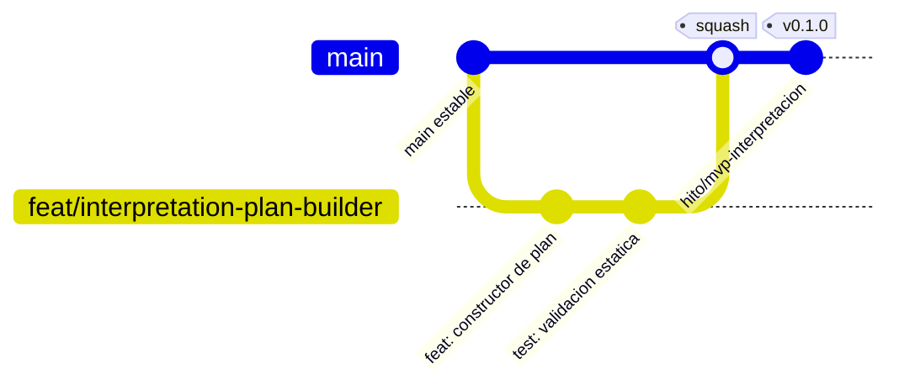

<!-- docs/15_git_github.md -->
<!-- Actualizado: 2026-08-16 -->
# 15 — Git y GitHub

Aplicacion de las decisiones del Bloque 9. **Cargar este archivo antes de crear ramas,
commits o tags.**

---

## 1. Estrategia de ramas — GitHub Flow

Un solo desarrollador; Git Flow completo seria ceremonia sin beneficio.



| Rama | Regla |
|---|---|
| `main` | **Siempre estable.** Todo commit en `main` pasa CI |
| Ramas de trabajo | Cortas, de un solo proposito, se borran tras el merge |

---

## 2. Nomenclatura de ramas

`<prefijo>/<parte>-<descripcion-corta>`

| Prefijo | Uso | Ejemplo real del proyecto |
|---|---|---|
| `feat/` | Capacidad nueva | `feat/business-knowledge-time-resolver` |
| `fix/` | Correccion | `fix/datasets-coverage-derivability` |
| `refactor/` | Sin cambio de comportamiento | `refactor/executor-validation-order` |
| `test/` | Solo pruebas | `test/analytics-contribution-properties` |
| `docs/` | Solo documentacion | `docs/update-mapa-avance` |
| `chore/` | Infraestructura y dependencias | `chore/bump-sqlalchemy` |

El `<parte>` corresponde a una carpeta de `src/querypilot/`. Una rama que no puede
nombrar su parte probablemente toca demasiadas.

---

## 3. Convencion de commits

Conventional Commits. `<tipo>(<alcance>): <descripcion en imperativo>`

| Tipo | Uso |
|---|---|
| `feat` | Capacidad nueva |
| `fix` | Correccion de comportamiento |
| `refactor` | Reorganizacion sin cambio de comportamiento |
| `test` | Pruebas |
| `docs` | Documentacion |
| `chore` | Infraestructura, dependencias, configuracion |
| `perf` | Rendimiento |

Ejemplos reales:

```
feat(analytics): agregar operacion desglosar con su ficha
fix(executor): exigir captura comun antes de un calculo derivado
test(datasets): cubrir derivabilidad por agregacion y su negacion
refactor(interpretation): separar deteccion de ambiguedad del constructor
docs(mapa): registrar regresion de trazas del peldano 5.2
chore(ci): fijar PostgreSQL 17 en el flujo de tests
```

El alcance es la carpeta de `src/querypilot/`, o `ci`, `docs`, `semantic`, `mapa`.

**Cambio de contrato:** si un commit modifica un contrato entre partes, el cuerpo debe
indicar que documento se actualizo. Un contrato que cambia en el codigo y no en el
documento es deriva.

---

## 4. Estrategia de merge

| Situacion | Metodo |
|---|---|
| Rama de trabajo → `main` | **Squash merge.** Un commit por unidad de trabajo |
| Cierre de peldano | Squash + tag de hito en el mismo commit |
| Release | Tag de version sobre `main` |

Sin merge commits: el historial de `main` es lineal y legible.

---

## 5. Flujo completo

```bash
git switch main && git pull
git switch -c feat/analytics-ranking

# desarrollar en cambios pequenos y verificables
uv run ruff check src tests && uv run ruff format src tests
uv run mypy src
uv run pytest

git add -A
git commit -m "feat(analytics): agregar operacion rankear con su ficha"
git push -u origin feat/analytics-ranking

# abrir PR -> CI verde -> squash merge -> borrar rama
```

---

## 6. Tags de hito y de version

Dos familias distintas, que no se confunden.

| Familia | Forma | Para quien | Ejemplo |
|---|---|---|---|
| **Hito** | `hito/[nombre]` | El proyecto: cierre de un peldano de `MAPA_AVANCE.md` | `hito/parte-operaciones` |
| **Version** | `vX.Y.Z` | Quien mira el repositorio desde afuera | `v0.1.0` |

**La identidad de un hito es su nombre, nunca su numero.** La escalera puede adaptarse e
insertar peldanos, lo que renumera la tabla; los tags son inmutables y un tag numerado
mentiria tras la primera adaptacion.

### Mensaje obligatorio del tag de hito

Incluye el resultado de la **regresion de las tres trazas**. Sin registro, la re-corrida
es autoreporte y no cuenta como evidencia.

```bash
git tag -a hito/parte-operaciones -m "Cierre del sub-peldano 5.2.
Evidencia: tests/analytics y tests/data_access en verde, propiedades incluidas.
Regresion de trazas: nominal OK, falla OK, recuperacion OK."
git push origin hito/parte-operaciones
```

### Correspondencia con versiones

| Version | Se etiqueta cuando |
|---|---|
| `v0.1.0` | Cierra el primer MVP y el supuesto queda validado o refutado |
| `v0.2.0` … `v0.6.0` | Cierra cada sub-peldano de implementacion |
| `v1.0.0` | Cierra el peldano de entrega: Compose levanta el sistema y el `README.md` es reproducible de cero |

El `MAPA_AVANCE.md` se actualiza como **ultimo commit del peldano**, junto con el tag.

---

## 7. Proteccion de `main`

A aplicar en la configuracion del repositorio:

| Regla | Estado |
|---|---|
| Prohibir empuje directo a `main` | Activa |
| Exigir PR antes del merge | Activa |
| Exigir CI en verde | Activa |
| Exigir rama actualizada con `main` | Activa |
| Borrado automatico de ramas tras el merge | Activa |
| Revision de terceros | No aplica: un solo desarrollador |
| `CODEOWNERS` | No aplica |

Aunque no haya revisor, el PR sigue teniendo valor: es donde el CI actua como puerta.

---

## 8. Versionado

Version inicial `0.1.0`. Versionado semantico, con la interpretacion propia de un
proyecto pre-`1.0`: la serie `0.x` puede romper compatibilidad entre versiones menores.

`v1.0.0` marca el primer contrato publico estable. A partir de ahi, todo cambio
incompatible de la superficie HTTP exige version mayor — y esa superficie es la frontera
publica, que se diseno para consumidores de terceros.
