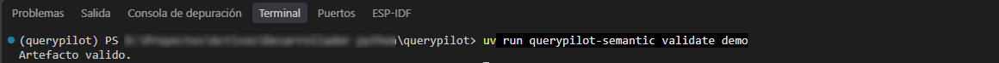
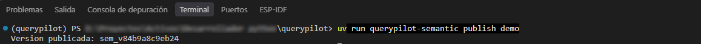
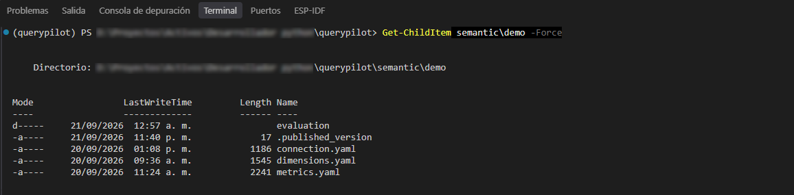

# Cómo usar QueryPilot en MVP 1: el artefacto semántico

Antes de que Interpretación pueda entender una pregunta, alguien tiene que enseñarle
el vocabulario de negocio de esa base de datos concreta. Ese vocabulario es el
**artefacto semántico**.

## Qué es

El artefacto semántico declara, para una conexión determinada:

- qué **métricas** existen (`net_revenue`, `units_sold`, `operations`...), con su
  definición de negocio, sus sinónimos y de dónde se obtienen físicamente;
- qué **dimensiones** existen (`customer`, `region`, `product`...);
- el **calendario** del negocio y los **umbrales** operativos de la conexión.

La conexión de demostración (`semantic/demo/`) describe una distribuidora mayorista
ficticia, con un esquema físico deliberadamente incómodo —columnas como `est_cod = 9`
para "anulado"— para que la capa semántica tenga algo real que traducir. El modelo
nunca ve esas columnas: ve `net_revenue`, con su definición en español.

Todo esto vive en YAML, versionado junto con el código:

```
semantic/demo/
├── connection.yaml     identidad, calendario, umbrales
├── dimensions.yaml     dimensiones disponibles
├── metrics.yaml        métricas, con su receta física
└── evaluation/
    └── cases.yaml       banco de evaluación (ver Evaluación)
```

## Validarlo

```bash
uv run querypilot-semantic validate demo
```

Carga los tres archivos YAML y corre las comprobaciones de integridad del artefacto
(métricas y dimensiones bien referenciadas, agregaciones compatibles, umbrales
coherentes entre sí, y varias más). Un artefacto inválido nunca se publica.



## Publicarlo y versionarlo

```bash
uv run querypilot-semantic publish demo
```

Si el artefacto es válido, calcula una **versión derivada del propio contenido** y la
publica.



### Qué significa esa versión

La versión (`sem_v84b9a8c9eb24` en el ejemplo) no la escribe nadie a mano: es un hash
del contenido del artefacto. Dos consecuencias directas:

- el mismo artefacto siempre produce la misma versión;
- cambiar un solo sinónimo, o agregar una métrica, cambia la versión.

Publicar deja un marcador (`.published_version`) en la carpeta de la conexión:



Esa versión viaja junto con cada interpretación y cada corrida de evaluación
(ver [Evaluación](evaluacion.md)). Sirve para responder, sin ambigüedad, "¿con qué
vocabulario se generó esta respuesta". Si el artefacto no es válido, la versión
publicada anterior sigue vigente — nunca se pisa con algo roto.

!!! note "Para el detalle completo"
    El contrato completo del artefacto semántico —los campos exactos, las ocho
    comprobaciones de integridad, cómo se resuelven sinónimos y acepciones por
    defecto— está en `docs/06_parte_conocimiento_negocio.md`, en la raíz del
    repositorio. Este manual explica lo suficiente para usarlo, no lo reemplaza.
