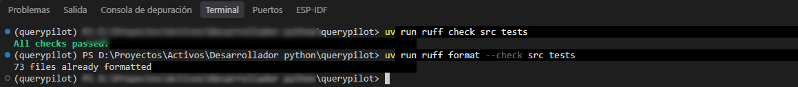
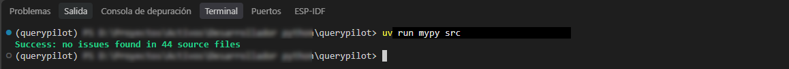
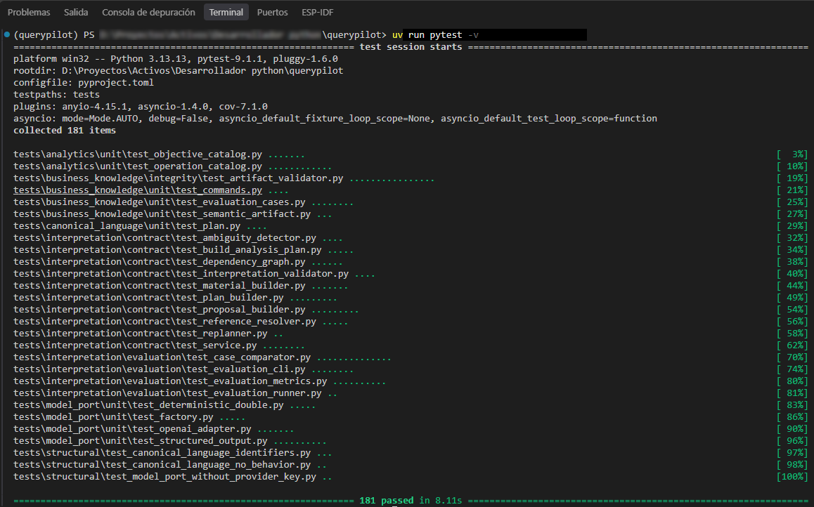

# Calidad y reproducibilidad

Todo lo que se describe en este manual se verifica automáticamente, sin depender de
que un modelo de lenguaje esté disponible. Esa separación es deliberada: el sistema
determinista (código, contratos, validaciones) se prueba en cada cambio; el modelo de
lenguaje se evalúa aparte, de forma manual, porque tiene costo y no es determinista
(ver [Evaluación](evaluacion.md)).

Tres herramientas cubren la verificación determinista:

## Ruff — estilo y correctitud del código

```bash
uv run ruff check src tests
uv run ruff format --check src tests
```

Lint y formato del código Python, en una sola herramienta.



## mypy — tipado estático

```bash
uv run mypy src
```

El proyecto es fuertemente tipado en modo estricto: todo dato que cruza una frontera
entre partes del sistema tiene un tipo declarado, y mypy lo verifica sin ejecutar
nada.



## pytest — comportamiento

```bash
uv run pytest
```

Prueba el comportamiento real del sistema: contratos entre partes, validaciones,
casos límite. Ninguno de estos tests necesita una clave de proveedor de modelo —
los que sí la necesitarían están explícitamente marcados y excluidos de la
integración continua.



!!! note "Sobre el número de tests"
    La captura muestra **181 tests aprobados**. Esa cifra corresponde al estado del
    repositorio en el momento en que se tomó la captura (bloque 1.8 cerrado) y va a
    seguir creciendo a medida que se agreguen partes nuevas del sistema. No la tomes
    como un número fijo: correlo vos mismo con `uv run pytest` para ver el estado
    actual.

## Integración continua

Cada pull request corre lint, tipado y tests automáticamente (`.github/workflows/`),
sin ninguna clave de modelo disponible en ese entorno — si una prueba la necesitara,
estaría mal categorizada. La evaluación con modelo real es un flujo aparte, de
disparo manual, exactamente porque consume el modelo y tiene costo.
