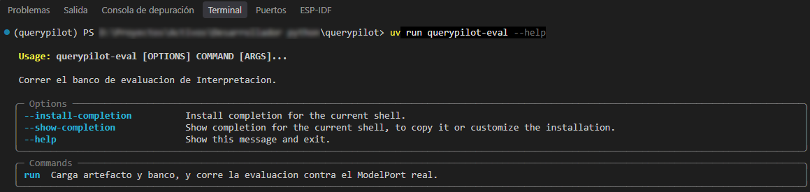
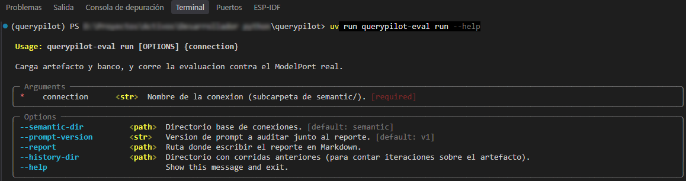
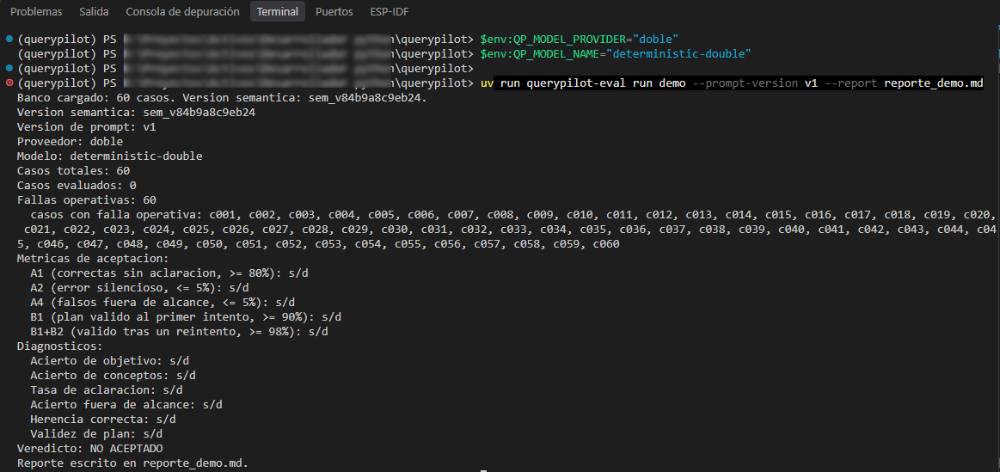
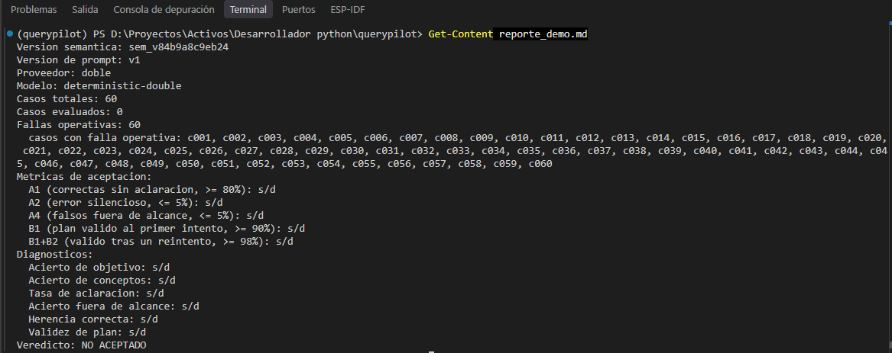

# Evaluación

## Para qué existe el banco de 60 casos

El supuesto más riesgoso de todo el proyecto es este: **¿puede un modelo de lenguaje,
con un vocabulario de negocio bien definido, convertir preguntas reales en
propuestas estructuradas válidas, de forma confiable?**

Si la respuesta es no, ninguna otra pieza del sistema importa: da igual qué tan
determinista y verificable sea todo lo que viene después si el punto de partida —
entender la pregunta— falla.

Para medir eso sin apoyarse en impresiones sueltas, existe un **banco de 60
preguntas congeladas**, cada una con su interpretación esperada
(`semantic/demo/evaluation/cases.yaml`). "Congelado" quiere decir: se escribió y se
fijó **antes** de correr el experimento, y no se toca según cómo salgan los
resultados — si se pudiera ajustar el banco después de ver que algo falla, dejaría
de medir nada.

El banco está compuesto, a propósito, por una mezcla de tipos de pregunta: preguntas
directas, preguntas con una premisa implícita, continuaciones de una conversación
anterior, preguntas con más de un objetivo a la vez, preguntas materialmente
ambiguas, y preguntas fuera de alcance.

## Qué se evalúa

Cada corrida contra el banco produce cinco métricas de aceptación. Ninguna es
un detalle académico: cada una corresponde a una forma concreta en la que el sistema
puede fallar.

| Métrica | Qué mide | Umbral |
|---|---|---|
| **A1** | Preguntas interpretadas correctamente, sin pedir aclaración | ≥ 80 % |
| **A2** | Preguntas donde el sistema arma un plan **con confianza pero mal** | ≤ 5 % |
| **A4** | Preguntas respondibles que el sistema declina como si no lo fueran | ≤ 5 % |
| **B1** | Planes válidos al primer intento | ≥ 90 % |
| **B1+B2** | Planes válidos al primer intento o tras un único reintento | ≥ 98 % |

**A2 es el umbral que de verdad importa.** Un sistema que pregunta cuando no está
seguro es, en el peor caso, molesto. Un sistema que responde con seguridad algo
incorrecto es peligroso, porque quien lo usa no tiene forma de notarlo. Por eso A2 es
el único umbral que **no admite compensación**: si A2 falla, no importa qué tan bien
salgan las otras cuatro métricas, el supuesto no queda validado. (El razonamiento
completo está en `docs/01_metodo_solucion.md`, sección 12.)

## Qué significa una falla operativa

Hay una tercera categoría, separada de "correcto" e "incorrecto": la **falla
operativa**. Ocurre cuando el modelo no llega a responder algo evaluable — se agotó
el tiempo de espera, se alcanzó un límite de la API, o la respuesta ni siquiera vino
en el formato esperado.

Una falla operativa no es un rechazo de dominio (el sistema no dijo "esto no se
puede responder" con una causa) ni un acierto ni un error: es que la corrida, en ese
caso puntual, no llegó a medir nada. Por eso **una corrida con fallas operativas
nunca se acepta**, sin importar cómo salgan las cinco métricas sobre los casos que sí
se evaluaron: no midió el banco completo, y no hay umbral que compense eso.

## El comando de evaluación

```bash
uv run querypilot-eval run <conexion>
```

Carga el artefacto semántico, lo valida, carga el banco de 60 casos, corre
Interpretación sobre cada uno y arma un reporte.



El subcomando `run` acepta, entre otras opciones, `--report` (para escribir el
reporte en un archivo Markdown) y `--history-dir` (para llevar un historial simple de
corridas anteriores, útil para no perder de vista cuántas veces se ajustó el
artefacto semántico — ver más abajo).



## Ejemplo de reporte: por qué "NO ACEPTADO" acá es correcto

Esta captura corresponde a una corrida real del comando, contra los 60 casos reales
del banco, **sin un proveedor de modelo configurado** (`QP_MODEL_PROVIDER=doble`, sin
clave de ningún tipo).



El resultado es 60 fallas operativas sobre 60 casos y un veredicto `NO ACEPTADO`.
**Esto no es un error del producto ni una corrida real fallida** — es la propiedad
que el sistema está diseñado para garantizar: si no hay con qué evaluar de verdad, el
sistema nunca declara una aceptación falsa. Una corrida vacía o rota no puede
disfrazarse de resultado positivo.

El mismo reporte, escrito en el archivo pedido con `--report`, se puede releer
después:



Esa es la forma del reporte. **Los números de A1/A2/A4/B1/B1+B2 de una corrida real
contra OpenAI todavía no existen** — correrla requiere una clave de API y tiene un
costo por inferencia, así que es una decisión deliberada, no algo que falte
implementar. Cuando esa corrida ocurra, el veredicto y las métricas reales se van a
documentar acá.

## Iteración sobre el artefacto semántico

Si una corrida real no alcanza los umbrales, el camino previsto no es tocar el banco
de casos: es ajustar el vocabulario del artefacto semántico (sinónimos, acepciones
por defecto) y volver a correr el banco congelado. Ese ciclo tiene un límite de **tres
iteraciones**; si tras la tercera los umbrales siguen sin alcanzarse, el supuesto se
considera refutado y el proyecto pivota (el pivote concreto está en
`01_metodo_solucion.md`, sección 12). El comando de evaluación cuenta cuántas
versiones semánticas distintas se evaluaron y avisa al llegar al límite, pero la
decisión final la registra una persona, no el programa.
