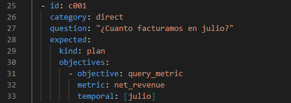
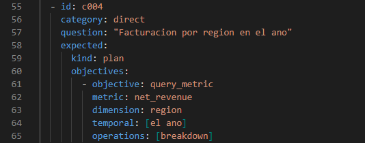
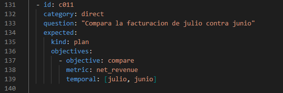
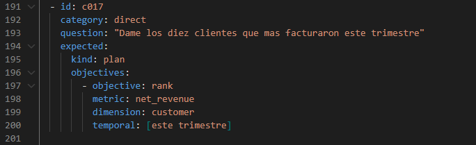

# Cómo interpreta preguntas

## Qué hace Interpretación

Interpretación recibe una pregunta en lenguaje natural, el catálogo de objetivos y
operaciones disponibles, y el vocabulario de negocio de la conexión (ver
[Artefacto semántico](artefacto_semantico.md)). Con eso arma un pedido al modelo de
lenguaje y recibe una **propuesta estructurada**: qué objetivo persigue la pregunta,
qué conceptos del vocabulario están involucrados, y qué pasos de cálculo la
resolverían.

Esa propuesta **no se acepta tal cual**. Antes de convertirse en un plan de análisis
(`AnalysisPlan`), pasa por un validador determinista —código convencional, sin
modelo de por medio— que comprueba, entre otras cosas, que:

- el objetivo exista en el catálogo cerrado;
- los conceptos citados (métricas, dimensiones) existan en el artefacto semántico;
- los parámetros de cada operación sean los que esa operación admite;
- una ambigüedad material declarada por el modelo nunca viaje junto con un plan.

Si algo no cumple, la propuesta se rechaza con una causa concreta — nunca se corrige
en silencio ni se ejecuta "lo más parecido". El modelo propone; el sistema
determinista decide.

El catálogo cerrado tiene, hoy, **7 objetivos** (`query_metric`, `compare`, `rank`,
`explain_variance`, `detect_anomaly`, `describe_dataset`, `explore`) y **10
operaciones** de cálculo. El detalle completo está en `docs/10_parte_operaciones.md`.

!!! warning "Esto todavía no ejecuta nada contra datos reales"
    Todo lo que sigue en esta página termina en un `AnalysisPlan` **validado**, no en
    una cifra. Ejecutar ese plan contra una base de datos real es trabajo de un
    bloque posterior — ver [Limitaciones del MVP 1](limitaciones.md).

## Los ejemplos de esta página

Las capturas que siguen muestran entradas del **banco de evaluación congelado**
(`semantic/demo/evaluation/cases.yaml`, ver [Evaluación](evaluacion.md)): declaran,
para cada pregunta, cuál es la interpretación que el sistema **debería** producir.

**No son el resultado de una corrida real contra el modelo** — la corrida real contra
OpenAI todavía está pendiente (ver [Evaluación](evaluacion.md)). Son la referencia con
la que, cuando esa corrida ocurra, se va a comparar lo que el modelo efectivamente
proponga. Sirven igual para explicar las cuatro formas de pregunta que el sistema
distingue hoy.

### Consulta directa

*"¿Cuánto facturamos en julio?"*

Pide el valor de una sola métrica en un período: objetivo `query_metric`, sobre
`net_revenue`, en julio. Es la forma más simple de pregunta.

### Desglose

*"Facturación por región en el año"*

Pide la misma métrica, pero abierta por una dimensión —una fila por región, sin
ordenar ni comparar—. Por eso el plan agrega una operación explícita de desglose
(`breakdown`) sobre la dimensión `region`.

### Comparación

*"Compara la facturación de julio contra junio"*

Pide la misma métrica en dos períodos distintos: objetivo `compare`, con ambos meses
declarados. La comparación en sí —diferencia absoluta y relativa— la calcula la
operación correspondiente, nunca el modelo.

### Ranking

*"Dame los diez clientes que más facturaron este trimestre"*

Pide un orden: objetivo `rank`, métrica `net_revenue`, dimensión `customer`. El
límite de elementos y el sentido del orden son parte del contrato de la operación
`rank`, no algo que el modelo inventa en el texto de la respuesta.

## Cuando la pregunta no alcanza para proponer un plan

No todas las preguntas producen un plan directamente. El sistema también reconoce:

- **preguntas ambiguas** ("¿quiénes fueron los mejores clientes?" — ¿mejores por
  qué métrica?), que se detienen y piden una aclaración en vez de adivinar una
  métrica por defecto;
- **preguntas fuera de alcance** ("¿nos conviene abrir una sucursal en Córdoba?"),
  que requieren criterio de negocio y no una operación de cálculo, y se declinan con
  alternativas concretas en vez de forzar una respuesta.

Ambos casos están cubiertos en el banco de evaluación y se explican en
[Evaluación](evaluacion.md).
